# MCP Framework - High-Level Component Architecture

## Template Method Design Pattern for Enterprise AI Agents

```mermaid
graph TB
    subgraph "Template Method Framework - Reusable Foundation"
        TM[Template Method Engine<br/>🔧 Security Pipeline<br/>🛡️ Authentication<br/>📊 Monitoring]
        SC[9 Consolidated Security Controls<br/>🏗️ MCP Server: 5 Controls<br/>🤖 Agent Service: 3 Controls<br/>🛡️ LLM Guards: 1 Control<br/>🔐 Input Sanitization<br/>🔑 Token Validation<br/>� Schema Validation<br/>🗄️ Credential Management<br/>🧹 Context Sanitization<br/>🚫 Prompt Injection Protection<br/>� Context Size Validation<br/>� Response Sanitization<br/>�️ Model Armor Integration]
    end
    
    subgraph "Agent Layer - Unlimited Extensions"
        A1[Underwriting Agent<br/>📋 Risk Assessment<br/>⚡ Zero Security Code<br/>🚀 6 Hour Development]
        A2[Claims Processing Agent<br/>� Automated Claims Review<br/>⚡ Zero Security Code<br/>🚀 6 Hour Development]
        A3[Fraud Detection Agent<br/>� Pattern Analysis<br/>⚡ Zero Security Code<br/>🚀 6 Hour Development]
        AN[Business Process Agent N...<br/>💼 Any Business Workflow<br/>⚡ Zero Security Code<br/>🚀 6 Hour Development]
    end
    
    subgraph "MCP Server Infrastructure"
        MCP[MCP Server<br/>☁️ Cloud-Native GCP<br/>🔄 Auto-Scaling<br/>📡 Business API Gateway<br/>🛡️ Enterprise Security]
        API[Business Systems<br/>🏢 Core Banking<br/>💰 Policy Management<br/>� Risk Analytics<br/>🌐 Any Business API<br/>� Legacy Systems]
    end
    
    TM -.->|Inherits All Security| A1
    TM -.->|Inherits All Security| A2
    TM -.->|Inherits All Security| A3
    TM -.->|Inherits All Security| AN
    
    A1 -->|Secure Request| MCP
    A2 -->|Secure Request| MCP
    A3 -->|Secure Request| MCP
    AN -->|Secure Request| MCP
    
    MCP -->|Authenticated API Calls| API
    
    SC -->|Protects All Components| MCP
    SC -->|Validates All Requests| A1
    SC -->|Validates All Requests| A2
    SC -->|Validates All Requests| A3
    SC -->|Validates All Requests| AN
    
    style TM fill:#e1f5fe,stroke:#01579b,stroke-width:4px
    style SC fill:#f3e5f5,stroke:#4a148c,stroke-width:4px
    style A1 fill:#e8f5e8,stroke:#2e7d32,stroke-width:3px
    style A2 fill:#e8f5e8,stroke:#2e7d32,stroke-width:3px
    style A3 fill:#e8f5e8,stroke:#2e7d32,stroke-width:3px
    style AN fill:#e8f5e8,stroke:#2e7d32,stroke-width:3px
    style MCP fill:#fff3e0,stroke:#ef6c00,stroke-width:4px
    style API fill:#fce4ec,stroke:#c2185b,stroke-width:3px
```

## Business Value Proposition

### 🎯 **Template Method Pattern Benefits**

| **Aspect** | **Traditional Approach** | **Template Method Framework** | **Business Impact** |
|------------|-------------------------|------------------------------|-------------------|
| **Security Implementation** | Custom per agent (6 months) | Inherited automatically (0 hours) | **100% elimination** |
| **Development Time** | 6 months per agent | 6 hours per agent | **99.5% reduction** |
| **Quality Consistency** | Varies by implementation | Uniform enterprise standards | **Zero security variance** |
| **Maintenance Overhead** | N agents × security updates | 1 framework × all agents | **N-fold efficiency** |
| **Risk Profile** | Multiple security implementations | Single validated framework | **Minimized attack surface** |

### 🏗️ **Architecture Principles**

1. **Separation of Concerns**: Security framework separate from business logic
2. **Single Source of Truth**: One security implementation for all agents
3. **Inheritance Pattern**: Agents automatically inherit all security controls
4. **Standards Compliance**: Industry-standard MCP protocol adoption
5. **Cloud-Native Design**: Auto-scaling, resilient infrastructure

### �️ **Security Controls Implementation**

The framework implements **9 consolidated security controls** distributed across the architecture layers:

| **Component** | **Security Controls** | **Implementation** |
|---------------|----------------------|-------------------|
| **MCP Server (5 Controls)** | Input Sanitization | OWASP-recommended prompt injection prevention |
| | Token Validation | Google Cloud ID token validation |
| | Schema Validation | JSON-RPC 2.0 message validation |
| | Credential Management | Google Cloud Secret Manager integration |
| | Context Sanitization | Multi-layer context poisoning prevention |
| **Agent Service (3 Controls)** | Prompt Injection Protection | Agent-specific InputSanitizer wrapper |
| | Context Size Validation | Agent-specific ContextSanitizer wrapper |
| | Response Sanitization | PII detection and redaction |
| **LLM Guards (1 Control)** | Model Armor Integration | Advanced AI threat detection |

### �💰 **ROI Calculation**

**Per Agent Savings:**
- Development Cost: $300K → $12K (96% reduction)
- Security Implementation: $150K → $0 (100% elimination)
- Testing & Validation: $100K → $20K (80% reduction)
- **Total Savings per Agent: $518K**

**Enterprise Scale (10 Agents):**
- **Total Investment Avoided: $5.18M**
- **Framework Development Cost: $1M**
- **Net ROI: $4.18M (418% return)**

### 🚀 **Strategic Enablement**

- **Unlimited Agent Creation**: No architectural constraints
- **Future-Proof Investment**: Standards-based MCP protocol
- **Vendor Independence**: Open architecture prevents lock-in
- **Rapid Innovation**: 6-hour business process agent development cycle
- **Business Integration**: Any business API or legacy system supported

---

*This architecture enables the organization to become an AI-first enterprise while maintaining the highest security and compliance standards.*
