# MCP Enhanced Security Sequence Diagram with Template Method Pattern

This document provides sequence diagrams showing the complete end-to-end flow through the enhanced 3-layer MCP security architecture with **Template Method design pattern**, including Model Armor integration and comprehensive security controls.

## Enhanced 3-Layer Security Flow with Template Method

```
┌─────────────────────────────────────────────────────────────────┐
│              Template Method Security Flow Overview              │
├─────────────────────────────────────────────────────────────────┤
│ User → Apigee Gateway → BaseAgentService → EnhancedAgentService  │
│        (Layer 1)       (Template Method)   (Concrete Agent)     │
│                              ↓                    ↓             │
│                    OptimizedSecurity      Google ADK/LLM        │
│                        ↓                         ↓              │
│                   MCP Server → Tools      Agent Response        │
│                   (Layer 3)                                     │
├─────────────────────────────────────────────────────────────────┤
│ Security Controls Applied via Template Method:                  │
│ • Layer 1: 4 Gateway Controls (Authentication/Rate Limiting)    │
│ • Layer 2: 4 Agent Controls (Template Method Orchestrated)     │
│   - Pre-processing: Prompt injection + Context validation      │
│   - Post-processing: MCP verification + Response sanitization  │
│ • Layer 3: 12 MCP Server Controls (Tool-specific)              │
│ • Total: 20 Security Controls with Template Method Pattern     │
└─────────────────────────────────────────────────────────────────┘
```

## Template Method Security Sequence Diagram

```mermaid
sequenceDiagram
    participant User as 👤 User
    participant Apigee as 🛡️ Apigee Gateway<br/>(Layer 1 - 4 Controls)
    participant FastAPI as 🌐 FastAPI Endpoint
    participant BaseAgent as 🏛️ BaseAgentService<br/>(Template Method)
    participant Security as 🔒 OptimizedAgentSecurity<br/>(4 Agent Controls)
    participant EnhancedAgent as 🤖 EnhancedAgentService<br/>(Concrete Implementation)
    participant ADK as 🧠 Google ADK<br/>(LLM Agent + Runner)
    participant MCPClient as 🔗 BaseMCPClient<br/>(Tool Discovery)
    participant MCPServer as 🛠️ MCP Server<br/>(Layer 3 - 12 Controls)
    participant Tools as ⚙️ External Tools

    %% Initial Request Flow
    User->>Apigee: POST /greet {message, user_id, session_id}
    
    Note over Apigee: Layer 1 Security (4 Controls)
    Apigee->>Apigee: 1. Authentication & Authorization
    Apigee->>Apigee: 2. Rate Limiting & Throttling  
    Apigee->>Apigee: 3. CORS Policy Enforcement
    Apigee->>Apigee: 4. Basic Input Validation
    
    alt Layer 1 Security Fails
        Apigee-->>User: 401/429/403 Response
    else Layer 1 Security Passes
        Apigee->>FastAPI: Forward Request
        FastAPI->>BaseAgent: process_request(request, fastapi_request)
        
        %% Template Method Pattern Orchestration
        Note over BaseAgent: Template Method Pattern Begins
        
        %% Phase 1: Request Security Validation (Template Method Hook)
        BaseAgent->>BaseAgent: _validate_request_security()
        BaseAgent->>Security: validate_request(message, user_id, session_id, context)
        
        Note over Security: Agent Security Controls (4 Controls)
        Security->>Security: 1. Prompt Injection Detection
        Security->>Security: 2. Context Size Validation
        Security->>Security: 3. Input Sanitization
        Security->>Security: 4. User Session Verification
        
        Security-->>BaseAgent: (is_valid, validation_results, violations)
        
        alt Request Security Validation Fails
            BaseAgent->>BaseAgent: _handle_security_violation(violations)
            BaseAgent-->>FastAPI: HTTPException(400, "Security violation")
            FastAPI-->>User: Error Response with Details
        else Request Security Validation Passes
            
            %% Phase 2: Agent Processing (Abstract Method Implementation)
            BaseAgent->>EnhancedAgent: _process_agent_request(message, user_id, session_id, context, validation_context)
            
            Note over EnhancedAgent: Concrete Implementation Begins
            
            %% Google ADK Agent Execution
            EnhancedAgent->>ADK: runner.run_async(user_id, session_id, message)
            
            Note over ADK: Google ADK Processing
            ADK->>ADK: Initialize LLM Session
            ADK->>ADK: Process User Message
            ADK->>ADK: Determine Tool Requirements
            
            %% MCP Tool Discovery and Execution
            alt Tools Required
                ADK->>MCPClient: Request available tools
                MCPClient->>MCPServer: Tool discovery request
                
                Note over MCPServer: Layer 3 Security (12 Controls)
                MCPServer->>MCPServer: 1-4. Authentication & Authorization
                MCPServer->>MCPServer: 5-8. Input Validation & Sanitization  
                MCPServer->>MCPServer: 9-12. Tool Execution & Response Security
                
                MCPServer->>Tools: Execute requested tools
                Tools-->>MCPServer: Tool results
                MCPServer-->>MCPClient: Secured tool results
                MCPClient-->>ADK: Tool results
            end
            
            ADK->>ADK: Generate Agent Response
            ADK-->>EnhancedAgent: agent_response
            EnhancedAgent-->>BaseAgent: agent_result
            
            %% Phase 3: Response Security Validation (Template Method Hook)
            BaseAgent->>BaseAgent: _validate_response_security(agent_result, user_id, session_id)
            BaseAgent->>Security: verify_mcp_response(agent_result)
            
            Note over Security: Post-Processing Security
            Security->>Security: 5. MCP Response Verification
            Security->>Security: 6. Response Content Sanitization
            Security->>Security: 7. Output Content Filtering
            Security->>Security: 8. Metadata Validation
            
            Security-->>BaseAgent: verification_results
            
            alt Response Security Validation Fails
                BaseAgent->>BaseAgent: _handle_security_violation(violations)
                BaseAgent-->>FastAPI: HTTPException(500, "Response security violation")
                FastAPI-->>User: Error Response
            else Response Security Validation Passes
                
                %% Phase 4: Final Response Preparation (Template Method Hook)
                BaseAgent->>BaseAgent: _prepare_final_response(verified_result, user_id, session_id)
                BaseAgent-->>FastAPI: GreetingResponse{response, user_id, session_id, success, security_validation}
                FastAPI-->>User: Final Secure Response
            end
        end
    end
```



## Template Method Pattern Security Flow


## Security Control Distribution

### Layer 1: Apigee Gateway (4 Controls)


### Layer 2: Template Method Security (4 Controls)


### Layer 3: MCP Server (12 Controls)


## Template Method Benefits

### 1. Consistent Security Enforcement
- **Single Point of Control**: All security logic consolidated in BaseAgentService
- **Template Method Orchestration**: process_request() ensures identical security pipeline for all implementations
- **Abstract Method Contracts**: Concrete implementations focus only on agent-specific logic

### 2. Easy Extension for New Agent Types


### 3. Performance Characteristics
- **Security Overhead**: ~4-6ms per request via optimized template pipeline
- **Template Method Efficiency**: Single security validation cycle for all agent types
- **Parallel Processing**: Security validation can run concurrently with agent initialization

### 4. Development Benefits
- **Separation of Concerns**: Security logic completely isolated from business logic
- **Testing Strategy**: Security and agent logic can be unit tested independently
- **Maintenance**: Security updates automatically apply to all agent implementations
- **Code Reuse**: New agent implementations inherit complete security framework

## Error Handling Flow


This Template Method pattern provides enterprise-grade security consistency while maintaining the flexibility to support any LLM agent implementation. The pattern ensures that security controls are always applied in the correct order and with consistent behavior across all agent types.
