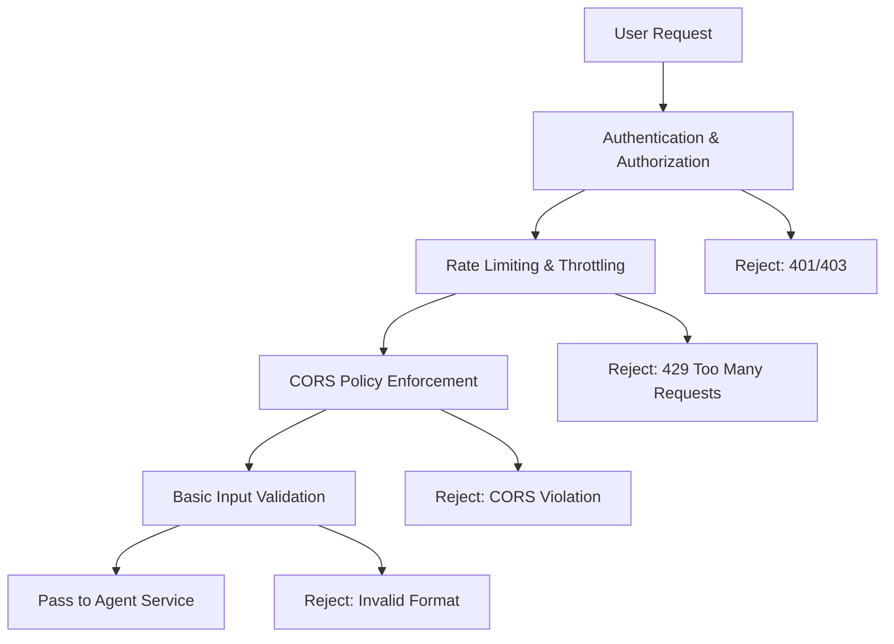
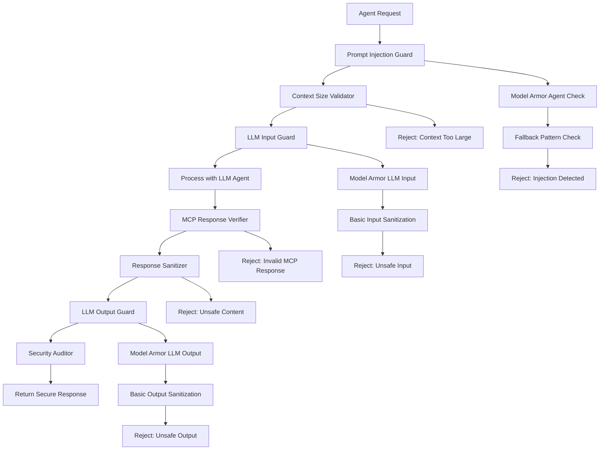
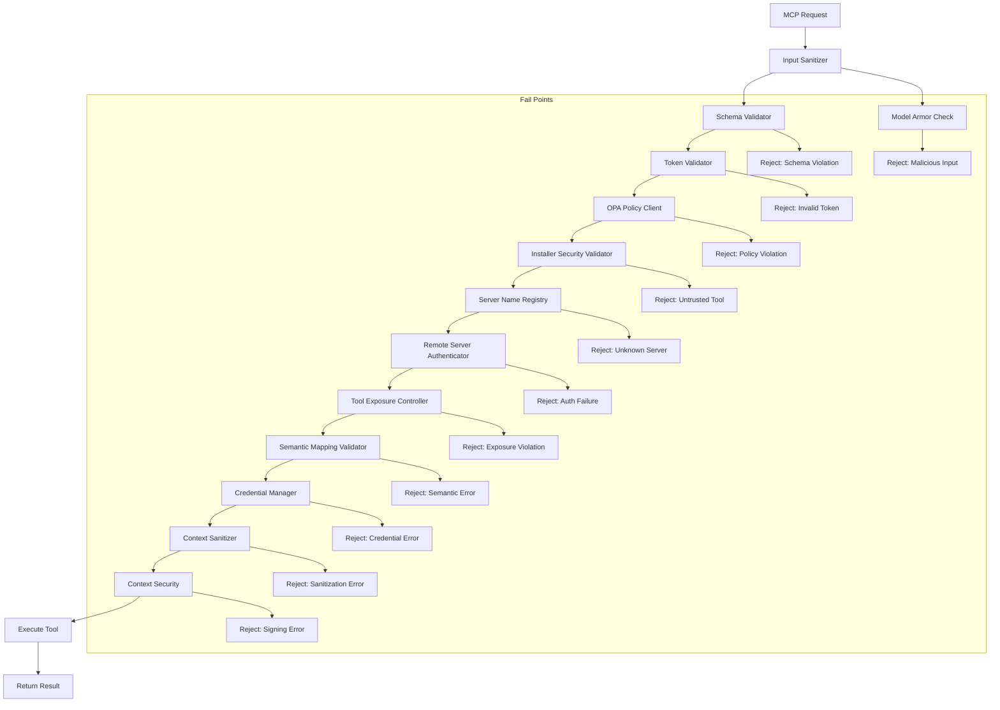

# MCP Enhanced Security Sequence Diagram

This document provides sequence diagrams showing the complete end-to-end flow through the enhanced 3-layer MCP security architecture, including Model Armor integration and LLM Guard protection.

## Enhanced 3-Layer Security Flow

```
┌─────────────────────────────────────────────────────────────────┐
│                    Request Flow Overview                         │
├─────────────────────────────────────────────────────────────────┤
│ User → Apigee Gateway → Agent Service → MCP Server → Tools      │
│        (Layer 1)       (Layer 2)       (Layer 3)              │
├─────────────────────────────────────────────────────────────────┤
│ Security Controls Applied:                                      │
│ • Layer 1: 4 Gateway Controls                                  │
│ • Layer 2: 6 Agent Controls (4 + 2 LLM Guards)                 │
│ • Layer 3: 12 MCP Server Controls                              │
│ • Total: 22 Security Controls with Model Armor Integration     │
└─────────────────────────────────────────────────────────────────┘
```

## Complete Security Flow Sequence Diagram

```mermaid
sequenceDiagram
    participant User as 👤 User
    participant Apigee as 🛡️ Apigee Gateway<br/>(Layer 1)
    participant Agent as 🤖 Agent Service<br/>(Layer 2)
    participant Security as 🔒 OptimizedAgentSecurity<br/>(6 Controls)
    participant LLMGuard as 🧠 LLM Guard<br/>(Model Armor)
    participant MCP as 🔧 MCP Server<br/>(Layer 3)
    participant Tools as ⚙️ External Tools
    participant ModelArmor as 🛡️ Model Armor API

    %% User Request Phase
    User->>Apigee: 1. POST /secure_greet_user
    Note over User,Apigee: Initial Request

    %% Layer 1: Apigee Gateway Security (4 Controls)
    rect rgb(255, 235, 205)
        Note over Apigee: Layer 1: Gateway Security (4 Controls)
        Apigee->>Apigee: 1.1 Authentication & Authorization
        Apigee->>Apigee: 1.2 Rate Limiting & Throttling
        Apigee->>Apigee: 1.3 CORS Policy Enforcement
        Apigee->>Apigee: 1.4 Basic Input Validation
    end

    Apigee->>Agent: 2. Validated Request
    Note over Apigee,Agent: Request passes Layer 1

    %% Layer 2: Agent Service Security (6 Controls)
    rect rgb(220, 255, 220)
        Note over Agent,ModelArmor: Layer 2: Agent Security (6 Controls)
        
        %% Agent Service Entry
        Agent->>Security: 3. validate_request(message, user_id, session_id, context)
        
        %% Control 1: Prompt Injection Protection
        Security->>Security: 3.1 PromptInjectionGuard.detect_injection()
        Security->>ModelArmor: 3.1.1 Model Armor Agent Threat Check
        ModelArmor-->>Security: 3.1.2 Agent Threat Analysis
        Security->>Security: 3.1.3 Fallback Pattern Detection
        Note over Security: ✅ Control 1: Prompt Injection (3-4ms)

        %% Control 2: Context Size Validation
        Security->>Security: 3.2 ContextSizeValidator.validate_size()
        Note over Security: ✅ Control 2: Context Size (<1ms)

        %% Control 3: LLM Input Guard
        Security->>LLMGuard: 3.3 sanitize_llm_input(context, user_message, system_prompt)
        LLMGuard->>ModelArmor: 3.3.1 Model Armor LLM Input Check
        ModelArmor-->>LLMGuard: 3.3.2 LLM Input Analysis
        LLMGuard->>LLMGuard: 3.3.3 Basic Input Sanitization
        LLMGuard-->>Security: 3.3.4 Sanitized Input + Metadata
        Note over LLMGuard: ✅ Control 3: LLM Input Guard (3-4ms)

        Security-->>Agent: 4. Validation Success + Sanitized Context
    end

    %% Agent Processing
    Agent->>Agent: 5. Initialize LLM Agent with Sanitized Context
    Agent->>Agent: 6. Process User Request with Agent

    %% MCP Server Interaction
    Agent->>MCP: 7. MCP Request (tool invocation)
    
    %% Layer 3: MCP Server Security (12 Controls)
    rect rgb(255, 240, 245)
        Note over MCP: Layer 3: MCP Server Security (12 Controls)
        
        %% Phase 1: Pre-authentication (Controls 1-2)
        MCP->>MCP: 7.1 InputSanitizer.sanitize()
        MCP->>ModelArmor: 7.1.1 Model Armor Input Check
        ModelArmor-->>MCP: 7.1.2 Input Analysis
        MCP->>MCP: 7.2 SchemaValidator.validate()
        Note over MCP: ✅ Phase 1: Pre-auth (1-2ms)

        %% Phase 2: Authentication (Controls 3-4)
        MCP->>MCP: 7.3 GoogleCloudTokenValidator.validate()
        MCP->>MCP: 7.4 OPAPolicyClient.check_policy()
        Note over MCP: ✅ Phase 2: Authentication (5-10ms)

        %% Phase 3: Zero-Trust Infrastructure (Controls 5-7)
        MCP->>MCP: 7.5 InstallerSecurityValidator.validate_tool_integrity()
        MCP->>MCP: 7.6 ServerNameRegistry.verify_server_identity()
        MCP->>MCP: 7.7 RemoteServerAuthenticator.authenticate_remote_server()
        Note over MCP: ✅ Phase 3: Infrastructure (3-5ms)

        %% Phase 4: Tool-Specific Security (Controls 8-9)
        MCP->>MCP: 7.8 ToolExposureController.validate_tool_exposure()
        MCP->>MCP: 7.9 SemanticMappingValidator.validate_tool_semantics()
        Note over MCP: ✅ Phase 4: Tool Security (2-3ms)

        %% Phase 5: Data Processing (Controls 10-12)
        MCP->>MCP: 7.10 CredentialManager.get_credentials()
        MCP->>MCP: 7.11 ContextSanitizer.sanitize()
        MCP->>MCP: 7.12 ContextSecurity.sign()
        Note over MCP: ✅ Phase 5: Data Processing (3-5ms)
    end

    %% Tool Execution
    MCP->>Tools: 8. Secure Tool Invocation
    Tools-->>MCP: 9. Tool Response
    MCP-->>Agent: 10. Verified MCP Response

    %% Layer 2: Response Processing
    rect rgb(220, 255, 220)
        Note over Agent,ModelArmor: Layer 2: Response Security (3 Controls)
        
        %% Control 4: MCP Response Verification
        Agent->>Security: 11. verify_mcp_response(mcp_response, user_id, session_id)
        Security->>Security: 11.1 MCPResponseVerifier.verify_response()
        Note over Security: ✅ Control 4: MCP Response Verification (<1ms)

        %% Control 5: Response Sanitization
        Security->>Security: 11.2 ResponseSanitizer.sanitize_response()
        Note over Security: ✅ Control 5: Response Sanitization (1-2ms)

        %% Control 6: LLM Output Guard
        Agent->>LLMGuard: 12. validate_llm_output(llm_response, original_context)
        LLMGuard->>ModelArmor: 12.1 Model Armor LLM Output Check
        ModelArmor-->>LLMGuard: 12.2 LLM Output Analysis
        LLMGuard->>LLMGuard: 12.3 Basic Output Sanitization
        LLMGuard-->>Agent: 12.4 Validated Response + Metadata
        Note over LLMGuard: ✅ Control 6: LLM Output Guard (3-4ms)

        %% Security Auditing
        Security->>Security: 13. SecurityAuditor.log_security_event()
        Note over Security: ✅ Audit Trail Complete
    end

    %% Final Response
    Agent-->>Apigee: 14. Secure Response
    Apigee-->>User: 15. Final Response

    %% Performance Summary
    rect rgb(240, 248, 255)
        Note over User,Tools: Performance Summary<br/>• Layer 1 (Apigee): ~5ms<br/>• Layer 2 (Agent): 11-13ms<br/>• Layer 3 (MCP): 14-25ms<br/>• Model Armor: 3-4ms per call<br/>• Total Overhead: ~30-43ms
    end
```



## Detailed Security Control Flow

### **Layer 1: Apigee Gateway (4 Controls)**



### **Layer 2: Agent Service (6 Controls)**



### **Layer 3: MCP Server (12 Controls)**



## Model Armor Integration Points

### **Agent Layer Protection**
- **Purpose**: Detect agent behavior manipulation
- **Integration**: PromptInjectionGuard with fallback patterns
- **Performance**: 3-4ms per check
- **Fallback**: Local pattern matching when API unavailable

### **LLM Layer Protection**
- **Input Guard**: Sanitize context, user messages, system prompts
- **Output Guard**: Validate LLM responses for safety and leakage
- **Integration**: LLMGuard class with Model Armor API
- **Performance**: 3-4ms per input/output check

### **Tool Layer Protection**
- **Purpose**: General input sanitization
- **Integration**: InputSanitizer with Model Armor
- **Performance**: Included in MCP Server overhead
- **Coverage**: All tool interactions protected

## Performance Characteristics

### **Latency Breakdown**
| Layer | Controls | Overhead | Description |
|-------|----------|----------|-------------|
| **Apigee Gateway** | 4 | ~5ms | External authentication & rate limiting |
| **Agent Service** | 6 | 11-13ms | Agent-specific + LLM protection |
| **MCP Server** | 12 | 14-25ms | Comprehensive tool security |
| **Model Armor** | API | 3-4ms | Per API call with fallback |
| **Total** | 22 | ~30-43ms | Complete security pipeline |

### **Optimization Benefits**
1. **No Security Redundancy**: Each layer has specific responsibilities
2. **Fast-Fail Pattern**: Early rejection reduces processing overhead
3. **Parallel Processing**: Independent security checks where possible
4. **Intelligent Caching**: Token validation and policy caching
5. **Fallback Protection**: Local patterns when Model Armor unavailable

## Architecture Benefits

### **1. Layered Defense-in-Depth**
- **Clear Separation**: Each layer protects different aspects
- **Complementary Controls**: No overlap or redundancy
- **Performance Optimized**: Minimal latency impact per layer

### **2. Model Armor Integration**
- **Specialized Detection**: AI-specific threat analysis
- **Enterprise Support**: Production-ready API integration
- **Fallback Protection**: Graceful degradation capability
- **Comprehensive Coverage**: All AI interaction points protected

### **3. Zero-Trust Architecture**
- **Never Trust, Always Verify**: All inputs validated
- **Principle of Least Privilege**: Minimal required permissions
- **Continuous Verification**: Every request fully validated
- **Comprehensive Auditing**: Complete security event trail

This enhanced 3-layer security architecture provides enterprise-grade protection for AI agent systems while maintaining optimal performance and clear architectural boundaries.
