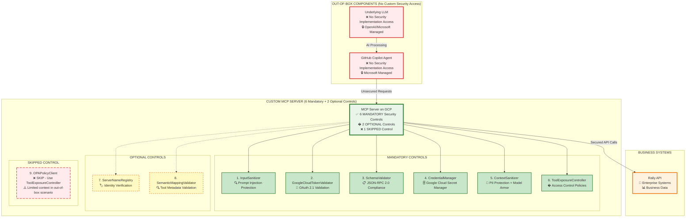
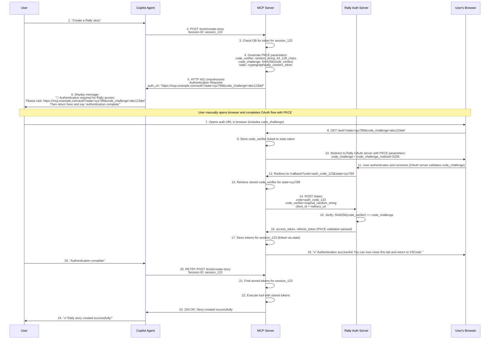
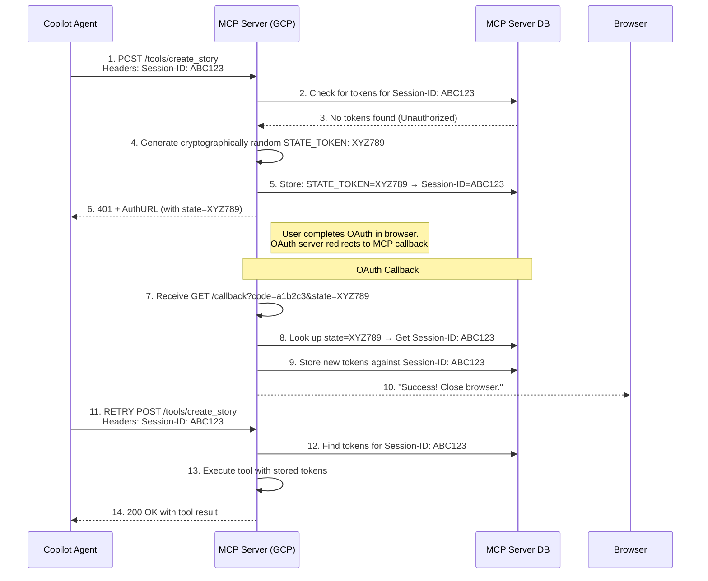

# 🚀 End-to-End Flow: GitHub Copilot Agent with Custom MCP Server (Realistic Implementation)

## 📋 Overview

This document details the **realistic** end-to-end workflow of a user interacting with **GitHub Copilot's Agent Mode** to execute tasks against **Rally** through a custom **MCP (Model Context Protocol)** server. 

**⚠️ IMPORTANT**: This documentation reflects the **actual capabilities and limitations** of GitHub Copilot Agent, including the fact that it **cannot render interactive links** or handle automated OAuth flows.

### Key Implementation Realities:
- ✅ **Manual Authentication**: Users must manually open browser and complete OAuth flows
- ✅ **Text-Based Instructions**: Agent provides URLs as text (not clickable links)
- ✅ **User Confirmation Required**: Users must confirm authentication completion before retry
- ✅ **Session-Based Token Management**: MCP Server maintains tokens linked to Agent sessions

### Authentication Flow Summary:
1. **Agent** detects authentication needed and provides text instructions
2. **User** manually opens authentication URL in browser  
3. **User** completes OAuth flow and returns to Agent
4. **User** confirms completion, triggering Agent retry
5. **MCP Server** uses stored tokens for subsequent requests## 🔒 Security Controls Implementation Analysis

Since **GitHub Copilot Agent** and the underlying **LLM** are out-of-the-box services without access f## 🔑 Key Points

| Aspect | Description |
|--------|-------------|
| 🆔 **Session ID Management** | Generated once by Agent and used consistently to maintain state |
| 🔐 **OAuth Flow** | MCP server acts as OAuth client, handling entire flow including PKCE |
| 🌐 **Manual Authentication** | **CRITICAL**: User must manually open browser and complete OAuth (Agent cannot render interactive links) |
| 💬 **User Confirmation Required** | User must return to Agent and confirm "authentication complete" before retry |
| 🔄 **Manual Retry Trigger** | Agent retries original request only after user confirmation (no automatic retry) |
| 🛡️ **Security** | PKCE prevents authorization code interception; state parameter binds authentication to request |

## ⚠️ **GitHub Copilot Limitations**

| Limitation | Impact | Workaround |
|------------|--------|------------|
| **Cannot render clickable links** | No interactive OAuth flows | Provide text URLs for manual copying |
| **Cannot open browser windows** | No automatic OAuth initiation | User must manually open authentication URLs |
| **Cannot detect OAuth completion** | No automatic request retry | User must confirm completion before retry |
| **Limited UI capabilities** | Text-only responses | Clear step-by-step instructions in text format |

## ✅ **Realistic Implementation Pattern**

### What GitHub Copilot CAN Do:
- ✅ Display text messages with URLs
- ✅ Make HTTP requests to MCP Server
- ✅ Wait for user text responses
- ✅ Retry requests based on user confirmation
- ✅ Maintain conversation context

### What GitHub Copilot CANNOT Do:
- ❌ Render clickable links or buttons
- ❌ Open browser windows
- ❌ Handle OAuth redirects directly
- ❌ Detect external authentication completion
- ❌ Automatic retry without user inputm security implementation, we must analyze which of the **9 MCP Framework Security Controls** from [SECURITY_CONTROLS_OVERVIEW.md](./SECURITY_CONTROLS_OVERVIEW.md) can be effectively implemented on the MCP Server.

### 🎯 MCP Framework Security Controls Analysis for Out-of-Box Scenario

Based on the authoritative 9 security controls documented in the MCP Framework, here's the implementation analysis:

| **Security Control** | **Implementation** | **Effectiveness** | **Rationale** |
|---------------------|-------------------|------------------|---------------|
| **1. InputSanitizer** | ✅ **MANDATORY** | 🟢 HIGH | Agent cannot sanitize; server must block prompt injection, SQL injection, XSS, command injection |
| **2. GoogleCloudTokenValidator** | ✅ **MANDATORY** | 🟢 HIGH | Agent provides OAuth 2.1 token; server validates via Cloud Run headers (`X-Goog-Authenticated-User-Email`) |
| **3. SchemaValidator** | ✅ **MANDATORY** | 🟢 HIGH | Agent sends JSON-RPC 2.0; server enforces protocol compliance and security rules |
| **4. CredentialManager** | ✅ **MANDATORY** | 🟢 HIGH | Agent cannot access secrets; server handles Google Cloud Secret Manager and credential injection |
| **5. ContextSanitizer** | ✅ **MANDATORY** | 🟢 HIGH | LLM cannot sanitize responses; server prevents PII leakage and context poisoning (Model Armor + regex) |
| **6. ToolExposureController** | ✅ **MANDATORY** | 🟢 HIGH | Agent cannot control access; server manages tool policies and approval workflows |
| **7. ServerNameRegistry** | 🔶 **OPTIONAL** | 🟡 MEDIUM | Useful for multi-server environments; limited value in single MCP Server deployments |
| **8. SemanticMappingValidator** | 🔶 **OPTIONAL** | 🟡 MEDIUM | Validates tool metadata consistency; less critical for static tool sets |
| **9. OPAPolicyClient** | ❌ **SKIP** | 🔴 LOW | Requires rich context unavailable in out-of-box scenario; use ToolExposureController instead |

### 🛡️ Security Architecture for Out-of-Box IDE Integration



### 🔐 Security Implementation Mapping for Out-of-Box Scenario

#### **Phase 1: Critical Security Foundation (6 Mandatory Controls)**

##### **1. InputSanitizer - Request Validation**
```http
POST /tools/create_rally_story
Headers: Authorization: Bearer <oauth_token>
Content: <user_query>

MCP Server Processing:
✅ InputSanitizer.sanitize_string(user_query)
- Detect prompt injection patterns
- Filter SQL injection attempts  
- Block XSS and command injection
- Apply HTML escaping and content filtering
```

##### **2. GoogleCloudTokenValidator - OAuth Authentication**
```json
{
  "cloudRunHeaders": {
    "X-Goog-Authenticated-User-Email": "service-account@project.iam.gserviceaccount.com",
    "X-Goog-Authenticated-User-ID": "user-id"
  },
  "validation": "Automatic Cloud Run token validation",
  "fallback": "JWT validation with google.auth library"
}
```

##### **3. SchemaValidator - Protocol Compliance**
```json
{
  "jsonrpc": "2.0",
  "method": "tools/list",
  "params": {},
  "id": 1,
  "validation": "JSON-RPC 2.0 structure + MCP security rules"
}
```

##### **4. CredentialManager - Secret Management**
```python
# Secure credential injection from Google Cloud Secret Manager
credentials = {
    "rally_api_key": secret_manager.get_secret("rally-api-key"),
    "oauth_client_secret": secret_manager.get_secret("oauth-client-secret")
}
```

##### **5. ContextSanitizer - Response Protection**
```python
# Model Armor integration with regex fallback
sanitized_response = context_sanitizer.sanitize({
    "model_armor_api": "Advanced threat detection",
    "regex_fallback": "PII pattern matching",
    "pii_redaction": "[EMAIL-REDACTED], [SSN-REDACTED]"
})
```

##### **6. ToolExposureController - Access Control**
```json
{
  "policy": {
    "service_accounts": {
      "copilot@project.iam.gserviceaccount.com": {
        "allowed_tools": ["hello", "create_rally_story", "get_rally_data"],
        "approval_required": false
      }
    }
  }
}
```

#### **Phase 2: Optional Controls (2 Controls)**

##### **7. ServerNameRegistry - Identity Verification**
```python
# Server identity management (useful for multi-server setups)
server_registry.register_server(
    server_id="rally-mcp-server",
    namespace="enterprise",
    tools=["rally_create", "rally_read", "rally_update"]
)
```

##### **8. SemanticMappingValidator - Tool Metadata Validation**
```python
# Tool metadata consistency validation
semantic_validator.validate_tool_semantics(
    tool_name="create_rally_story",
    parameters={"title": "string", "description": "string"},
    metadata={"category": "data_access", "output_type": "json"}
)
```

#### **Phase 3: Skipped Control (1 Control)**

##### **9. OPAPolicyClient - Policy Engine**
```python
# ❌ SKIP: Limited effectiveness in out-of-box scenario
# Reason: Agent provides minimal context (only service account from OAuth)
# Cannot build rich policy context for dynamic authorization
# Alternative: Use ToolExposureController with static service account policies
```

### ⚠️ Security Architecture Constraints Analysis

| **Component** | **Security Capability** | **Implementation Strategy** |
|---------------|------------------------|----------------------------|
| **GitHub Copilot Agent** | ❌ No custom security access | Microsoft managed - cannot modify |
| **Underlying LLM** | ❌ No custom security access | OpenAI/Microsoft managed - cannot modify |
| **MCP Server** | ✅ Full security control | **6 mandatory + 2 optional controls** |
| **Business APIs** | ⚡ Existing enterprise security | Protected by MCP Server security gateway |

### 🎯 Critical Security Recommendations for Out-of-Box Integration

1. **Mandatory Controls First**: Implement 6 critical controls before deployment
2. **Server-Side Defense**: All security must be on MCP Server due to Agent/LLM constraints  
3. **OAuth 2.1 Reliance**: Leverage Google Cloud Run automatic token validation
4. **Response Sanitization**: Extra important since no control over Agent response handling
5. **Static Policy Management**: Use service account-based policies instead of dynamic OPA rules

### 🔒 Security Implementation Priority

| **Priority** | **Security Controls** | **Implementation Timeline** |
|--------------|----------------------|----------------------------|
| **P0 - Critical** | InputSanitizer, GoogleCloudTokenValidator | Deploy before any user access |
| **P1 - High** | SchemaValidator, CredentialManager | Deploy before production |
| **P2 - High** | ContextSanitizer, ToolExposureController | Deploy before production |
| **P3 - Optional** | ServerNameRegistry, SemanticMappingValidator | Deploy for enhanced security |
| **P4 - Skip** | OPAPolicyClient | Use ToolExposureController instead |

### 🔒 Security Implementation Summary for Out-of-Box Scenario

| Security Control | Implementation Status | Technology Stack |
|------------------|----------------------|------------------|
| 🔐 **InputSanitizer** | ✅ MANDATORY on MCP Server | Regex patterns, HTML escaping, content filtering |
| 🛡️ **GoogleCloudTokenValidator** | ✅ MANDATORY on MCP Server | Cloud Run headers, google.auth, JWT validation |
| ✅ **SchemaValidator** | ✅ MANDATORY on MCP Server | jsonschema library, JSON-RPC 2.0 compliance |
| 🎯 **CredentialManager** | ✅ MANDATORY on MCP Server | Google Cloud Secret Manager, secure caching |
| � **ContextSanitizer** | ✅ MANDATORY on MCP Server | Model Armor API, regex fallback, PII detection |
| 🎲 **ToolExposureController** | ✅ MANDATORY on MCP Server | JSON policies, approval workflows, service account auth |
| 🚫 **ServerNameRegistry** | 🔶 OPTIONAL on MCP Server | Custom registry, namespace management |
| 📏 **SemanticMappingValidator** | 🔶 OPTIONAL on MCP Server | Metadata validation, semantic consistency |
| 🛡️ **OPAPolicyClient** | ❌ SKIP - Use ToolExposureController | Limited context in out-of-box scenario |

### � Security Coverage Analysis

**✅ Comprehensive Protection (6 Mandatory Controls)**
- All critical attack vectors covered by MCP Server
- Defense-in-depth with multiple security layers
- OAuth 2.1 integration with Google Cloud authentication
- Advanced threat detection via Model Armor integration

**🔶 Enhanced Features (2 Optional Controls)**
- Server identity verification for multi-server environments
- Tool metadata validation for dynamic tool scenarios

**❌ Limitations (1 Skipped Control)**
- Cannot implement rich context-aware policies (use static service account policies instead)
- Limited visibility into Agent/LLM internal processing
- Must rely on OAuth 2.1 service account permissions for user authorization

This security analysis ensures that all practical and effective security controls from the MCP Framework are properly implemented for out-of-box IDE integration scenarios, with clear prioritization and implementation guidance. PKCE**.

---

## 🔧 Prerequisites

| Component | Description |
|-----------|-------------|
| 🔨 **VS Code IDE** | GitHub Copilot Agent Mode enabled |
| ☁️ **Custom MCP Server** | Deployed on Google Cloud Platform (GCP) |
| 🔐 **Rally OAuth App** | Application registration completed |
| ⚙️ **mcp.json** | Configuration file properly set up |

---

## 🌊 Sequence Diagram



---

## 📖 Step-by-Step Explanation

### 1. 🚀 Agent Initialization in VSCode

When the Copilot Agent starts in VSCode:

- **Generates** a unique Session ID (UUID)
- **Stores** it in environment variable `COPILOT_MCP_SESSION_ID`
- **Persists** for the Agent's lifetime to identify all requests from this IDE session

### 2. 💬 User Query

User types a query in Copilot chat requiring Rally interaction:

> **Example:** *"Create a Rally story for task X"*

- Copilot Agent **parses** the query
- **Consults** `mcp.json` to determine the appropriate MCP server

### 3. 📡 Initial Request to MCP Server

Agent sends a request to the Rally MCP server:

```http
POST /tools/create_rally_story
Headers: 
  Session-ID: <session_id>
Content: <query_parameters>
```

### 4. 🔍 Authentication Check and PKCE Generation

MCP server processes the request:

- ✅ **Checks** database for access token associated with Session ID
- ❌ **No token exists** (first request)
- 🔐 **Generates PKCE parameters** (OAuth 2.1 requirement):
  - `code_verifier`: Cryptographically random string (43-128 characters)
  - `code_challenge`: SHA256 hash of code_verifier, base64url-encoded
  - `state`: Cryptographically random token for CSRF protection
- 💾 **Stores** code_verifier linked to state token in database
- **Responds** with `HTTP 401` and authentication URL containing code_challenge

**PKCE Parameter Generation Example:**
```python
import secrets
import hashlib
import base64

# Generate code_verifier (43-128 characters)
code_verifier = base64.urlsafe_b64encode(secrets.token_bytes(32)).decode('utf-8').rstrip('=')

# Generate code_challenge (SHA256 of code_verifier)
code_challenge = base64.urlsafe_b64encode(
    hashlib.sha256(code_verifier.encode('utf-8')).digest()
).decode('utf-8').rstrip('=')

# Store association: state_token -> {code_verifier, session_id}
```

### 5. 🔐 Manual User Authentication Flow with PKCE

**⚠️ CRITICAL: GitHub Copilot Cannot Render Interactive Links**

Instead of rendering clickable links (which Copilot cannot do), the Agent:

1. **Displays text message** with authentication URL
2. **Instructs user** to manually open the URL in browser
3. **Waits for user confirmation** that authentication is complete

**Agent Response Example:**
```
🔐 Authentication required for Rally access.

Please follow these steps:
1. Copy this URL: https://mcp.example.com/auth?state=xyz789&code_challenge=abc123def456
2. Open it in your browser
3. Complete the Rally authentication
4. Return here and say "authentication complete"

Note: This URL includes PKCE security parameters for OAuth 2.1 compliance.
```

### 6. 🌐 User Completes OAuth in Browser with PKCE (Manual Process)

User manually completes PKCE-protected authentication:

1. **User copies URL** from Copilot chat (includes code_challenge parameter)
2. **Opens URL in browser** (separate from VSCode)
3. **MCP Server processes** authentication request:
   - Stores code_verifier linked to state token
   - Redirects to Rally OAuth server with PKCE parameters
4. **Completes OAuth flow** with Rally (OAuth server validates code_challenge)
5. **Sees success message** in browser after PKCE validation
6. **Returns to VSCode** and confirms completion

### 7. 🔄 OAuth Redirect and Token Exchange with PKCE Verification

OAuth flow completion with PKCE validation:

1. **Rally OAuth server** redirects to MCP server's callback with authorization code
2. **MCP server callback** endpoint:
   - ✅ Validates `state` parameter (CSRF protection)
   - 🔍 Retrieves stored `code_verifier` for the state token
   - 🔍 Retrieves associated Session ID from state mapping
   - � **PKCE Token Exchange**:
     ```http
     POST /oauth/token
     Content-Type: application/x-www-form-urlencoded
     
     grant_type=authorization_code
     &code=authorization_code_from_rally
     &client_id=your_rally_client_id
     &code_verifier=original_code_verifier_value
     &redirect_uri=https://mcp.example.com/callback
     ```
   - ✅ **Rally validates**: `SHA256(code_verifier) == stored_code_challenge`
   - 🔄 **Receives tokens** only if PKCE verification passes
   - 💾 Stores tokens in database mapped to Session ID
   - 📄 Returns HTML success page to browser

**🔐 PKCE Security Benefits:**
- Prevents authorization code interception attacks
- Ensures only the client that initiated the flow can exchange the code
- No client secret required (suitable for public clients)
- Cryptographically binds authorization request to token request

### 8. ↩️ User Confirmation and Request Retry

**Critical Step**: User must manually confirm authentication completion:

1. � **User returns to VSCode** and tells Agent "authentication complete"
2. 🔄 **Agent retries** the original request with same Session ID
3. 🔍 **MCP server finds** access token for Session ID
4. 📡 **Makes authenticated** API call to Rally
5. 🛡️ **Sanitizes response** if needed
6. 📤 **Returns result** to Agent
7. 💬 **Agent displays** result in chat

### ⚠️ **Key Difference from Original Pattern**

**ORIGINAL (Incorrect)**: Assumed Agent could render clickable links and handle interactive OAuth
```
Agent->>User: 8. Render "Sign in to Rally" link  ❌ NOT POSSIBLE
```

**CORRECTED (Realistic)**: Agent provides text instructions for manual authentication
```
Agent->>User: 5. Display authentication instructions with URL  ✅ POSSIBLE
User->>Agent: 15. "Authentication complete"  ✅ REQUIRED
```

---

## � State Parameter to Session-ID Mapping

The state token is critically associated with the Session-ID provided by the Agent. This association is the linchpin that allows the MCP server to "remember" which IDE session initiated the authentication request after the user completes the browser-based OAuth flow.

### Detailed State Mapping Flow



### Step-by-Step State Mapping Breakdown

1. **Initial Request with Session-ID**: The Copilot Agent makes its first call to the MCP server's tool endpoint (e.g., `POST /tools/create_rally_story`). It includes the `Session-ID: ABC123` header.

2. **Server Generates State**: The MCP server receives the request and sees that `Session-ID: ABC123` has no associated access tokens. It then:
   - Generates a unique, cryptographically random string for the state parameter (e.g., `XYZ789`)
   - Creates a crucial association in its database: it stores `state=XYZ789 -> Session-ID=ABC123`

3. **AuthURL with State**: The MCP server generates the AuthURL for the OAuth provider (Rally/GitHub) and includes the generated state parameter:
   ```text
   https://rally1.rallydev.com/login/oauth2/auth?response_type=code&client_id=...&state=XYZ789&...
   ```

4. **OAuth Redirection**: After the user authenticates, the OAuth server redirects back to the MCP server's callback URL with the authorization code and the original state parameter (`.../oauth/callback?code=a1b2c3&state=XYZ789`).

5. **State Validation and Session Lookup**: The MCP server's callback endpoint:
   - Receives the request with `?state=XYZ789`
   - Validates the state parameter to prevent CSRF
   - Uses the state value to look up the associated Session-ID in its database
   - Finds that `state=XYZ789` is linked to `Session-ID=ABC123`

6. **Token Storage**: The MCP server exchanges the code for an access token. It then stores this access token (and refresh token) against the `Session-ID: ABC123` in its database.

7. **Completing the Loop**: When the Copilot Agent retries the original request with `Session-ID: ABC123`, the MCP server finds the valid tokens and can execute the tool call.

### Parameter Summary

| Parameter | Generated By | Purpose | Association |
|-----------|-------------|---------|-------------|
| **Session-ID** | Copilot Agent | A persistent identifier for the entire IDE session. Used to link all requests from the same user to their stored OAuth tokens. | The key used by the MCP server to store and retrieve the user's access tokens. |
| **state** | MCP Server | A one-time, unique token for the OAuth flow. Its sole purpose is to securely connect the OAuth callback response back to the original session that initiated the request. | The temporary bridge. The MCP server creates a database entry that maps the state token to the Session-ID. |

This mechanism ensures that even though the OAuth flow happens out-of-band in a web browser, the resulting credentials are correctly linked to the original user session in the IDE.

---

## 🔑 Key Points

| Aspect | Description |
|--------|-------------|
| 🆔 **Session ID Management** | Generated once by Agent and used consistently to maintain state |
| 🔐 **OAuth 2.1 with PKCE** | MCP server implements full PKCE flow (code_verifier + code_challenge) for security |
| 🌐 **Manual Authentication** | **CRITICAL**: User must manually open browser and complete OAuth (Agent cannot render interactive links) |
| 💬 **User Confirmation Required** | User must return to Agent and confirm "authentication complete" before retry |
| 🔄 **Manual Retry Trigger** | Agent retries original request only after user confirmation (no automatic retry) |
| 🛡️ **PKCE Security** | Prevents authorization code interception; cryptographically binds auth request to token exchange |
| � **State Parameter** | CSRF protection that links OAuth callback to original Agent session |

## 🔐 **PKCE Implementation Details**

| PKCE Component | Purpose | Implementation |
|----------------|---------|----------------|
| **code_verifier** | Secret random string (43-128 chars) | Generated by MCP Server, stored temporarily |
| **code_challenge** | SHA256 hash of code_verifier | Included in authorization URL, sent to OAuth server |
| **code_challenge_method** | Hashing method (always "S256") | Tells OAuth server how to verify the challenge |
| **PKCE Verification** | OAuth server validates verifier matches challenge | `SHA256(code_verifier) == code_challenge` |

**🔒 PKCE Security Flow:**
1. MCP Server generates random `code_verifier`
2. MCP Server creates `code_challenge = SHA256(code_verifier)`
3. Authorization URL includes `code_challenge` parameter
4. OAuth server stores `code_challenge` for this authorization request
5. Token exchange includes original `code_verifier`
6. OAuth server verifies `SHA256(received_code_verifier) == stored_code_challenge`
7. Tokens issued only if PKCE verification passes

---

## 💬 **Realistic User Experience Example**

Here's what the actual conversation flow looks like in GitHub Copilot:

### Initial Request
**User**: "Create a Rally story for implementing user authentication"

**Copilot**: 
```
🔐 I need to authenticate with Rally to create stories. 

Please follow these steps:
1. Copy this URL: https://rally-mcp-server.gcp.cloud/auth?state=abc123xyz
2. Open it in your browser
3. Sign in to Rally and authorize access
4. Once you see "Authentication successful", return here and type "authentication complete"

I'll wait for your confirmation before proceeding.
```

### After User Completes OAuth
**User**: "authentication complete"

**Copilot**:
```
✅ Great! Let me create that Rally story now...

📝 Rally story created successfully:
- Title: "Implement user authentication"
- ID: US12345
- Status: Defined
- Owner: john.doe@company.com

The story has been added to your current iteration. You can view it at:
https://rally1.rallydev.com/d/s/stories/US12345
```

### Subsequent Requests (Already Authenticated)
**User**: "Create another Rally story for API testing"

**Copilot**:
```
📝 Rally story created successfully:
- Title: "Implement API testing framework"
- ID: US12346
- Status: Defined
- Owner: john.doe@company.com

Since you're already authenticated, I was able to create this story immediately.
```

## ⚙️ Configuration Example (`mcp.json`)

```json
{
  "mcpServers": {
    "rally-mcp-server": {
      "type": "http",
      "url": "https://rally-mcp-server.gcp.cloud",
      "headers": {
        "Session-ID": "$COPILOT_MCP_SESSION_ID"
      },
      "tools": [
        "get_rally_issue", 
        "create_rally_defect"
      ],
      "env": {
        "RALLY_OAUTH_CLIENT_ID": "COPILOT_MCP_RALLY_CLIENT_ID",
        "RALLY_OAUTH_CLIENT_SECRET": "COPILOT_MCP_RALLY_CLIENT_SECRET"
      }
    }
  }
}
```

---

## 🔗 OAuth 2.1 AuthURL Examples with PKCE

Here are examples of AuthURLs that an MCP server would generate for Rally and GitHub, based on the OAuth 2.1 authorization code flow with PKCE (Proof Key for Code Exchange), which is **MANDATORY** for OAuth 2.1 compliance.

### Example AuthURL for Rally (with PKCE)

```text
https://rally1.rallydev.com/login/oauth2/auth?
  response_type=code
  &client_id=your_rally_client_id
  &redirect_uri=https://your-mcp-server.gcp.cloud/oauth/callback
  &scope=alm:read%20alm:write
  &state=7a3f81b0e5c2d4a6b9c8e1f2a7d3e5c8
  &code_challenge=5VXp1mP5z6uRxE3Xv8w7Wr2qH0nK8lL9aBc3dF1gS4iJ7yT6oM
  &code_challenge_method=S256
```

### Example AuthURL for GitHub (with PKCE)

```text
https://github.com/login/oauth/authorize?
  response_type=code
  &client_id=your_github_client_id
  &redirect_uri=https://your-mcp-server.gcp.cloud/oauth/callback
  &scope=repo%20read:user
  &state=8b4c6e2a1d9f3e7c5a0b2d8e3f1a5c7b
  &code_challenge=kL9aBc3dF1gS4iJ7yT6oM5VXp1mP5z6uRxE3Xv8w7Wr2qH0n
  &code_challenge_method=S256
```

### 🔐 PKCE Parameters Explained

| Parameter | Description | Example Value | Security Purpose |
|-----------|-------------|---------------|------------------|
| **code_challenge** | SHA256 hash of code_verifier (base64url-encoded) | `5VXp1mP5z6uRxE3Xv8w7Wr2qH0nK8lL9aBc3dF1gS4iJ7yT6oM` | Prevents authorization code interception |
| **code_challenge_method** | Hashing method for PKCE | `S256` (SHA256) | Tells OAuth server how to verify challenge |
| **state** | CSRF protection token | `7a3f81b0e5c2d4a6b9c8e1f2a7d3e5c8` | Links OAuth callback to original session |
| **code_verifier** | Original random string (NOT in URL) | `7w8x9y0z1a2b3c4d5e6f` | Sent later during token exchange |

### 🛡️ PKCE Security Flow

```mermaid
graph LR
    A[MCP Server Generates<br/>code_verifier] --> B[Calculate<br/>code_challenge = SHA256]
    B --> C[Include code_challenge<br/>in Auth URL]
    C --> D[User Completes OAuth<br/>at OAuth Server]
    D --> E[OAuth Server Stores<br/>code_challenge]
    E --> F[Authorization Code<br/>Returned to MCP Server]
    F --> G[MCP Server Sends<br/>code_verifier in Token Request]
    G --> H[OAuth Server Verifies<br/>SHA256 Match]
    H --> I[Tokens Issued Only<br/>if PKCE Valid]
```



### 🔍 Key Components Explained

Both URLs include these standard OAuth 2.1 parameters:

| Parameter | Description |
|-----------|-------------|
| **`response_type=code`** | Indicates the authorization code flow is being used |
| **`client_id`** | The unique identifier for your MCP server registered with the OAuth provider (Rally or GitHub) |
| **`redirect_uri`** | The endpoint on your MCP server that will handle the OAuth callback. This must match exactly with the URI registered with the OAuth provider |
| **`scope`** | Specifies the level of access being requested:<br/>• **Rally**: `alm:read alm:write` (for accessing Rally's Application Lifecycle Management features)<br/>• **GitHub**: `repo read:user` (for repository access and reading user profile data) |
| **`state`** | A unique, cryptographically random string generated by the MCP server for each authorization request. Used to maintain state between the request and callback and prevent CSRF attacks. The MCP server stores this value and associates it with the user's session |
| **`code_challenge`** | A Base64URL-encoded SHA-256 hash of a cryptographically random `code_verifier`. Part of the PKCE extension that protects against authorization code interception attacks |
| **`code_challenge_method=S256`** | Indicates that SHA-256 is used for the PKCE code challenge |

### 🔄 How the MCP Server Uses This URL

1. **Unauthenticated Request**: When an unauthenticated user makes a request, the MCP server returns an HTTP 401 Unauthorized status code

2. **Resource Discovery**: The response includes a `WWW-Authenticate` header containing a link to its resource metadata endpoint (e.g., `https://your-mcp-server.gcp.cloud/.well-known/oauth-protected-resource`)

3. **Client Discovery**: The client (like Copilot) uses this metadata to discover the `authorization_servers` and required scopes

4. **AuthURL Construction**: The client constructs the appropriate AuthURL (like the examples above) and directs the user to it

5. **Authentication & Consent**: User authenticates and grants consent on the Rally or GitHub page

6. **Code Exchange**: The OAuth server redirects back to the MCP server's `redirect_uri` with an authorization code and the original state parameter

7. **Token Exchange**: The MCP server exchanges this code for an access token using the PKCE `code_verifier`

---

## �🔒 Security Considerations

| Security Measure | Implementation |
|------------------|----------------|
| 🔐 **Token Storage** | Tokens stored securely on MCP server, not on client |
| 🛡️ **Context Sanitization** | Performed on MCP server before sending responses to Agent |
| ✅ **Input Validation** | Sanitization implemented on MCP server |
| 🎯 **Authorization Checks** | Fine-grained checks performed against Rally APIs |
| 🔒 **PKCE Protection** | Prevents authorization code interception attacks |
| 🎲 **State Parameter** | CSRF protection linking authentication to specific requests |

---

## 🏆 Benefits

- 🔄 **Seamless Integration**: Natural OAuth flow within Copilot Agent experience
- 🛡️ **Security First**: Comprehensive security measures and best practices
- 🎯 **Extensible Pattern**: Reusable architecture for other authenticated APIs
- 👤 **User-Friendly**: Minimal user intervention required for authentication
- 📊 **Session Management**: Persistent authentication across multiple requests

---

This workflow provides a **secure, extensible pattern** for integrating authenticated tools into the **GitHub Copilot Agent experience** with **Rally API integration**.

---

*📝 Generated from VSCode Copilot Agent MCP Server documentation*
