# 🚀 End-to-End Flow: GitHub Copilot Agent with Custom MCP Server (Realistic Implementation)

## 📋 Overview

This document details the **realistic** end-to-end workflow of a user interacting with **GitHub Copilot's Agent Mode** to execute tasks against **Rally** through a custom **MCP (Model Context Protocol)** server. 

**⚠️ IMPORTANT**: This documentation reflects the **actual capabilities and limitations** of GitHub Copilot Agent, including the fact that it **cannot render interactive links** or handle automated OAuth flows.

### Key Implementation Realities:
- ✅ **Manual Authentication**: Users must manually open browser and complete OAuth flows
- ✅ **Text-Based Instructions**: Agent provides URLs as text (not clickable links)
- ✅ **User Confirmation Required**: Users must confirm authentication completion before retry
- ✅ **Session-Based Token Management**: MCP Server maintains tokens linked to Agent sessions

### Authentication Flow Summary:
1. **Agent** detects authentication needed and provides text instructions
2. **User** manually opens authentication URL in browser  
3. **User** completes OAuth flow and returns to Agent
4. **User** confirms completion, triggering Agent retry
5. **MCP Server** uses stored tokens for subsequent requests## 🔒 Security Controls Implementation Analysis

Since **GitHub Copilot Agent** and the underlying **LLM** are out-of-the-box services without access f## 🔑 Key Points

| Aspect | Description |
|--------|-------------|
| 🆔 **Session ID Management** | Generated once by Agent and used consistently to maintain state |
| 🔐 **OAuth Flow** | MCP server acts as OAuth client, handling entire flow including PKCE |
| 🌐 **Manual Authentication** | **CRITICAL**: User must manually open browser and complete OAuth (Agent cannot render interactive links) |
| 💬 **User Confirmation Required** | User must return to Agent and confirm "authentication complete" before retry |
| 🔄 **Manual Retry Trigger** | Agent retries original request only after user confirmation (no automatic retry) |
| 🛡️ **Security** | PKCE prevents authorization code interception; state parameter binds authentication to request |

## ⚠️ **GitHub Copilot Limitations**

| Limitation | Impact | Workaround |
|------------|--------|------------|
| **Cannot render clickable links** | No interactive OAuth flows | Provide text URLs for manual copying |
| **Cannot open browser windows** | No automatic OAuth initiation | User must manually open authentication URLs |
| **Cannot detect OAuth completion** | No automatic request retry | User must confirm completion before retry |
| **Limited UI capabilities** | Text-only responses | Clear step-by-step instructions in text format |

## ✅ **Realistic Implementation Pattern**

### What GitHub Copilot CAN Do:
- ✅ Display text messages with URLs
- ✅ Make HTTP requests to MCP Server
- ✅ Wait for user text responses
- ✅ Retry requests based on user confirmation
- ✅ Maintain conversation context

### What GitHub Copilot CANNOT Do:
- ❌ Render clickable links or buttons
- ❌ Open browser windows
- ❌ Handle OAuth redirects directly
- ❌ Detect external authentication completion
- ❌ Automatic retry without user inputm security implementation, we must analyze which of the **9 MCP Framework Security Controls** from [SECURITY_CONTROLS_OVERVIEW.md](./SECURITY_CONTROLS_OVERVIEW.md) can be effectively implemented on the MCP Server.

### 🎯 MCP Framework Security Controls Analysis for Out-of-Box Scenario

**REVISED ANALYSIS** - Based on actual end-to-end flow and data exchange patterns:

| **Security Control** | **Implementation** | **Effectiveness** | **Rationale** |
|---------------------|-------------------|------------------|---------------|
| **1. InputSanitizer** | ✅ **MANDATORY** | 🟢 HIGH | Agent sends user prompts/tool requests; server must prevent prompt injection, SQL injection, XSS attacks |
| **2. GoogleCloudTokenValidator** | ❌ **NOT APPLICABLE** | � N/A | **Copilot Agent runs on desktop VSCode, not GCP**; uses Rally OAuth tokens, not Google Cloud tokens |
| **3. SchemaValidator** | ✅ **MANDATORY** | 🟢 HIGH | Agent sends JSON-RPC 2.0 MCP messages; server must enforce protocol compliance and parameter validation |
| **4. CredentialManager** | ✅ **MANDATORY** | 🟢 HIGH | Server stores Rally OAuth tokens, PKCE verifiers, and session data; requires secure credential management |
| **5. ContextSanitizer** | ✅ **MANDATORY** | 🟢 HIGH | Server returns Rally API responses to Agent; must sanitize PII, sensitive data before LLM processing |
| **6. ToolExposureController** | ✅ **MANDATORY** | 🟢 HIGH | Server controls which Rally tools are available; manages access policies and user authorization |
| **7. ServerNameRegistry** | 🔶 **OPTIONAL** | 🟡 MEDIUM | Could validate MCP server identity in multi-server setups; limited value in single Rally integration |
| **8. SemanticMappingValidator** | 🔶 **OPTIONAL** | 🟡 MEDIUM | Validates Rally tool metadata consistency; useful for dynamic tool registration scenarios |
| **9. OPAPolicyClient** | ❌ **SKIP** | 🔴 LOW | **No rich policy context available**; desktop Agent provides minimal user context; use static policies instead |

### 🛡️ Security Architecture for GitHub Copilot Agent + MCP Server Integration

```mermaid
graph TB
    subgraph "DESKTOP ENVIRONMENT (Limited Security Control)"
        CA[GitHub Copilot Agent<br/>❌ No Security Implementation Access<br/>🔒 Microsoft Managed<br/>📍 Desktop VSCode]
        LLM[Underlying LLM<br/>❌ No Security Implementation Access<br/>🔒 OpenAI/Microsoft Managed]
    end
    
    subgraph "CUSTOM MCP SERVER (5 Mandatory + 2 Optional Controls)"
        MCP[MCP Server with FastMCP<br/>✅ 5 MANDATORY Security Controls<br/>🔶 2 OPTIONAL Controls<br/>❌ 2 NOT APPLICABLE Controls]
        
        subgraph "MANDATORY CONTROLS (Required for Production)"
            SC1[1. InputSanitizer<br/>🔍 Prompt Injection Protection<br/>� Rally API Input Validation]
            SC3[3. SchemaValidator<br/>📋 JSON-RPC 2.0 Compliance<br/>✅ Pydantic Model Validation]
            SC4[4. CredentialManager<br/>🗄️ Rally OAuth Token Storage<br/>🔐 PKCE Verifier Management]
            SC5[5. ContextSanitizer<br/>🧹 Rally Response Sanitization<br/>🚫 PII Protection]
            SC6[6. ToolExposureController<br/>🎯 Rally Tool Access Control<br/>📝 Session-based Authorization]
        end
        
        subgraph "OPTIONAL CONTROLS (Enhanced Security)"
            SC7[7. ServerNameRegistry<br/>🏷️ MCP Server Identity<br/>🔍 Multi-server Validation]
            SC8[8. SemanticMappingValidator<br/>🔍 Rally Tool Metadata<br/>📊 Dynamic Tool Validation]
        end
        
        subgraph "NOT APPLICABLE CONTROLS"
            SC2[2. GoogleCloudTokenValidator<br/>❌ NOT APPLICABLE<br/>📍 Desktop Agent ≠ GCP Environment]
            SC9[9. OPAPolicyClient<br/>❌ NOT APPLICABLE<br/>⚠️ Limited desktop context]
        end
    end
    
    subgraph "RALLY BUSINESS SYSTEM"
        RALLY[Rally API<br/>🔐 Rally OAuth 2.1<br/>📊 Enterprise ALM Data]
    end
    
    CA -->|Unsecured Requests| MCP
    LLM -->|AI Processing| CA
    
    MCP --> SC1
    MCP --> SC2
    MCP --> SC3
    MCP --> SC4
    MCP --> SC5
    MCP --> SC6
    MCP -.-> SC7
    MCP -.-> SC8
    
    MCP -->|Secured API Calls| RALLY
    
    style CA fill:#ffebee,stroke:#d32f2f,stroke-width:3px
    style LLM fill:#ffebee,stroke:#d32f2f,stroke-width:3px
    style MCP fill:#e8f5e8,stroke:#2e7d32,stroke-width:4px
    style SC1 fill:#c8e6c9,stroke:#2e7d32,stroke-width:2px
    style SC2 fill:#c8e6c9,stroke:#2e7d32,stroke-width:2px
    style SC3 fill:#c8e6c9,stroke:#2e7d32,stroke-width:2px
    style SC4 fill:#c8e6c9,stroke:#2e7d32,stroke-width:2px
    style SC5 fill:#c8e6c9,stroke:#2e7d32,stroke-width:2px
    style SC6 fill:#c8e6c9,stroke:#2e7d32,stroke-width:2px
    style SC7 fill:#fff9c4,stroke:#f57f17,stroke-width:2px,stroke-dasharray: 5 5
    style SC8 fill:#fff9c4,stroke:#f57f17,stroke-width:2px,stroke-dasharray: 5 5
    style SC9 fill:#ffebee,stroke:#d32f2f,stroke-width:2px,stroke-dasharray: 10 5
    style RALLY fill:#fff3e0,stroke:#ef6c00,stroke-width:3px
```



### 🔐 Security Implementation Mapping for Out-of-Box Scenario

#### **Phase 1: Critical Security Foundation (6 Mandatory Controls)**

##### **1. InputSanitizer - Request Validation**
```http
POST /tools/create_rally_story
Headers: Authorization: Bearer <oauth_token>
Content: <user_query>

MCP Server Processing:
✅ InputSanitizer.sanitize_string(user_query)
- Detect prompt injection patterns
- Filter SQL injection attempts  
- Block XSS and command injection
- Apply HTML escaping and content filtering
```

##### **2. GoogleCloudTokenValidator - OAuth Authentication**
```json
{
  "cloudRunHeaders": {
    "X-Goog-Authenticated-User-Email": "service-account@project.iam.gserviceaccount.com",
    "X-Goog-Authenticated-User-ID": "user-id"
  },
  "validation": "Automatic Cloud Run token validation",
  "fallback": "JWT validation with google.auth library"
}
```

##### **3. SchemaValidator - Protocol Compliance**
```json
{
  "jsonrpc": "2.0",
  "method": "tools/list",
  "params": {},
  "id": 1,
  "validation": "JSON-RPC 2.0 structure + MCP security rules"
}
```

##### **4. CredentialManager - Secret Management**
```python
# Secure credential injection from Google Cloud Secret Manager
credentials = {
    "rally_api_key": secret_manager.get_secret("rally-api-key"),
    "oauth_client_secret": secret_manager.get_secret("oauth-client-secret")
}
```

##### **5. ContextSanitizer - Response Protection**
```python
# Model Armor integration with regex fallback
sanitized_response = context_sanitizer.sanitize({
    "model_armor_api": "Advanced threat detection",
    "regex_fallback": "PII pattern matching",
    "pii_redaction": "[EMAIL-REDACTED], [SSN-REDACTED]"
})
```

##### **6. ToolExposureController - Access Control**
```json
{
  "policy": {
    "service_accounts": {
      "copilot@project.iam.gserviceaccount.com": {
        "allowed_tools": ["hello", "create_rally_story", "get_rally_data"],
        "approval_required": false
      }
    }
  }
}
```

#### **Phase 2: Optional Controls (2 Controls)**

##### **7. ServerNameRegistry - Identity Verification**
```python
# Server identity management (useful for multi-server setups)
server_registry.register_server(
    server_id="rally-mcp-server",
    namespace="enterprise",
    tools=["rally_create", "rally_read", "rally_update"]
)
```

##### **8. SemanticMappingValidator - Tool Metadata Validation**
```python
# Tool metadata consistency validation
semantic_validator.validate_tool_semantics(
    tool_name="create_rally_story",
    parameters={"title": "string", "description": "string"},
    metadata={"category": "data_access", "output_type": "json"}
)
```

#### **Phase 3: Skipped Control (1 Control)**

##### **9. OPAPolicyClient - Policy Engine**
```python
# ❌ SKIP: Limited effectiveness in out-of-box scenario
# Reason: Agent provides minimal context (only service account from OAuth)
# Cannot build rich policy context for dynamic authorization
# Alternative: Use ToolExposureController with static service account policies
```

### ⚠️ Security Architecture Constraints Analysis

| **Component** | **Security Capability** | **Implementation Strategy** |
|---------------|------------------------|----------------------------|
| **GitHub Copilot Agent** | ❌ No custom security access | Microsoft managed - cannot modify |
| **Underlying LLM** | ❌ No custom security access | OpenAI/Microsoft managed - cannot modify |
| **MCP Server** | ✅ Full security control | **6 mandatory + 2 optional controls** |
| **Business APIs** | ⚡ Existing enterprise security | Protected by MCP Server security gateway |

### 🎯 Critical Security Recommendations for Out-of-Box Integration

1. **Mandatory Controls First**: Implement 5 critical controls before deployment
2. **Server-Side Defense**: All security must be on MCP Server due to Agent/LLM constraints  
3. **Rally OAuth Security**: Leverage PKCE and secure token storage instead of Google Cloud tokens
4. **Response Sanitization**: Critical since no control over Agent response handling
5. **Session-based Authorization**: Use session mappings and static policies for desktop scenarios

### 🔒 Security Implementation Priority

| **Priority** | **Security Controls** | **Implementation Timeline** |
|--------------|----------------------|----------------------------|
| **P0 - Critical** | InputSanitizer, SchemaValidator | Deploy before any user access |
| **P1 - High** | CredentialManager, ContextSanitizer | Deploy before production |
| **P2 - High** | ToolExposureController | Deploy before production |
| **P3 - Optional** | ServerNameRegistry, SemanticMappingValidator | Deploy for enhanced security |
| **P4 - Not Applicable** | GoogleCloudTokenValidator, OPAPolicyClient | Skip for desktop Agent scenarios |

### 🔒 Security Implementation Summary for Desktop Agent Scenario

| Security Control | Implementation Status | Technology Stack |
|------------------|----------------------|------------------|
| 🔐 **InputSanitizer** | ✅ MANDATORY on MCP Server | Regex patterns, HTML escaping, FastAPI validation |
| ❌ **GoogleCloudTokenValidator** | ❌ NOT APPLICABLE | Desktop Agent ≠ GCP environment |
| ✅ **SchemaValidator** | ✅ MANDATORY on MCP Server | Pydantic models, JSON-RPC 2.0 compliance |
| 🎯 **CredentialManager** | ✅ MANDATORY on MCP Server | SQLite/PostgreSQL, Rally OAuth tokens, PKCE storage |
| 🧹 **ContextSanitizer** | ✅ MANDATORY on MCP Server | Regex filtering, PII detection, response sanitization |
| 🎲 **ToolExposureController** | ✅ MANDATORY on MCP Server | Session-based policies, Rally tool authorization |
| 🏷️ **ServerNameRegistry** | 🔶 OPTIONAL on MCP Server | Server identity validation, multi-server scenarios |
| 🔍 **SemanticMappingValidator** | 🔶 OPTIONAL on MCP Server | Rally tool metadata validation, dynamic registration |
| ❌ **OPAPolicyClient** | ❌ NOT APPLICABLE | Limited desktop context, use static policies instead |

### 📊 Security Coverage Analysis

**✅ Comprehensive Protection (5 Mandatory Controls)**
- All critical attack vectors covered by MCP Server
- Defense-in-depth with multiple security layers
- Rally OAuth 2.1 integration with PKCE authentication
- Advanced response sanitization and PII protection

**🔶 Enhanced Features (2 Optional Controls)**
- Server identity verification for multi-server environments
- Tool metadata validation for dynamic tool scenarios

**❌ Not Applicable (2 Controls)**
- Cannot implement Google Cloud token validation (desktop environment)
- Cannot implement rich context-aware policies (use static session policies instead)
- Limited visibility into Agent/LLM internal processing
- Must rely on Rally OAuth 2.1 and session-based permissions for user authorization

This security analysis ensures that all practical and effective security controls from the MCP Framework are properly implemented for desktop Agent integration scenarios, with clear prioritization and evidence-based implementation guidance.

### 🔍 **Detailed Security Control Analysis Based on Data Flow**

#### **Data Exchange Points in the End-to-End Flow:**

**1. Agent → MCP Server (Tool Request)**
```json
{
  "jsonrpc": "2.0",
  "method": "tools/call", 
  "params": {
    "name": "create_story",
    "arguments": {
      "title": "User Story: Login functionality",
      "description": "As a user I want to...",
      "points": 3
    }
  },
  "headers": {
    "Session-ID": "abc123xyz789"
  }
}
```
**Required Controls:**
- ✅ **InputSanitizer**: Validates `title`, `description` for injection attacks
- ✅ **SchemaValidator**: Validates JSON-RPC 2.0 structure and parameters  
- ✅ **CredentialManager**: Validates `Session-ID` and retrieves stored tokens

**2. MCP Server → Agent (401 Authentication Required)**
```json
{
  "error": "Authentication required",
  "auth_url": "https://mcp-server.com/auth?state=abc&code_challenge=xyz",
  "instructions": ["Copy URL and authenticate in browser"]
}
```
**Required Controls:**
- ✅ **ContextSanitizer**: Ensures auth URLs are safe and don't leak sensitive data
- ✅ **ToolExposureController**: Controls which tools require authentication

**3. MCP Server ↔ Rally API (Authenticated Requests)**
```json
{
  "HierarchicalRequirement": {
    "Name": "User Story: Login functionality", 
    "Description": "As a user I want to...",
    "PlanEstimate": 3
  }
}
```
**Required Controls:**
- ✅ **CredentialManager**: Manages Rally OAuth tokens and PKCE verifiers
- ✅ **InputSanitizer**: Validates data before sending to Rally API
- ✅ **ContextSanitizer**: Sanitizes Rally responses before returning to Agent

**4. MCP Server → Agent (Rally Response)**
```json
{
  "success": true,
  "story": {
    "id": "12345",
    "formatted_id": "US1234", 
    "name": "User Story: Login functionality",
    "url": "https://rally1.rallydev.com/#/detail/userstory/12345"
  }
}
```
**Required Controls:**
- ✅ **ContextSanitizer**: Removes PII, sensitive URLs, internal Rally data
- ✅ **ToolExposureController**: Controls which Rally data fields are exposed

#### **Why Specific Controls Are NOT APPLICABLE:**

**❌ GoogleCloudTokenValidator:**
- **Reason**: GitHub Copilot Agent runs on desktop VSCode, not in GCP
- **Alternative**: Rally OAuth 2.1 tokens with PKCE validation
- **Data Evidence**: No `X-Goog-Authenticated-User-Email` headers in desktop scenarios

**❌ OPAPolicyClient:**
- **Reason**: Desktop Agent provides minimal context (no user roles, departments, etc.)
- **Alternative**: Static session-based policies via ToolExposureController
- **Data Evidence**: Limited contextual information from desktop environment

---

## 🔧 Prerequisites

| Component | Description |
|-----------|-------------|
| 🔨 **VS Code IDE** | GitHub Copilot Agent Mode enabled |
| ☁️ **Custom MCP Server** | Deployed on Google Cloud Platform (GCP) |
| 🔐 **Rally OAuth App** | Application registration completed |
| ⚙️ **mcp.json** | Configuration file properly set up |

---

## 🌊 Sequence Diagram

```mermaid
sequenceDiagram
    participant User
    participant Agent as Copilot Agent
    participant MCP as MCP Server
    participant AuthSrv as Rally Auth Server
    participant Browser as User's Browser

    User->>Agent: 1. "Create a Rally story"
    Agent->>MCP: 2. POST /tools/create-story<br>Session-ID: session_123
    MCP->>MCP: 3. Check DB for token for session_123
    MCP->>MCP: 4. Generate PKCE parameters:<br>code_verifier: random_string_43_128_chars<br>code_challenge: SHA256(code_verifier)<br>state: cryptographically_random_token
    MCP->>Agent: 5. HTTP 401 Unauthorized<br>Authentication Required<br>auth_url: "https://mcp.example.com/auth?state=xyz789&code_challenge=abc123def"

    Agent->>User: 6. Display message:<br>"🔐 Authentication required for Rally access.<br>Please visit: https://mcp.example.com/auth?state=xyz789&code_challenge=abc123def<br>Then return here and say 'authentication complete'"
    
    Note over User,Browser: User manually opens browser and completes OAuth flow with PKCE
    User->>Browser: 7. Opens auth URL in browser (includes code_challenge)
    Browser->>MCP: 8. GET /auth?state=xyz789&code_challenge=abc123def
    MCP->>MCP: 9. Store code_verifier linked to state token
    MCP->>Browser: 10. Redirect to Rally OAuth server with PKCE parameters:<br>code_challenge + code_challenge_method=S256
    Browser->>AuthSrv: 11. User authenticates and consents (OAuth server validates code_challenge)
    AuthSrv->>MCP: 12. Redirect to /callback?code=auth_code_123&state=xyz789
    MCP->>MCP: 13. Retrieve stored code_verifier for state=xyz789
    MCP->>AuthSrv: 14. POST /token<br>code=auth_code_123<br>code_verifier=original_random_string<br>client_id + redirect_uri
    AuthSrv->>AuthSrv: 15. Verify: SHA256(code_verifier) == code_challenge
    AuthSrv->>MCP: 16. access_token, refresh_token (PKCE validation passed)
    MCP->>MCP: 17. Store tokens for session_123 (linked via state)
    MCP->>Browser: 18. "✅ Authentication successful! You can now close this tab and return to VSCode."
    
    User->>Agent: 19. "Authentication complete"
    Agent->>MCP: 20. RETRY POST /tools/create-story<br>Session-ID: session_123
    MCP->>MCP: 21. Find stored tokens for session_123
    MCP->>MCP: 22. Execute tool with stored tokens
    MCP->>Agent: 23. 200 OK: Story created successfully
    Agent->>User: 24. "✅ Rally story created successfully!"
```



---

## 📖 Step-by-Step Explanation

### 1. 🚀 Agent Initialization in VSCode

When the Copilot Agent starts in VSCode:

- **Generates** a unique Session ID (UUID)
- **Stores** it in environment variable `COPILOT_MCP_SESSION_ID`
- **Persists** for the Agent's lifetime to identify all requests from this IDE session

### 2. 💬 User Query

User types a query in Copilot chat requiring Rally interaction:

> **Example:** *"Create a Rally story for task X"*

- Copilot Agent **parses** the query
- **Consults** `mcp.json` to determine the appropriate MCP server

### 3. 📡 Initial Request to MCP Server

Agent sends a request to the Rally MCP server:

```http
POST /tools/create_rally_story
Headers: 
  Session-ID: <session_id>
Content: <query_parameters>
```

### 4. 🔍 Authentication Check and PKCE Generation

MCP server processes the request:

- ✅ **Checks** database for access token associated with Session ID
- ❌ **No token exists** (first request)
- 🔐 **Generates PKCE parameters** (OAuth 2.1 requirement):
  - `code_verifier`: Cryptographically random string (43-128 characters)
  - `code_challenge`: SHA256 hash of code_verifier, base64url-encoded
  - `state`: Cryptographically random token for CSRF protection
- 💾 **Stores** code_verifier linked to state token in database
- **Responds** with `HTTP 401` and authentication URL containing code_challenge

**PKCE Parameter Generation Example:**
```python
import secrets
import hashlib
import base64

# Generate code_verifier (43-128 characters)
code_verifier = base64.urlsafe_b64encode(secrets.token_bytes(32)).decode('utf-8').rstrip('=')

# Generate code_challenge (SHA256 of code_verifier)
code_challenge = base64.urlsafe_b64encode(
    hashlib.sha256(code_verifier.encode('utf-8')).digest()
).decode('utf-8').rstrip('=')

# Store association: state_token -> {code_verifier, session_id}
```

### 5. 🔐 Manual User Authentication Flow with PKCE

**⚠️ CRITICAL: GitHub Copilot Cannot Render Interactive Links**

Instead of rendering clickable links (which Copilot cannot do), the Agent:

1. **Displays text message** with authentication URL
2. **Instructs user** to manually open the URL in browser
3. **Waits for user confirmation** that authentication is complete

**Agent Response Example:**
```
🔐 Authentication required for Rally access.

Please follow these steps:
1. Copy this URL: https://mcp.example.com/auth?state=xyz789&code_challenge=abc123def456
2. Open it in your browser
3. Complete the Rally authentication
4. Return here and say "authentication complete"

Note: This URL includes PKCE security parameters for OAuth 2.1 compliance.
```

### 6. 🌐 User Completes OAuth in Browser with PKCE (Manual Process)

User manually completes PKCE-protected authentication:

1. **User copies URL** from Copilot chat (includes code_challenge parameter)
2. **Opens URL in browser** (separate from VSCode)
3. **MCP Server processes** authentication request:
   - Stores code_verifier linked to state token
   - Redirects to Rally OAuth server with PKCE parameters
4. **Completes OAuth flow** with Rally (OAuth server validates code_challenge)
5. **Sees success message** in browser after PKCE validation
6. **Returns to VSCode** and confirms completion

### 7. 🔄 OAuth Redirect and Token Exchange with PKCE Verification

OAuth flow completion with PKCE validation:

1. **Rally OAuth server** redirects to MCP server's callback with authorization code
2. **MCP server callback** endpoint:
   - ✅ Validates `state` parameter (CSRF protection)
   - 🔍 Retrieves stored `code_verifier` for the state token
   - 🔍 Retrieves associated Session ID from state mapping
   - � **PKCE Token Exchange**:
     ```http
     POST /oauth/token
     Content-Type: application/x-www-form-urlencoded
     
     grant_type=authorization_code
     &code=authorization_code_from_rally
     &client_id=your_rally_client_id
     &code_verifier=original_code_verifier_value
     &redirect_uri=https://mcp.example.com/callback
     ```
   - ✅ **Rally validates**: `SHA256(code_verifier) == stored_code_challenge`
   - 🔄 **Receives tokens** only if PKCE verification passes
   - 💾 Stores tokens in database mapped to Session ID
   - 📄 Returns HTML success page to browser

**🔐 PKCE Security Benefits:**
- Prevents authorization code interception attacks
- Ensures only the client that initiated the flow can exchange the code
- No client secret required (suitable for public clients)
- Cryptographically binds authorization request to token request

### 8. ↩️ User Confirmation and Request Retry

**Critical Step**: User must manually confirm authentication completion:

1. � **User returns to VSCode** and tells Agent "authentication complete"
2. 🔄 **Agent retries** the original request with same Session ID
3. 🔍 **MCP server finds** access token for Session ID
4. 📡 **Makes authenticated** API call to Rally
5. 🛡️ **Sanitizes response** if needed
6. 📤 **Returns result** to Agent
7. 💬 **Agent displays** result in chat


---

## � State Parameter to Session-ID Mapping

The state token is critically associated with the Session-ID provided by the Agent. This association is the linchpin that allows the MCP server to "remember" which IDE session initiated the authentication request after the user completes the browser-based OAuth flow.

### Detailed State Mapping Flow


### Step-by-Step State Mapping Breakdown

1. **Initial Request with Session-ID**: The Copilot Agent makes its first call to the MCP server's tool endpoint (e.g., `POST /tools/create_rally_story`). It includes the `Session-ID: ABC123` header.

2. **Server Generates State**: The MCP server receives the request and sees that `Session-ID: ABC123` has no associated access tokens. It then:
   - Generates a unique, cryptographically random string for the state parameter (e.g., `XYZ789`)
   - Creates a crucial association in its database: it stores `state=XYZ789 -> Session-ID=ABC123`

3. **AuthURL with State**: The MCP server generates the AuthURL for the OAuth provider (Rally/GitHub) and includes the generated state parameter:
   ```text
   https://rally1.rallydev.com/login/oauth2/auth?response_type=code&client_id=...&state=XYZ789&...
   ```

4. **OAuth Redirection**: After the user authenticates, the OAuth server redirects back to the MCP server's callback URL with the authorization code and the original state parameter (`.../oauth/callback?code=a1b2c3&state=XYZ789`).

5. **State Validation and Session Lookup**: The MCP server's callback endpoint:
   - Receives the request with `?state=XYZ789`
   - Validates the state parameter to prevent CSRF
   - Uses the state value to look up the associated Session-ID in its database
   - Finds that `state=XYZ789` is linked to `Session-ID=ABC123`

6. **Token Storage**: The MCP server exchanges the code for an access token. It then stores this access token (and refresh token) against the `Session-ID: ABC123` in its database.

7. **Completing the Loop**: When the Copilot Agent retries the original request with `Session-ID: ABC123`, the MCP server finds the valid tokens and can execute the tool call.

### Parameter Summary

| Parameter | Generated By | Purpose | Association |
|-----------|-------------|---------|-------------|
| **Session-ID** | Copilot Agent | A persistent identifier for the entire IDE session. Used to link all requests from the same user to their stored OAuth tokens. | The key used by the MCP server to store and retrieve the user's access tokens. |
| **state** | MCP Server | A one-time, unique token for the OAuth flow. Its sole purpose is to securely connect the OAuth callback response back to the original session that initiated the request. | The temporary bridge. The MCP server creates a database entry that maps the state token to the Session-ID. |

This mechanism ensures that even though the OAuth flow happens out-of-band in a web browser, the resulting credentials are correctly linked to the original user session in the IDE.

---

## 💻 **MCP Server Implementation Code Snippets**

> **🚀 Note: FastMCP + FastAPI Implementation**
> 
> The code snippets below use **FastMCP** with **FastAPI** instead of Flask for several important reasons:
> 
> **✅ Native MCP Protocol Support:**
> - FastMCP provides built-in MCP tool registration and protocol handling
> - Automatic MCP message serialization/deseriization
> - Standard MCP security and authentication patterns
> 
> **✅ Performance & Modern Architecture:**
> - FastAPI is ASGI-based (faster than Flask's WSGI)
> - Native async/await support for better concurrency
> - Automatic OpenAPI documentation generation
> 
> **✅ Type Safety & Validation:**
> - Pydantic models for request/response validation
> - Automatic type checking and error handling
> - Better debugging and development experience
> 
> **✅ MCP Ecosystem Integration:**
> - Direct compatibility with MCP clients like GitHub Copilot
> - Standard tool registration patterns
> - Built-in security hooks and middleware support

### 1. 🚫 Initial Tool Call - 401 Unauthorized Response

**FastMCP Tool**: `create_story` (First Time Call)

```python
from fastmcp import FastMCP
from fastapi import FastAPI, HTTPException, Depends, Header
from pydantic import BaseModel
import secrets
import hashlib
import base64
import sqlite3
from datetime import datetime
from typing import Optional

# Initialize FastMCP server with FastAPI
app = FastAPI(title="Rally MCP Server", version="1.0.0")
mcp = FastMCP("Rally Integration Server")

class CreateStoryRequest(BaseModel):
    title: str
    description: str = ""
    points: int = 1

class AuthErrorResponse(BaseModel):
    error: str
    error_description: str
    auth_url: str
    instructions: list[str]

@mcp.tool()
async def create_story_tool(
    request: CreateStoryRequest,
    session_id: Optional[str] = Header(None, alias="Session-ID")
):
    """
    FastMCP tool for creating Rally stories.
    Returns authentication error with PKCE parameters if user not authenticated.
    """
    if not session_id:
        raise HTTPException(
            status_code=400,
            detail="Missing Session-ID header"
        )
    
    # Check if we have valid tokens for this session
    tokens = await get_stored_tokens(session_id)
    if not tokens:
        # Generate PKCE parameters for OAuth flow
        pkce_data = generate_pkce_parameters()
        state_token = secrets.token_urlsafe(32)
        
        # Store PKCE and session mapping
        await store_oauth_state(state_token, session_id, pkce_data['code_verifier'])
        
        # Build authorization URL
        auth_url = build_authorization_url(state_token, pkce_data['code_challenge'])
        
        # Return authentication required error
        raise HTTPException(
            status_code=401,
            detail=AuthErrorResponse(
                error="Authentication required",
                error_description="User must authenticate with Rally to access this tool",
                auth_url=auth_url,
                instructions=[
                    "1. Copy the auth_url and open it in your browser",
                    "2. Complete Rally authentication and authorization",
                    "3. Return to this chat and say 'authentication complete'",
                    "4. Retry your original request"
                ]
            ).dict()
        )
    
    # If we reach here, tokens exist - proceed with tool execution
    return await execute_create_story_tool(session_id, tokens, request)

async def generate_pkce_parameters():
    """Generate PKCE code_verifier and code_challenge"""
    # Generate cryptographically random code_verifier (43-128 chars)
    code_verifier = base64.urlsafe_b64encode(
        secrets.token_bytes(32)
    ).decode('utf-8').rstrip('=')
    
    # Generate code_challenge (SHA256 of code_verifier)
    code_challenge = base64.urlsafe_b64encode(
        hashlib.sha256(code_verifier.encode('utf-8')).digest()
    ).decode('utf-8').rstrip('=')
    
    return {
        'code_verifier': code_verifier,
        'code_challenge': code_challenge
    }

async def store_oauth_state(state_token: str, session_id: str, code_verifier: str):
    """Store OAuth state mapping in database"""
    # Use async database operations
    import aiosqlite
    
    async with aiosqlite.connect('mcp_server.db') as db:
        await db.execute('''
            INSERT INTO oauth_states (state_token, session_id, code_verifier, created_at)
            VALUES (?, ?, ?, ?)
        ''', (state_token, session_id, code_verifier, datetime.utcnow()))
        await db.commit()

def build_authorization_url(state_token, code_challenge):
    """Build OAuth authorization URL with PKCE parameters"""
    base_url = "https://mcp-server.example.com/auth"
    params = {
        'state': state_token,
        'code_challenge': code_challenge,
        'code_challenge_method': 'S256'
    }
    
    query_string = '&'.join([f"{k}={v}" for k, v in params.items()])
    return f"{base_url}?{query_string}"
```

**Sample 401 Response:**
```json
{
  "error": "Authentication required",
  "error_description": "User must authenticate with Rally to access this tool",
  "auth_url": "https://mcp-server.example.com/auth?state=abc123xyz789&code_challenge=5VXp1mP5z6uRxE3Xv8w7Wr2qH0nK8lL9aBc3dF1gS4iJ7yT6oM&code_challenge_method=S256",
  "instructions": [
    "1. Copy the auth_url and open it in your browser",
    "2. Complete Rally authentication and authorization", 
    "3. Return to this chat and say 'authentication complete'",
    "4. Retry your original request"
  ]
}
```

### 2. 🔐 Authorization Endpoint - PKCE Processing

**FastAPI Endpoint**: `GET /auth` (Handles PKCE and redirects to Rally)

```python
from fastapi import Query
from fastapi.responses import RedirectResponse

@app.get("/auth")
async def authorize(
    state: str = Query(..., description="OAuth state token"),
    code_challenge: str = Query(..., description="PKCE code challenge"),
    code_challenge_method: str = Query(..., description="PKCE challenge method")
):
    """
    FastAPI authorization endpoint that processes PKCE parameters
    and redirects user to Rally OAuth server.
    """
    if code_challenge_method != 'S256':
        raise HTTPException(
            status_code=400,
            detail={
                'error': 'Unsupported code_challenge_method',
                'supported': ['S256']
            }
        )
    
    # Verify state token exists and retrieve associated data
    oauth_data = await get_oauth_state(state)
    if not oauth_data:
        raise HTTPException(
            status_code=400,
            detail={'error': 'Invalid or expired state token'}
        )
    
    # Verify code_challenge matches stored code_verifier
    stored_verifier = oauth_data['code_verifier']
    expected_challenge = base64.urlsafe_b64encode(
        hashlib.sha256(stored_verifier.encode('utf-8')).digest()
    ).decode('utf-8').rstrip('=')
    
    if code_challenge != expected_challenge:
        raise HTTPException(
            status_code=400,
            detail={'error': 'Invalid code_challenge - does not match stored code_verifier'}
        )
    
    # Build Rally OAuth URL with PKCE parameters
    rally_oauth_url = build_rally_oauth_url(state, code_challenge)
    
    # Redirect user to Rally OAuth server
    return RedirectResponse(url=rally_oauth_url)

async def get_oauth_state(state_token: str):
    """Retrieve OAuth state data from database"""
    import aiosqlite
    
    async with aiosqlite.connect('mcp_server.db') as db:
        async with db.execute('''
            SELECT session_id, code_verifier, created_at 
            FROM oauth_states 
            WHERE state_token = ? AND created_at > datetime('now', '-10 minutes')
        ''', (state_token,)) as cursor:
            result = await cursor.fetchone()
    
    if result:
        return {
            'session_id': result[0],
            'code_verifier': result[1],
            'created_at': result[2]
        }
    return None

def build_rally_oauth_url(state_token, code_challenge):
    """Build Rally OAuth authorization URL"""
    rally_base = "https://rally1.rallydev.com/login/oauth2/auth"
    params = {
        'response_type': 'code',
        'client_id': 'your_rally_client_id',
        'redirect_uri': 'https://mcp-server.example.com/callback',
        'scope': 'alm:read alm:write',
        'state': state_token,
        'code_challenge': code_challenge,
        'code_challenge_method': 'S256'
    }
    
    from urllib.parse import urlencode
    return f"{rally_base}?{urlencode(params)}"
```

### 3. 🔄 OAuth Callback - Token Exchange

**Endpoint**: `GET /callback` (Handles Rally OAuth callback)

```python
@app.route('/callback', methods=['GET'])
def oauth_callback():
    """
    OAuth callback endpoint that handles Rally's authorization response
    and exchanges authorization code for access tokens using PKCE.
    """
    authorization_code = request.args.get('code')
    state_token = request.args.get('state')
    error = request.args.get('error')
    
    if error:
        return f"""
        <html><body>
            <h2>❌ Authentication Failed</h2>
            <p>Error: {error}</p>
            <p>Please close this tab and try again.</p>
        </body></html>
        """, 400
    
    if not authorization_code or not state_token:
        return jsonify({
            'error': 'Missing authorization code or state parameter'
        }), 400
    
    # Retrieve OAuth state data
    oauth_data = get_oauth_state(state_token)
    if not oauth_data:
        return jsonify({
            'error': 'Invalid or expired state token'
        }), 400
    
    # Exchange authorization code for tokens using PKCE
    tokens = exchange_code_for_tokens(
        authorization_code, 
        oauth_data['code_verifier']
    )
    
    if not tokens:
        return """
        <html><body>
            <h2>❌ Token Exchange Failed</h2>
            <p>Failed to obtain access tokens from Rally.</p>
            <p>Please close this tab and try again.</p>
        </body></html>
        """, 500
    
    # Store tokens for the session
    store_tokens_for_session(oauth_data['session_id'], tokens)
    
    # Clean up OAuth state
    cleanup_oauth_state(state_token)
    
    return """
    <html><body>
        <h2>✅ Authentication Successful!</h2>
        <p>You have successfully authenticated with Rally.</p>
        <p><strong>You can now close this tab and return to VSCode.</strong></p>
        <p>In VSCode, tell the agent "authentication complete" to continue.</p>
        <script>
            // Optional: Auto-close after 3 seconds
            setTimeout(() => window.close(), 3000);
        </script>
    </body></html>
    """

def exchange_code_for_tokens(authorization_code, code_verifier):
    """Exchange authorization code for access tokens using PKCE"""
    import requests
    
    token_url = "https://rally1.rallydev.com/login/oauth2/token"
    
    data = {
        'grant_type': 'authorization_code',
        'code': authorization_code,
        'client_id': 'your_rally_client_id',
        'code_verifier': code_verifier,  # PKCE verification
        'redirect_uri': 'https://mcp-server.example.com/callback'
    }
    
    headers = {
        'Content-Type': 'application/x-www-form-urlencoded',
        'Accept': 'application/json'
    }
    
    try:
        response = requests.post(token_url, data=data, headers=headers)
        response.raise_for_status()
        
        tokens = response.json()
        return {
            'access_token': tokens['access_token'],
            'refresh_token': tokens.get('refresh_token'),
            'expires_in': tokens.get('expires_in', 3600),
            'token_type': tokens.get('token_type', 'Bearer'),
            'scope': tokens.get('scope')
        }
    except requests.RequestException as e:
        print(f"Token exchange failed: {e}")
        return None

def store_tokens_for_session(session_id, tokens):
    """Store tokens in database mapped to session ID"""
    conn = sqlite3.connect('mcp_server.db')
    cursor = conn.cursor()
    
    cursor.execute('''
        INSERT OR REPLACE INTO session_tokens 
        (session_id, access_token, refresh_token, expires_at, created_at)
        VALUES (?, ?, ?, datetime('now', '+' || ? || ' seconds'), ?)
    ''', (
        session_id, 
        tokens['access_token'], 
        tokens.get('refresh_token'),
        tokens.get('expires_in', 3600),
        datetime.utcnow()
    ))
    
    conn.commit()
    conn.close()

def cleanup_oauth_state(state_token):
    """Remove OAuth state after successful token exchange"""
    conn = sqlite3.connect('mcp_server.db')
    cursor = conn.cursor()
    cursor.execute('DELETE FROM oauth_states WHERE state_token = ?', (state_token,))
    conn.commit()
    conn.close()
```

### 4. ✅ Tool Execution - Authenticated Request

**Endpoint**: `POST /tools/create-story` (Retry After Authentication)

```python
def execute_create_story_tool(session_id, tokens, request_data):
    """
    Execute the create story tool with authenticated Rally API calls.
    Called when valid tokens exist for the session.
    """
    try:
        # Extract story details from request
        story_title = request_data.get('title', 'New Story')
        story_description = request_data.get('description', '')
        story_points = request_data.get('points', 1)
        
        # Make authenticated Rally API call
        rally_response = create_rally_story(
            tokens['access_token'],
            story_title,
            story_description, 
            story_points
        )
        
        if rally_response:
            return jsonify({
                'success': True,
                'message': 'Rally story created successfully',
                'story': {
                    'id': rally_response['ObjectID'],
                    'formatted_id': rally_response['FormattedID'],
                    'name': rally_response['Name'],
                    'state': rally_response['ScheduleState'],
                    'url': f"https://rally1.rallydev.com/#/detail/userstory/{rally_response['ObjectID']}"
                }
            })
        else:
            return jsonify({
                'error': 'Failed to create Rally story',
                'message': 'Rally API call failed'
            }), 500
            
    except Exception as e:
        return jsonify({
            'error': 'Tool execution failed',
            'message': str(e)
        }), 500

def create_rally_story(access_token, title, description, points):
    """Create a story in Rally using the API"""
    import requests
    
    rally_api_url = "https://rally1.rallydev.com/slm/webservice/v2.0/hierarchicalrequirement"
    
    headers = {
        'Authorization': f'Bearer {access_token}',
        'Content-Type': 'application/json',
        'Accept': 'application/json'
    }
    
    story_data = {
        'HierarchicalRequirement': {
            'Name': title,
            'Description': description,
            'PlanEstimate': points,
            'ScheduleState': 'Defined'
        }
    }
    
    try:
        response = requests.post(rally_api_url, json=story_data, headers=headers)
        response.raise_for_status()
        
        result = response.json()
        return result['CreateResult']['Object']
        
    except requests.RequestException as e:
        print(f"Rally API call failed: {e}")
        return None

def get_stored_tokens(session_id):
    """Retrieve stored tokens for a session"""
    conn = sqlite3.connect('mcp_server.db')
    cursor = conn.cursor()
    
    cursor.execute('''
        SELECT access_token, refresh_token, expires_at
        FROM session_tokens 
        WHERE session_id = ? AND expires_at > datetime('now')
    ''', (session_id,))
    
    result = cursor.fetchone()
    conn.close()
    
    if result:
        return {
            'access_token': result[0],
            'refresh_token': result[1],
            'expires_at': result[2]
        }
    return None
```

**Sample Successful Response:**
```json
{
  "success": true,
  "message": "Rally story created successfully",
  "story": {
    "id": "12345678901",
    "formatted_id": "US1234", 
    "name": "Implement user authentication",
    "state": "Defined",
    "url": "https://rally1.rallydev.com/#/detail/userstory/12345678901"
  }
}
```

### 5. 🗃️ Database Schema

```sql
-- OAuth state tracking table
CREATE TABLE oauth_states (
    id INTEGER PRIMARY KEY AUTOINCREMENT,
    state_token TEXT UNIQUE NOT NULL,
    session_id TEXT NOT NULL,
    code_verifier TEXT NOT NULL,
    created_at TIMESTAMP DEFAULT CURRENT_TIMESTAMP
);

-- Session tokens table  
CREATE TABLE session_tokens (
    id INTEGER PRIMARY KEY AUTOINCREMENT,
    session_id TEXT UNIQUE NOT NULL,
    access_token TEXT NOT NULL,
    refresh_token TEXT,
    expires_at TIMESTAMP NOT NULL,
    created_at TIMESTAMP DEFAULT CURRENT_TIMESTAMP
);

-- Index for performance
CREATE INDEX idx_oauth_states_state_token ON oauth_states(state_token);
CREATE INDEX idx_session_tokens_session_id ON session_tokens(session_id);
```

### � **FastMCP Installation & Setup**

```bash
# Install FastMCP and dependencies
pip install fastmcp fastapi uvicorn aiosqlite httpx pydantic

# Run the MCP server
uvicorn main:app --host 0.0.0.0 --port 8000 --reload
```

**Key Dependencies:**
- `fastmcp`: Native MCP protocol implementation
- `fastapi`: Modern, fast web framework for APIs  
- `uvicorn`: ASGI server for FastAPI
- `aiosqlite`: Async SQLite database operations
- `httpx`: Async HTTP client for Rally API calls
- `pydantic`: Data validation and serialization

**Why FastMCP > Flask:**
- ✅ Built-in MCP protocol support
- ✅ Async performance advantages
- ✅ Automatic OpenAPI documentation
- ✅ Type safety with Pydantic models
- ✅ Better error handling and debugging

### �🔒 **Security Notes**

1. **PKCE Verification**: Code challenge is verified against code verifier during token exchange
2. **State Token Expiration**: OAuth states expire after 10 minutes for security
3. **Token Storage**: Access tokens are securely stored and automatically expire
4. **Session Isolation**: Each Agent session has isolated token storage
5. **HTTPS Required**: All OAuth flows must use HTTPS in production
6. **Input Validation**: All endpoints validate required parameters and formats

These code snippets provide a complete implementation of the PKCE-enabled OAuth 2.1 flow that GitHub Copilot Agent can successfully interact with using the manual authentication pattern.

---

## 🔑 Key Points

| Aspect | Description |
|--------|-------------|
| 🆔 **Session ID Management** | Generated once by Agent and used consistently to maintain state |
| 🔐 **OAuth 2.1 with PKCE** | MCP server implements full PKCE flow (code_verifier + code_challenge) for security |
| 🌐 **Manual Authentication** | **CRITICAL**: User must manually open browser and complete OAuth (Agent cannot render interactive links) |
| 💬 **User Confirmation Required** | User must return to Agent and confirm "authentication complete" before retry |
| 🔄 **Manual Retry Trigger** | Agent retries original request only after user confirmation (no automatic retry) |
| 🛡️ **PKCE Security** | Prevents authorization code interception; cryptographically binds auth request to token exchange |
| � **State Parameter** | CSRF protection that links OAuth callback to original Agent session |

## 🔐 **PKCE Implementation Details**

| PKCE Component | Purpose | Implementation |
|----------------|---------|----------------|
| **code_verifier** | Secret random string (43-128 chars) | Generated by MCP Server, stored temporarily |
| **code_challenge** | SHA256 hash of code_verifier | Included in authorization URL, sent to OAuth server |
| **code_challenge_method** | Hashing method (always "S256") | Tells OAuth server how to verify the challenge |
| **PKCE Verification** | OAuth server validates verifier matches challenge | `SHA256(code_verifier) == code_challenge` |

**🔒 PKCE Security Flow:**
1. MCP Server generates random `code_verifier`
2. MCP Server creates `code_challenge = SHA256(code_verifier)`
3. Authorization URL includes `code_challenge` parameter
4. OAuth server stores `code_challenge` for this authorization request
5. Token exchange includes original `code_verifier`
6. OAuth server verifies `SHA256(received_code_verifier) == stored_code_challenge`
7. Tokens issued only if PKCE verification passes

---

## 💬 **Realistic User Experience Example**

Here's what the actual conversation flow looks like in GitHub Copilot:

### Initial Request
**User**: "Create a Rally story for implementing user authentication"

**Copilot**: 
```
🔐 I need to authenticate with Rally to create stories. 

Please follow these steps:
1. Copy this URL: https://rally-mcp-server.gcp.cloud/auth?state=abc123xyz
2. Open it in your browser
3. Sign in to Rally and authorize access
4. Once you see "Authentication successful", return here and type "authentication complete"

I'll wait for your confirmation before proceeding.
```

### After User Completes OAuth
**User**: "authentication complete"

**Copilot**:
```
✅ Great! Let me create that Rally story now...

📝 Rally story created successfully:
- Title: "Implement user authentication"
- ID: US12345
- Status: Defined
- Owner: john.doe@company.com

The story has been added to your current iteration. You can view it at:
https://rally1.rallydev.com/d/s/stories/US12345
```

### Subsequent Requests (Already Authenticated)
**User**: "Create another Rally story for API testing"

**Copilot**:
```
📝 Rally story created successfully:
- Title: "Implement API testing framework"
- ID: US12346
- Status: Defined
- Owner: john.doe@company.com

Since you're already authenticated, I was able to create this story immediately.
```

## ⚙️ Configuration Example (`mcp.json`)

```json
{
  "mcpServers": {
    "rally-mcp-server": {
      "type": "http",
      "url": "https://rally-mcp-server.gcp.cloud",
      "headers": {
        "Session-ID": "$COPILOT_MCP_SESSION_ID"
      },
      "tools": [
        "get_rally_issue", 
        "create_rally_defect"
      ],
      "env": {
        "RALLY_OAUTH_CLIENT_ID": "COPILOT_MCP_RALLY_CLIENT_ID",
        "RALLY_OAUTH_CLIENT_SECRET": "COPILOT_MCP_RALLY_CLIENT_SECRET"
      }
    }
  }
}
```

---

## 🔗 OAuth 2.1 AuthURL Examples with PKCE

Here are examples of AuthURLs that an MCP server would generate for Rally and GitHub, based on the OAuth 2.1 authorization code flow with PKCE (Proof Key for Code Exchange), which is **MANDATORY** for OAuth 2.1 compliance.

### Example AuthURL for Rally (with PKCE)

```text
https://rally1.rallydev.com/login/oauth2/auth?
  response_type=code
  &client_id=your_rally_client_id
  &redirect_uri=https://your-mcp-server.gcp.cloud/oauth/callback
  &scope=alm:read%20alm:write
  &state=7a3f81b0e5c2d4a6b9c8e1f2a7d3e5c8
  &code_challenge=5VXp1mP5z6uRxE3Xv8w7Wr2qH0nK8lL9aBc3dF1gS4iJ7yT6oM
  &code_challenge_method=S256
```

### Example AuthURL for GitHub (with PKCE)

```text
https://github.com/login/oauth/authorize?
  response_type=code
  &client_id=your_github_client_id
  &redirect_uri=https://your-mcp-server.gcp.cloud/oauth/callback
  &scope=repo%20read:user
  &state=8b4c6e2a1d9f3e7c5a0b2d8e3f1a5c7b
  &code_challenge=kL9aBc3dF1gS4iJ7yT6oM5VXp1mP5z6uRxE3Xv8w7Wr2qH0n
  &code_challenge_method=S256
```

### 🔐 PKCE Parameters Explained

| Parameter | Description | Example Value | Security Purpose |
|-----------|-------------|---------------|------------------|
| **code_challenge** | SHA256 hash of code_verifier (base64url-encoded) | `5VXp1mP5z6uRxE3Xv8w7Wr2qH0nK8lL9aBc3dF1gS4iJ7yT6oM` | Prevents authorization code interception |
| **code_challenge_method** | Hashing method for PKCE | `S256` (SHA256) | Tells OAuth server how to verify challenge |
| **state** | CSRF protection token | `7a3f81b0e5c2d4a6b9c8e1f2a7d3e5c8` | Links OAuth callback to original session |
| **code_verifier** | Original random string (NOT in URL) | `7w8x9y0z1a2b3c4d5e6f` | Sent later during token exchange |

### 🛡️ PKCE Security Flow


### 🔍 Key Components Explained

Both URLs include these standard OAuth 2.1 parameters:

| Parameter | Description |
|-----------|-------------|
| **`response_type=code`** | Indicates the authorization code flow is being used |
| **`client_id`** | The unique identifier for your MCP server registered with the OAuth provider (Rally or GitHub) |
| **`redirect_uri`** | The endpoint on your MCP server that will handle the OAuth callback. This must match exactly with the URI registered with the OAuth provider |
| **`scope`** | Specifies the level of access being requested:<br/>• **Rally**: `alm:read alm:write` (for accessing Rally's Application Lifecycle Management features)<br/>• **GitHub**: `repo read:user` (for repository access and reading user profile data) |
| **`state`** | A unique, cryptographically random string generated by the MCP server for each authorization request. Used to maintain state between the request and callback and prevent CSRF attacks. The MCP server stores this value and associates it with the user's session |
| **`code_challenge`** | A Base64URL-encoded SHA-256 hash of a cryptographically random `code_verifier`. Part of the PKCE extension that protects against authorization code interception attacks |
| **`code_challenge_method=S256`** | Indicates that SHA-256 is used for the PKCE code challenge |

### 🔄 How the MCP Server Uses This URL

1. **Unauthenticated Request**: When an unauthenticated user makes a request, the MCP server returns an HTTP 401 Unauthorized status code

2. **Resource Discovery**: The response includes a `WWW-Authenticate` header containing a link to its resource metadata endpoint (e.g., `https://your-mcp-server.gcp.cloud/.well-known/oauth-protected-resource`)

3. **Client Discovery**: The client (like Copilot) uses this metadata to discover the `authorization_servers` and required scopes

4. **AuthURL Construction**: The client constructs the appropriate AuthURL (like the examples above) and directs the user to it

5. **Authentication & Consent**: User authenticates and grants consent on the Rally or GitHub page

6. **Code Exchange**: The OAuth server redirects back to the MCP server's `redirect_uri` with an authorization code and the original state parameter

7. **Token Exchange**: The MCP server exchanges this code for an access token using the PKCE `code_verifier`

---

## �🔒 Security Considerations

| Security Measure | Implementation |
|------------------|----------------|
| 🔐 **Token Storage** | Tokens stored securely on MCP server, not on client |
| 🛡️ **Context Sanitization** | Performed on MCP server before sending responses to Agent |
| ✅ **Input Validation** | Sanitization implemented on MCP server |
| 🎯 **Authorization Checks** | Fine-grained checks performed against Rally APIs |
| 🔒 **PKCE Protection** | Prevents authorization code interception attacks |
| 🎲 **State Parameter** | CSRF protection linking authentication to specific requests |

---

## 🏆 Benefits

- 🔄 **Seamless Integration**: Natural OAuth flow within Copilot Agent experience
- 🛡️ **Security First**: Comprehensive security measures and best practices
- 🎯 **Extensible Pattern**: Reusable architecture for other authenticated APIs
- 👤 **User-Friendly**: Minimal user intervention required for authentication
- 📊 **Session Management**: Persistent authentication across multiple requests

---

This workflow provides a **secure, extensible pattern** for integrating authenticated tools into the **GitHub Copilot Agent experience** with **Rally API integration**.

---

*📝 Generated from VSCode Copilot Agent MCP Server documentation*
