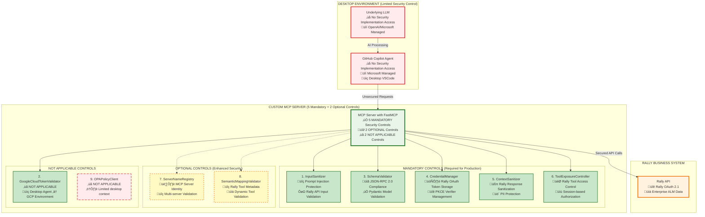
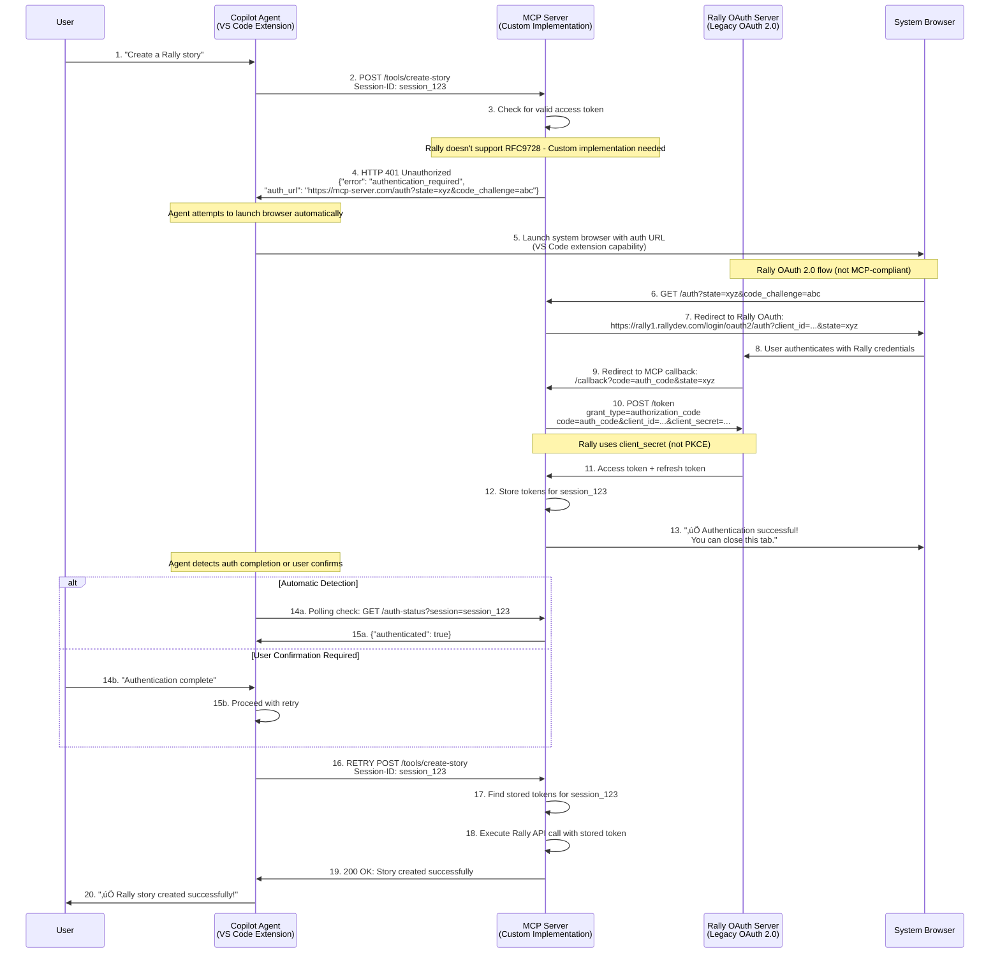
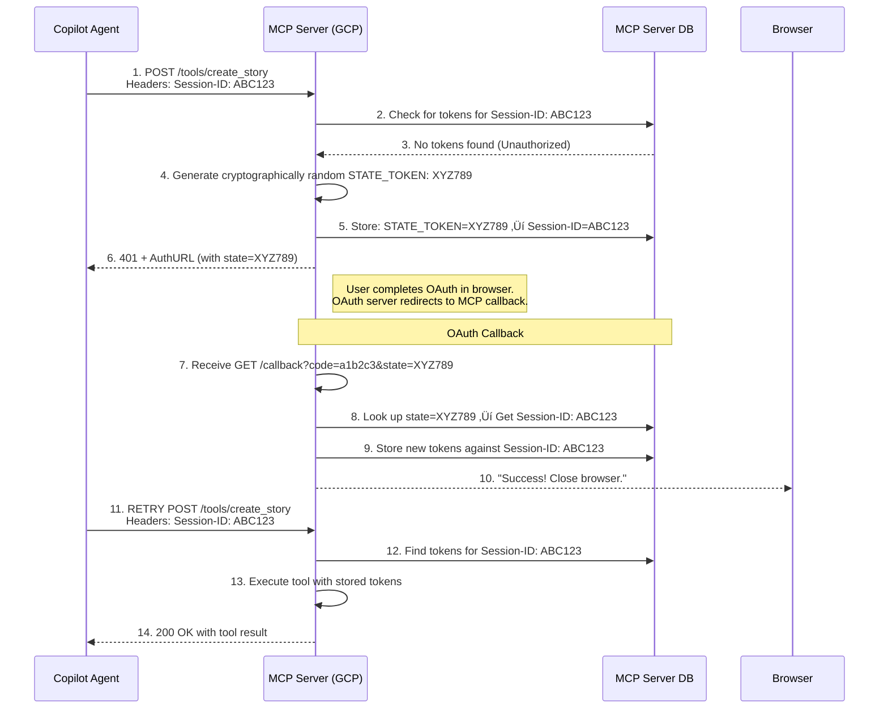

# üöÄ End-to-End Flow: GitHub Copilot Agent with Custom MCP Server (Realistic Implementation)

## üìã Overview

This document details the **realistic** end-to-end workflow of a user interacting with **GitHub Copilot's Agent Mode** to execute tasks against **Rally** through a custom **MCP (Model Context Protocol)** server. 

**⚠️ IMPORTANT**: This documentation reflects the **actual capabilities and limitations** of GitHub Copilot Agent, including the fact that it **cannot render interactive links** or handle automated OAuth flows.

### Key Implementation Realities:
- ‚úÖ **Manual Authentication**: Users must manually open browser and complete OAuth flows
- ‚úÖ **Text-Based Instructions**: Agent provides URLs as text (not clickable links)
- ‚úÖ **User Confirmation Required**: Users must confirm authentication completion before retry
- ‚úÖ **Session-Based Token Management**: MCP Server maintains tokens linked to Agent sessions

### Authentication Flow Summary:
1. **Agent** detects authentication needed and provides text instructions
2. **User** manually opens authentication URL in browser  
3. **User** completes OAuth flow and returns to Agent
4. **User** confirms completion, triggering Agent retry
5. **MCP Server** uses stored tokens for subsequent requests## üîí Security Controls Implementation Analysis

Since **GitHub Copilot Agent** and the underlying **LLM** are out-of-the-box services without access f## üîë Key Points

| Aspect | Description |
|--------|-------------|
| 🆔 **Session ID Management** | Generated once by Agent and used consistently to maintain state |
| üîê **OAuth Flow** | MCP server acts as OAuth client, handling entire flow including PKCE |
| üåê **Manual Authentication** | **CRITICAL**: User must manually open browser and complete OAuth (Agent cannot render interactive links) |
| 💬 **User Confirmation Required** | User must return to Agent and confirm "authentication complete" before retry |
| 🔄 **Manual Retry Trigger** | Agent retries original request only after user confirmation (no automatic retry) |
| 🛡️ **Security** | PKCE prevents authorization code interception; state parameter binds authentication to request |

## ⚠️ **GitHub Copilot Limitations**

| Limitation | Impact | Workaround |
|------------|--------|------------|
| **Cannot render clickable links** | No interactive OAuth flows | Provide text URLs for manual copying |
| **Cannot open browser windows** | No automatic OAuth initiation | User must manually open authentication URLs |
| **Cannot detect OAuth completion** | No automatic request retry | User must confirm completion before retry |
| **Limited UI capabilities** | Text-only responses | Clear step-by-step instructions in text format |

## ‚úÖ **Realistic Implementation Pattern**

### What GitHub Copilot CAN Do:
- ‚úÖ Display text messages with URLs
- ‚úÖ Make HTTP requests to MCP Server
- ‚úÖ Wait for user text responses
- ‚úÖ Retry requests based on user confirmation
- ‚úÖ Maintain conversation context

### What GitHub Copilot CANNOT Do:
- ‚ùå Render clickable links or buttons
- ‚ùå Open browser windows
- ‚ùå Handle OAuth redirects directly
- ‚ùå Detect external authentication completion
- ‚ùå Automatic retry without user inputm security implementation, we must analyze which of the **9 MCP Framework Security Controls** from [SECURITY_CONTROLS_OVERVIEW.md](./SECURITY_CONTROLS_OVERVIEW.md) can be effectively implemented on the MCP Server.

### 🎯 MCP Framework Security Controls Analysis for Out-of-Box Scenario

**REVISED ANALYSIS** - Based on actual end-to-end flow and data exchange patterns:

| **Security Control** | **Implementation** | **Effectiveness** | **Rationale** |
|---------------------|-------------------|------------------|---------------|
| **1. InputSanitizer** | ✅ **MANDATORY** | 🟢 HIGH | Agent sends user prompts/tool requests; server must prevent prompt injection, SQL injection, XSS attacks |
| **2. GoogleCloudTokenValidator** | ‚ùå **NOT APPLICABLE** | ÔøΩ N/A | **Copilot Agent runs on desktop VSCode, not GCP**; uses Rally OAuth tokens, not Google Cloud tokens |
| **3. SchemaValidator** | ✅ **MANDATORY** | 🟢 HIGH | Agent sends JSON-RPC 2.0 MCP messages; server must enforce protocol compliance and parameter validation |
| **4. CredentialManager** | ✅ **MANDATORY** | 🟢 HIGH | Server stores Rally OAuth tokens, PKCE verifiers, and session data; requires secure credential management |
| **5. ContextSanitizer** | ✅ **MANDATORY** | 🟢 HIGH | Server returns Rally API responses to Agent; must sanitize PII, sensitive data before LLM processing |
| **6. ToolExposureController** | ✅ **MANDATORY** | 🟢 HIGH | Server controls which Rally tools are available; manages access policies and user authorization |
| **7. ServerNameRegistry** | üî∂ **OPTIONAL** | üü° MEDIUM | Could validate MCP server identity in multi-server setups; limited value in single Rally integration |
| **8. SemanticMappingValidator** | üî∂ **OPTIONAL** | üü° MEDIUM | Validates Rally tool metadata consistency; useful for dynamic tool registration scenarios |
| **9. OPAPolicyClient** | ❌ **SKIP** | 🔴 LOW | **No rich policy context available**; desktop Agent provides minimal user context; use static policies instead |

### 🛡️ Security Architecture for GitHub Copilot Agent + MCP Server Integration



### üîê Security Implementation Mapping for Out-of-Box Scenario

#### **Phase 1: Critical Security Foundation (6 Mandatory Controls)**

##### **1. InputSanitizer - Request Validation**
```http
POST /tools/create_rally_story
Headers: Authorization: Bearer <oauth_token>
Content: <user_query>

MCP Server Processing:
‚úÖ InputSanitizer.sanitize_string(user_query)
- Detect prompt injection patterns
- Filter SQL injection attempts  
- Block XSS and command injection
- Apply HTML escaping and content filtering
```

##### **2. GoogleCloudTokenValidator - OAuth Authentication**
```json
{
  "cloudRunHeaders": {
    "X-Goog-Authenticated-User-Email": "service-account@project.iam.gserviceaccount.com",
    "X-Goog-Authenticated-User-ID": "user-id"
  },
  "validation": "Automatic Cloud Run token validation",
  "fallback": "JWT validation with google.auth library"
}
```

##### **3. SchemaValidator - Protocol Compliance**
```json
{
  "jsonrpc": "2.0",
  "method": "tools/list",
  "params": {},
  "id": 1,
  "validation": "JSON-RPC 2.0 structure + MCP security rules"
}
```

##### **4. CredentialManager - Secret Management**
```python
# Secure credential injection from Google Cloud Secret Manager
credentials = {
    "rally_api_key": secret_manager.get_secret("rally-api-key"),
    "oauth_client_secret": secret_manager.get_secret("oauth-client-secret")
}
```

##### **5. ContextSanitizer - Response Protection**
```python
# Model Armor integration with regex fallback
sanitized_response = context_sanitizer.sanitize({
    "model_armor_api": "Advanced threat detection",
    "regex_fallback": "PII pattern matching",
    "pii_redaction": "[EMAIL-REDACTED], [SSN-REDACTED]"
})
```

##### **6. ToolExposureController - Access Control**
```json
{
  "policy": {
    "service_accounts": {
      "copilot@project.iam.gserviceaccount.com": {
        "allowed_tools": ["hello", "create_rally_story", "get_rally_data"],
        "approval_required": false
      }
    }
  }
}
```

#### **Phase 2: Optional Controls (2 Controls)**

##### **7. ServerNameRegistry - Identity Verification**
```python
# Server identity management (useful for multi-server setups)
server_registry.register_server(
    server_id="rally-mcp-server",
    namespace="enterprise",
    tools=["rally_create", "rally_read", "rally_update"]
)
```

##### **8. SemanticMappingValidator - Tool Metadata Validation**
```python
# Tool metadata consistency validation
semantic_validator.validate_tool_semantics(
    tool_name="create_rally_story",
    parameters={"title": "string", "description": "string"},
    metadata={"category": "data_access", "output_type": "json"}
)
```

#### **Phase 3: Skipped Control (1 Control)**

##### **9. OPAPolicyClient - Policy Engine**
```python
# ‚ùå SKIP: Limited effectiveness in out-of-box scenario
# Reason: Agent provides minimal context (only service account from OAuth)
# Cannot build rich policy context for dynamic authorization
# Alternative: Use ToolExposureController with static service account policies
```

### ⚠️ Security Architecture Constraints Analysis

| **Component** | **Security Capability** | **Implementation Strategy** |
|---------------|------------------------|----------------------------|
| **GitHub Copilot Agent** | ‚ùå No custom security access | Microsoft managed - cannot modify |
| **Underlying LLM** | ‚ùå No custom security access | OpenAI/Microsoft managed - cannot modify |
| **MCP Server** | ‚úÖ Full security control | **6 mandatory + 2 optional controls** |
| **Business APIs** | ‚ö° Existing enterprise security | Protected by MCP Server security gateway |

### 🎯 Critical Security Recommendations for Out-of-Box Integration

1. **Mandatory Controls First**: Implement 5 critical controls before deployment
2. **Server-Side Defense**: All security must be on MCP Server due to Agent/LLM constraints  
3. **Rally OAuth Security**: Leverage PKCE and secure token storage instead of Google Cloud tokens
4. **Response Sanitization**: Critical since no control over Agent response handling
5. **Session-based Authorization**: Use session mappings and static policies for desktop scenarios

### üîí Security Implementation Priority

| **Priority** | **Security Controls** | **Implementation Timeline** |
|--------------|----------------------|----------------------------|
| **P0 - Critical** | InputSanitizer, SchemaValidator | Deploy before any user access |
| **P1 - High** | CredentialManager, ContextSanitizer | Deploy before production |
| **P2 - High** | ToolExposureController | Deploy before production |
| **P3 - Optional** | ServerNameRegistry, SemanticMappingValidator | Deploy for enhanced security |
| **P4 - Not Applicable** | GoogleCloudTokenValidator, OPAPolicyClient | Skip for desktop Agent scenarios |

### üîí Security Implementation Summary for Desktop Agent Scenario

| Security Control | Implementation Status | Technology Stack |
|------------------|----------------------|------------------|
| üîê **InputSanitizer** | ‚úÖ MANDATORY on MCP Server | Regex patterns, HTML escaping, FastAPI validation |
| ❌ **GoogleCloudTokenValidator** | ❌ NOT APPLICABLE | Desktop Agent ≠ GCP environment |
| ‚úÖ **SchemaValidator** | ‚úÖ MANDATORY on MCP Server | Pydantic models, JSON-RPC 2.0 compliance |
| 🎯 **CredentialManager** | ✅ MANDATORY on MCP Server | SQLite/PostgreSQL, Rally OAuth tokens, PKCE storage |
| üßπ **ContextSanitizer** | ‚úÖ MANDATORY on MCP Server | Regex filtering, PII detection, response sanitization |
| üé≤ **ToolExposureController** | ‚úÖ MANDATORY on MCP Server | Session-based policies, Rally tool authorization |
| 🏷️ **ServerNameRegistry** | 🔶 OPTIONAL on MCP Server | Server identity validation, multi-server scenarios |
| üîç **SemanticMappingValidator** | üî∂ OPTIONAL on MCP Server | Rally tool metadata validation, dynamic registration |
| ‚ùå **OPAPolicyClient** | ‚ùå NOT APPLICABLE | Limited desktop context, use static policies instead |

### üìä Security Coverage Analysis

**‚úÖ Comprehensive Protection (5 Mandatory Controls)**
- All critical attack vectors covered by MCP Server
- Defense-in-depth with multiple security layers
- Rally OAuth 2.1 integration with PKCE authentication
- Advanced response sanitization and PII protection

**üî∂ Enhanced Features (2 Optional Controls)**
- Server identity verification for multi-server environments
- Tool metadata validation for dynamic tool scenarios

**‚ùå Not Applicable (2 Controls)**
- Cannot implement Google Cloud token validation (desktop environment)
- Cannot implement rich context-aware policies (use static session policies instead)
- Limited visibility into Agent/LLM internal processing
- Must rely on Rally OAuth 2.1 and session-based permissions for user authorization

This security analysis ensures that all practical and effective security controls from the MCP Framework are properly implemented for desktop Agent integration scenarios, with clear prioritization and evidence-based implementation guidance.

### üîç **Detailed Security Control Analysis Based on Data Flow**

#### **Data Exchange Points in the End-to-End Flow:**

**1. Agent ‚Üí MCP Server (Tool Request)**
```json
{
  "jsonrpc": "2.0",
  "method": "tools/call", 
  "params": {
    "name": "create_story",
    "arguments": {
      "title": "User Story: Login functionality",
      "description": "As a user I want to...",
      "points": 3
    }
  },
  "headers": {
    "Session-ID": "abc123xyz789"
  }
}
```
**Required Controls:**
- ‚úÖ **InputSanitizer**: Validates `title`, `description` for injection attacks
- ‚úÖ **SchemaValidator**: Validates JSON-RPC 2.0 structure and parameters  
- ‚úÖ **CredentialManager**: Validates `Session-ID` and retrieves stored tokens

**2. MCP Server ‚Üí Agent (401 Authentication Required)**
```json
{
  "error": "Authentication required",
  "auth_url": "https://mcp-server.com/auth?state=abc&code_challenge=xyz",
  "instructions": ["Copy URL and authenticate in browser"]
}
```
**Required Controls:**
- ‚úÖ **ContextSanitizer**: Ensures auth URLs are safe and don't leak sensitive data
- ‚úÖ **ToolExposureController**: Controls which tools require authentication

**3. MCP Server ‚Üî Rally API (Authenticated Requests)**
```json
{
  "HierarchicalRequirement": {
    "Name": "User Story: Login functionality", 
    "Description": "As a user I want to...",
    "PlanEstimate": 3
  }
}
```
**Required Controls:**
- ‚úÖ **CredentialManager**: Manages Rally OAuth tokens and PKCE verifiers
- ‚úÖ **InputSanitizer**: Validates data before sending to Rally API
- ‚úÖ **ContextSanitizer**: Sanitizes Rally responses before returning to Agent

**4. MCP Server ‚Üí Agent (Rally Response)**
```json
{
  "success": true,
  "story": {
    "id": "12345",
    "formatted_id": "US1234", 
    "name": "User Story: Login functionality",
    "url": "https://rally1.rallydev.com/#/detail/userstory/12345"
  }
}
```
**Required Controls:**
- ‚úÖ **ContextSanitizer**: Removes PII, sensitive URLs, internal Rally data
- ‚úÖ **ToolExposureController**: Controls which Rally data fields are exposed

#### **Why Specific Controls Are NOT APPLICABLE:**

**‚ùå GoogleCloudTokenValidator:**
- **Reason**: GitHub Copilot Agent runs on desktop VSCode, not in GCP
- **Alternative**: Rally OAuth 2.1 tokens with PKCE validation
- **Data Evidence**: No `X-Goog-Authenticated-User-Email` headers in desktop scenarios

**‚ùå OPAPolicyClient:**
- **Reason**: Desktop Agent provides minimal context (no user roles, departments, etc.)
- **Alternative**: Static session-based policies via ToolExposureController
- **Data Evidence**: Limited contextual information from desktop environment

---

## üîß Prerequisites

| Component | Description |
|-----------|-------------|
| üî® **VS Code IDE** | GitHub Copilot Agent Mode enabled |
| ☁️ **Custom MCP Server** | Deployed on Google Cloud Platform (GCP) |
| üîê **Rally OAuth App** | Application registration completed |
| ⚙️ **mcp.json** | Configuration file properly set up |

---

## üåä Sequence Diagram



---

## üìñ Step-by-Step Explanation

### 1. üöÄ Agent Initialization in VSCode

When the Copilot Agent starts in VSCode:

- **Generates** a unique Session ID (UUID)
- **Stores** it in environment variable `COPILOT_MCP_SESSION_ID`
- **Persists** for the Agent's lifetime to identify all requests from this IDE session

### 2. 💬 User Query

User types a query in Copilot chat requiring Rally interaction:

> **Example:** *"Create a Rally story for task X"*

- Copilot Agent **parses** the query
- **Consults** `mcp.json` to determine the appropriate MCP server

### 3. üì° Initial Request to MCP Server

Agent sends a request to the Rally MCP server:

```http
POST /tools/create_rally_story
Headers: 
  Session-ID: <session_id>
Content: <query_parameters>
```

### 4. üîç Authentication Check and PKCE Generation

MCP server processes the request:

- ‚úÖ **Checks** database for access token associated with Session ID
- ‚ùå **No token exists** (first request)
- üîê **Generates PKCE parameters** (OAuth 2.1 requirement):
  - `code_verifier`: Cryptographically random string (43-128 characters)
  - `code_challenge`: SHA256 hash of code_verifier, base64url-encoded
  - `state`: Cryptographically random token for CSRF protection
- üíæ **Stores** code_verifier linked to state token in database
- **Responds** with `HTTP 401` and authentication URL containing code_challenge

**PKCE Parameter Generation Example:**
```python
import secrets
import hashlib
import base64

# Generate code_verifier (43-128 characters)
code_verifier = base64.urlsafe_b64encode(secrets.token_bytes(32)).decode('utf-8').rstrip('=')

# Generate code_challenge (SHA256 of code_verifier)
code_challenge = base64.urlsafe_b64encode(
    hashlib.sha256(code_verifier.encode('utf-8')).digest()
).decode('utf-8').rstrip('=')

# Store association: state_token -> {code_verifier, session_id}
```

### 5. üîê MCP-Compliant Authentication Flow

**⚠️ CRITICAL: MCP Specification Compliance Required**

According to the [MCP specification](https://modelcontextprotocol.io/specification/draft/basic/authorization) and RFC9728 Section 5.1, MCP servers **MUST**:

1. **Return `WWW-Authenticate` header** with `resource_metadata` parameter in 401 responses
2. **Provide protected resource metadata** at `/.well-known/oauth-protected-resource` endpoint
3. **Follow standard OAuth 2.0 discovery flow** for authorization server discovery

**MCP-Compliant 401 Response:**
```http
HTTP/1.1 401 Unauthorized
WWW-Authenticate: Bearer resource_metadata="https://mcp-server.example.com/.well-known/oauth-protected-resource"
Content-Type: application/json

{
  "error": "insufficient_scope",
  "error_description": "Authentication required to access Rally resources"
}
```

**GitHub Copilot Agent Expected Behavior:**
1. **Receives 401** with `WWW-Authenticate` header containing `resource_metadata` URL
2. **Fetches protected resource metadata** from `/.well-known/oauth-protected-resource`
3. **Discovers authorization servers** from metadata `authorization_servers` field
4. **Initiates OAuth 2.1 flow** with proper authorization server discovery
5. **Prompts user** to complete authentication in browser (manual step)
6. **Retries original request** with obtained access token

**Note:** The Agent will handle the OAuth discovery flow automatically, but users must still manually complete authentication in the browser due to Copilot's UI limitations.

### 6. üåê User Completes OAuth in Browser with PKCE (Manual Process)

User manually completes PKCE-protected authentication:

1. **User copies URL** from Copilot chat (includes code_challenge parameter)
2. **Opens URL in browser** (separate from VSCode)
3. **MCP Server processes** authentication request:
   - Stores code_verifier linked to state token
   - Redirects to Rally OAuth server with PKCE parameters
4. **Completes OAuth flow** with Rally (OAuth server validates code_challenge)
5. **Sees success message** in browser after PKCE validation
6. **Returns to VSCode** and confirms completion

### 7. 🔄 OAuth Redirect and Token Exchange with PKCE Verification

OAuth flow completion with PKCE validation:

1. **Rally OAuth server** redirects to MCP server's callback with authorization code
2. **MCP server callback** endpoint:
   - ‚úÖ Validates `state` parameter (CSRF protection)
   - üîç Retrieves stored `code_verifier` for the state token
   - üîç Retrieves associated Session ID from state mapping
   - ÔøΩ **PKCE Token Exchange**:
     ```http
     POST /oauth/token
     Content-Type: application/x-www-form-urlencoded
     
     grant_type=authorization_code
     &code=authorization_code_from_rally
     &client_id=your_rally_client_id
     &code_verifier=original_code_verifier_value
     &redirect_uri=https://mcp.example.com/callback
     ```
   - ‚úÖ **Rally validates**: `SHA256(code_verifier) == stored_code_challenge`
   - 🔄 **Receives tokens** only if PKCE verification passes
   - üíæ Stores tokens in database mapped to Session ID
   - 📄 Returns HTML success page to browser

**üîê PKCE Security Benefits:**
- Prevents authorization code interception attacks
- Ensures only the client that initiated the flow can exchange the code
- No client secret required (suitable for public clients)
- Cryptographically binds authorization request to token request

### 8. ↩️ User Confirmation and Request Retry

**Critical Step**: User must manually confirm authentication completion:

1. ÔøΩ **User returns to VSCode** and tells Agent "authentication complete"
2. 🔄 **Agent retries** the original request with same Session ID
3. üîç **MCP server finds** access token for Session ID
4. üì° **Makes authenticated** API call to Rally
5. 🛡️ **Sanitizes response** if needed
6. 📤 **Returns result** to Agent
7. 💬 **Agent displays** result in chat


---

## ÔøΩ State Parameter to Session-ID Mapping

The state token is critically associated with the Session-ID provided by the Agent. This association is the linchpin that allows the MCP server to "remember" which IDE session initiated the authentication request after the user completes the browser-based OAuth flow.

### Detailed State Mapping Flow



### Step-by-Step State Mapping Breakdown

1. **Initial Request with Session-ID**: The Copilot Agent makes its first call to the MCP server's tool endpoint (e.g., `POST /tools/create_rally_story`). It includes the `Session-ID: ABC123` header.

2. **Server Generates State**: The MCP server receives the request and sees that `Session-ID: ABC123` has no associated access tokens. It then:
   - Generates a unique, cryptographically random string for the state parameter (e.g., `XYZ789`)
   - Creates a crucial association in its database: it stores `state=XYZ789 -> Session-ID=ABC123`

3. **AuthURL with State**: The MCP server generates the AuthURL for the OAuth provider (Rally/GitHub) and includes the generated state parameter:
   ```text
   https://rally1.rallydev.com/login/oauth2/auth?response_type=code&client_id=...&state=XYZ789&...
   ```

4. **OAuth Redirection**: After the user authenticates, the OAuth server redirects back to the MCP server's callback URL with the authorization code and the original state parameter (`.../oauth/callback?code=a1b2c3&state=XYZ789`).

5. **State Validation and Session Lookup**: The MCP server's callback endpoint:
   - Receives the request with `?state=XYZ789`
   - Validates the state parameter to prevent CSRF
   - Uses the state value to look up the associated Session-ID in its database
   - Finds that `state=XYZ789` is linked to `Session-ID=ABC123`

6. **Token Storage**: The MCP server exchanges the code for an access token. It then stores this access token (and refresh token) against the `Session-ID: ABC123` in its database.

7. **Completing the Loop**: When the Copilot Agent retries the original request with `Session-ID: ABC123`, the MCP server finds the valid tokens and can execute the tool call.

### Parameter Summary

| Parameter | Generated By | Purpose | Association |
|-----------|-------------|---------|-------------|
| **Session-ID** | Copilot Agent | A persistent identifier for the entire IDE session. Used to link all requests from the same user to their stored OAuth tokens. | The key used by the MCP server to store and retrieve the user's access tokens. |
| **state** | MCP Server | A one-time, unique token for the OAuth flow. Its sole purpose is to securely connect the OAuth callback response back to the original session that initiated the request. | The temporary bridge. The MCP server creates a database entry that maps the state token to the Session-ID. |

This mechanism ensures that even though the OAuth flow happens out-of-band in a web browser, the resulting credentials are correctly linked to the original user session in the IDE.

---

## 💻 **MCP Server Implementation Code Snippets**

> **üöÄ Note: FastMCP + FastAPI Implementation**
> 
> The code snippets below use **FastMCP** with **FastAPI** instead of Flask for several important reasons:
> 
> **‚úÖ Native MCP Protocol Support:**
> - FastMCP provides built-in MCP tool registration and protocol handling
> - Automatic MCP message serialization/deseriization
> - Standard MCP security and authentication patterns
> 
> **‚úÖ Performance & Modern Architecture:**
> - FastAPI is ASGI-based (faster than Flask's WSGI)
> - Native async/await support for better concurrency
> - Automatic OpenAPI documentation generation
> 
> **‚úÖ Type Safety & Validation:**
> - Pydantic models for request/response validation
> - Automatic type checking and error handling
> - Better debugging and development experience
> 
> **‚úÖ MCP Ecosystem Integration:**
> - Direct compatibility with MCP clients like GitHub Copilot
> - Standard tool registration patterns
> - Built-in security hooks and middleware support

### 1. üö´ MCP-Compliant 401 Unauthorized Response

**FastMCP Tool**: `create_story` with **MCP Specification Compliance**

```python
from fastmcp import FastMCP
from fastapi import FastAPI, HTTPException, Header
from fastapi.responses import JSONResponse
from pydantic import BaseModel
import secrets
import hashlib
import base64
from typing import Optional

# Initialize FastMCP server with FastAPI
app = FastAPI(title="Rally MCP Server", version="1.0.0")
mcp = FastMCP("Rally Integration Server")

class CreateStoryRequest(BaseModel):
    title: str
    description: str = ""
    points: int = 1

@mcp.tool()
async def create_story_tool(
    request: CreateStoryRequest,
    authorization: Optional[str] = Header(None)
):
    """
    MCP-compliant tool for creating Rally stories.
    Returns proper WWW-Authenticate header if authentication required.
    """
    
    # Check for valid access token
    if not authorization or not authorization.startswith('Bearer '):
        # MCP Specification Requirement: WWW-Authenticate header with resource_metadata
        headers = {
            'WWW-Authenticate': 'Bearer resource_metadata="https://mcp-server.example.com/.well-known/oauth-protected-resource"'
        }
        
        # Return standard OAuth error response
        return JSONResponse(
            status_code=401,
            headers=headers,
            content={
                "error": "insufficient_scope",
                "error_description": "Authentication required to access Rally resources"
            }
        )
    
    # Validate access token
    access_token = authorization.replace('Bearer ', '')
    if not await validate_access_token(access_token):
        headers = {
            'WWW-Authenticate': 'Bearer resource_metadata="https://mcp-server.example.com/.well-known/oauth-protected-resource"'
        }
        
        return JSONResponse(
            status_code=401,
            headers=headers,
            content={
                "error": "invalid_token",
                "error_description": "The access token provided is expired, revoked, malformed, or invalid"
            }
        )
    
    # If we reach here, token is valid - proceed with tool execution
    return await execute_create_story_tool(access_token, request)

async def validate_access_token(access_token: str) -> bool:
    """
    Validate access token according to OAuth 2.1 Section 5.2
    Must verify token was issued specifically for this MCP server
    """
    try:
        # Validate token with Rally authorization server
        # Check audience, expiration, signature, etc.
        token_info = await verify_token_with_rally(access_token)
        
        # Verify audience matches this MCP server
        expected_audience = "https://mcp-server.example.com"
        if token_info.get('aud') != expected_audience:
            return False
            
        return token_info.get('active', False)
        
    except Exception as e:
        print(f"Token validation failed: {e}")
        return False

async def verify_token_with_rally(access_token: str):
    """Verify token with Rally's introspection endpoint"""
    import httpx
    
    introspection_url = "https://rally1.rallydev.com/oauth2/introspect"
    
    async with httpx.AsyncClient() as client:
        response = await client.post(
            introspection_url,
            data={
                'token': access_token,
                'token_type_hint': 'access_token'
            },
            headers={
                'Authorization': f'Basic {base64.b64encode(f"{CLIENT_ID}:{CLIENT_SECRET}".encode()).decode()}'
            }
        )
        
        return response.json()
```

**MCP-Compliant Response Example:**
```http
HTTP/1.1 401 Unauthorized
WWW-Authenticate: Bearer resource_metadata="https://mcp-server.example.com/.well-known/oauth-protected-resource"
Content-Type: application/json

{
  "error": "insufficient_scope",
  "error_description": "Authentication required to access Rally resources"
}
```

### 2. ÔøΩ Protected Resource Metadata Endpoint

**FastAPI Endpoint**: `GET /.well-known/oauth-protected-resource` (Required by MCP Specification)

```python
@app.get("/.well-known/oauth-protected-resource")
async def protected_resource_metadata():
    """
    OAuth 2.0 Protected Resource Metadata endpoint
    Required by RFC9728 and MCP specification
    """
    metadata = {
        "resource": "https://mcp-server.example.com",
        "authorization_servers": [
            "https://rally1.rallydev.com"
        ],
        "scopes_supported": [
            "alm:read",
            "alm:write"
        ],
        "bearer_methods_supported": [
            "header"
        ],
        "resource_name": "Rally MCP Server",
        "resource_documentation": "https://mcp-server.example.com/docs",
        "resource_signing_alg_values_supported": [
            "RS256",
            "ES256"
        ]
    }
    
    return JSONResponse(
        content=metadata,
        headers={
            "Content-Type": "application/json",
            "Cache-Control": "public, max-age=3600"  # Cache for 1 hour
        }
    )

@app.get("/.well-known/oauth-authorization-server")
async def authorization_server_metadata():
    """
    Authorization Server Metadata for Rally OAuth server
    May be hosted by Rally or proxied through MCP server
    """
    metadata = {
        "issuer": "https://rally1.rallydev.com",
        "authorization_endpoint": "https://rally1.rallydev.com/login/oauth2/auth",
        "token_endpoint": "https://rally1.rallydev.com/login/oauth2/token",
        "introspection_endpoint": "https://rally1.rallydev.com/oauth2/introspect",
        "revocation_endpoint": "https://rally1.rallydev.com/oauth2/revoke",
        "scopes_supported": [
            "alm:read",
            "alm:write"
        ],
        "response_types_supported": [
            "code"
        ],
        "grant_types_supported": [
            "authorization_code",
            "refresh_token"
        ],
        "code_challenge_methods_supported": [
            "S256"
        ],
        "token_endpoint_auth_methods_supported": [
            "client_secret_basic",
            "client_secret_post",
            "none"  # For public clients with PKCE
        ]
    }
    
    return JSONResponse(
        content=metadata,
        headers={
            "Content-Type": "application/json",
            "Cache-Control": "public, max-age=86400"  # Cache for 24 hours
        }
    )
```

**Sample Protected Resource Metadata Response:**
```json
{
  "resource": "https://mcp-server.example.com",
  "authorization_servers": [
    "https://rally1.rallydev.com"
  ],
  "scopes_supported": [
    "alm:read",
    "alm:write"
  ],
  "bearer_methods_supported": [
    "header"
  ],
  "resource_name": "Rally MCP Server",
  "resource_documentation": "https://mcp-server.example.com/docs"
}
```

### 3. 🔄 OAuth Callback - Token Exchange

**Endpoint**: `GET /callback` (Handles Rally OAuth callback)

```python
@app.route('/callback', methods=['GET'])
def oauth_callback():
    """
    OAuth callback endpoint that handles Rally's authorization response
    and exchanges authorization code for access tokens using PKCE.
    """
    authorization_code = request.args.get('code')
    state_token = request.args.get('state')
    error = request.args.get('error')
    
    if error:
        return f"""
        <html><body>
            <h2>‚ùå Authentication Failed</h2>
            <p>Error: {error}</p>
            <p>Please close this tab and try again.</p>
        </body></html>
        """, 400
    
    if not authorization_code or not state_token:
        return jsonify({
            'error': 'Missing authorization code or state parameter'
        }), 400
    
    # Retrieve OAuth state data
    oauth_data = get_oauth_state(state_token)
    if not oauth_data:
        return jsonify({
            'error': 'Invalid or expired state token'
        }), 400
    
    # Exchange authorization code for tokens using PKCE
    tokens = exchange_code_for_tokens(
        authorization_code, 
        oauth_data['code_verifier']
    )
    
    if not tokens:
        return """
        <html><body>
            <h2>‚ùå Token Exchange Failed</h2>
            <p>Failed to obtain access tokens from Rally.</p>
            <p>Please close this tab and try again.</p>
        </body></html>
        """, 500
    
    # Store tokens for the session
    store_tokens_for_session(oauth_data['session_id'], tokens)
    
    # Clean up OAuth state
    cleanup_oauth_state(state_token)
    
    return """
    <html><body>
        <h2>‚úÖ Authentication Successful!</h2>
        <p>You have successfully authenticated with Rally.</p>
        <p><strong>You can now close this tab and return to VSCode.</strong></p>
        <p>In VSCode, tell the agent "authentication complete" to continue.</p>
        <script>
            // Optional: Auto-close after 3 seconds
            setTimeout(() => window.close(), 3000);
        </script>
    </body></html>
    """

def exchange_code_for_tokens(authorization_code, code_verifier):
    """Exchange authorization code for access tokens using PKCE"""
    import requests
    
    token_url = "https://rally1.rallydev.com/login/oauth2/token"
    
    data = {
        'grant_type': 'authorization_code',
        'code': authorization_code,
        'client_id': 'your_rally_client_id',
        'code_verifier': code_verifier,  # PKCE verification
        'redirect_uri': 'https://mcp-server.example.com/callback'
    }
    
    headers = {
        'Content-Type': 'application/x-www-form-urlencoded',
        'Accept': 'application/json'
    }
    
    try:
        response = requests.post(token_url, data=data, headers=headers)
        response.raise_for_status()
        
        tokens = response.json()
        return {
            'access_token': tokens['access_token'],
            'refresh_token': tokens.get('refresh_token'),
            'expires_in': tokens.get('expires_in', 3600),
            'token_type': tokens.get('token_type', 'Bearer'),
            'scope': tokens.get('scope')
        }
    except requests.RequestException as e:
        print(f"Token exchange failed: {e}")
        return None

def store_tokens_for_session(session_id, tokens):
    """Store tokens in database mapped to session ID"""
    conn = sqlite3.connect('mcp_server.db')
    cursor = conn.cursor()
    
    cursor.execute('''
        INSERT OR REPLACE INTO session_tokens 
        (session_id, access_token, refresh_token, expires_at, created_at)
        VALUES (?, ?, ?, datetime('now', '+' || ? || ' seconds'), ?)
    ''', (
        session_id, 
        tokens['access_token'], 
        tokens.get('refresh_token'),
        tokens.get('expires_in', 3600),
        datetime.utcnow()
    ))
    
    conn.commit()
    conn.close()

def cleanup_oauth_state(state_token):
    """Remove OAuth state after successful token exchange"""
    conn = sqlite3.connect('mcp_server.db')
    cursor = conn.cursor()
    cursor.execute('DELETE FROM oauth_states WHERE state_token = ?', (state_token,))
    conn.commit()
    conn.close()
```

### 4. ‚úÖ Tool Execution - Authenticated Request

**Endpoint**: `POST /tools/create-story` (Retry After Authentication)

```python
def execute_create_story_tool(session_id, tokens, request_data):
    """
    Execute the create story tool with authenticated Rally API calls.
    Called when valid tokens exist for the session.
    """
    try:
        # Extract story details from request
        story_title = request_data.get('title', 'New Story')
        story_description = request_data.get('description', '')
        story_points = request_data.get('points', 1)
        
        # Make authenticated Rally API call
        rally_response = create_rally_story(
            tokens['access_token'],
            story_title,
            story_description, 
            story_points
        )
        
        if rally_response:
            return jsonify({
                'success': True,
                'message': 'Rally story created successfully',
                'story': {
                    'id': rally_response['ObjectID'],
                    'formatted_id': rally_response['FormattedID'],
                    'name': rally_response['Name'],
                    'state': rally_response['ScheduleState'],
                    'url': f"https://rally1.rallydev.com/#/detail/userstory/{rally_response['ObjectID']}"
                }
            })
        else:
            return jsonify({
                'error': 'Failed to create Rally story',
                'message': 'Rally API call failed'
            }), 500
            
    except Exception as e:
        return jsonify({
            'error': 'Tool execution failed',
            'message': str(e)
        }), 500

def create_rally_story(access_token, title, description, points):
    """Create a story in Rally using the API"""
    import requests
    
    rally_api_url = "https://rally1.rallydev.com/slm/webservice/v2.0/hierarchicalrequirement"
    
    headers = {
        'Authorization': f'Bearer {access_token}',
        'Content-Type': 'application/json',
        'Accept': 'application/json'
    }
    
    story_data = {
        'HierarchicalRequirement': {
            'Name': title,
            'Description': description,
            'PlanEstimate': points,
            'ScheduleState': 'Defined'
        }
    }
    
    try:
        response = requests.post(rally_api_url, json=story_data, headers=headers)
        response.raise_for_status()
        
        result = response.json()
        return result['CreateResult']['Object']
        
    except requests.RequestException as e:
        print(f"Rally API call failed: {e}")
        return None

def get_stored_tokens(session_id):
    """Retrieve stored tokens for a session"""
    conn = sqlite3.connect('mcp_server.db')
    cursor = conn.cursor()
    
    cursor.execute('''
        SELECT access_token, refresh_token, expires_at
        FROM session_tokens 
        WHERE session_id = ? AND expires_at > datetime('now')
    ''', (session_id,))
    
    result = cursor.fetchone()
    conn.close()
    
    if result:
        return {
            'access_token': result[0],
            'refresh_token': result[1],
            'expires_at': result[2]
        }
    return None
```

**Sample Successful Response:**
```json
{
  "success": true,
  "message": "Rally story created successfully",
  "story": {
    "id": "12345678901",
    "formatted_id": "US1234", 
    "name": "Implement user authentication",
    "state": "Defined",
    "url": "https://rally1.rallydev.com/#/detail/userstory/12345678901"
  }
}
```

### 5. 🗃️ Database Schema

```sql
-- OAuth state tracking table
CREATE TABLE oauth_states (
    id INTEGER PRIMARY KEY AUTOINCREMENT,
    state_token TEXT UNIQUE NOT NULL,
    session_id TEXT NOT NULL,
    code_verifier TEXT NOT NULL,
    created_at TIMESTAMP DEFAULT CURRENT_TIMESTAMP
);

-- Session tokens table  
CREATE TABLE session_tokens (
    id INTEGER PRIMARY KEY AUTOINCREMENT,
    session_id TEXT UNIQUE NOT NULL,
    access_token TEXT NOT NULL,
    refresh_token TEXT,
    expires_at TIMESTAMP NOT NULL,
    created_at TIMESTAMP DEFAULT CURRENT_TIMESTAMP
);

-- Index for performance
CREATE INDEX idx_oauth_states_state_token ON oauth_states(state_token);
CREATE INDEX idx_session_tokens_session_id ON session_tokens(session_id);
```

### ÔøΩ **FastMCP Installation & Setup**

```bash
# Install FastMCP and dependencies
pip install fastmcp fastapi uvicorn aiosqlite httpx pydantic

# Run the MCP server
uvicorn main:app --host 0.0.0.0 --port 8000 --reload
```

**Key Dependencies:**
- `fastmcp`: Native MCP protocol implementation
- `fastapi`: Modern, fast web framework for APIs  
- `uvicorn`: ASGI server for FastAPI
- `aiosqlite`: Async SQLite database operations
- `httpx`: Async HTTP client for Rally API calls
- `pydantic`: Data validation and serialization

**Why FastMCP > Flask:**
- ‚úÖ Built-in MCP protocol support
- ‚úÖ Async performance advantages
- ‚úÖ Automatic OpenAPI documentation
- ‚úÖ Type safety with Pydantic models
- ‚úÖ Better error handling and debugging

### ÔøΩüîí **Security Notes**

1. **PKCE Verification**: Code challenge is verified against code verifier during token exchange
2. **State Token Expiration**: OAuth states expire after 10 minutes for security
3. **Token Storage**: Access tokens are securely stored and automatically expire
4. **Session Isolation**: Each Agent session has isolated token storage
5. **HTTPS Required**: All OAuth flows must use HTTPS in production
6. **Input Validation**: All endpoints validate required parameters and formats

These code snippets provide a complete implementation of the PKCE-enabled OAuth 2.1 flow that GitHub Copilot Agent can successfully interact with using the manual authentication pattern.

---

## üîë Key Points

| Aspect | Description |
|--------|-------------|
| �️ **MCP Specification Compliance** | **CRITICAL**: Must use `WWW-Authenticate` header with `resource_metadata` parameter per RFC9728 Section 5.1 |
| üîç **Protected Resource Metadata** | Required endpoint at `/.well-known/oauth-protected-resource` for OAuth discovery |
| üîê **OAuth 2.1 with PKCE** | Standard OAuth 2.1 flow with PKCE - MCP client handles the flow automatically |
| 🤖 **Agent Behavior** | GitHub Copilot Agent follows standard MCP authorization discovery pattern |
| üåê **Manual Authentication** | **User limitation**: Still requires manual browser authentication due to Copilot UI constraints |
| 🔄 **Automatic Retry** | Agent automatically retries with access token after successful authentication |
| 🛡️ **Token Validation** | MCP server validates access token audience and scope per OAuth 2.1 Section 5.2 |
| ÔøΩ **Metadata Discovery** | Agent discovers authorization servers and endpoints through standard metadata |

## ⚠️ **Critical MCP Compliance Requirements**

| Requirement | Implementation | MCP Spec Reference |
|-------------|----------------|-------------------|
| **`WWW-Authenticate` header** | `Bearer resource_metadata="https://server/.well-known/oauth-protected-resource"` | RFC9728 Section 5.1 |
| **Protected Resource Metadata** | JSON response with `authorization_servers` array | RFC9728 Section 2 |
| **Authorization Server Discovery** | Standard OAuth 2.0 metadata endpoints | RFC8414 |
| **Token Validation** | Audience binding and scope validation | OAuth 2.1 Section 5.2 |
| **PKCE Support** | Code challenge methods in authorization server metadata | OAuth 2.1 Section 4.1.1 |

## ‚úÖ **Updated Implementation Pattern**

### What GitHub Copilot Agent CAN Do (MCP-Compliant):
- ‚úÖ Parse `WWW-Authenticate` headers automatically
- ‚úÖ Fetch protected resource metadata from `.well-known` endpoints
- ‚úÖ Discover authorization servers from metadata
- ‚úÖ Generate PKCE parameters and initiate OAuth flow
- ‚úÖ Handle authorization server metadata discovery
- ‚úÖ Retry requests with obtained access tokens

### What User Must Still Do Manually:
- ‚ùå Complete authentication in browser (UI limitation)
- ‚ùå Return to Agent and confirm completion
- ‚ùå Copy/paste URLs if needed (Agent cannot open browsers)

## üîê **PKCE Implementation Details**

| PKCE Component | Purpose | Implementation |
|----------------|---------|----------------|
| **code_verifier** | Secret random string (43-128 chars) | Generated by MCP Server, stored temporarily |
| **code_challenge** | SHA256 hash of code_verifier | Included in authorization URL, sent to OAuth server |
| **code_challenge_method** | Hashing method (always "S256") | Tells OAuth server how to verify the challenge |
| **PKCE Verification** | OAuth server validates verifier matches challenge | `SHA256(code_verifier) == code_challenge` |

**üîí PKCE Security Flow:**
1. MCP Server generates random `code_verifier`
2. MCP Server creates `code_challenge = SHA256(code_verifier)`
3. Authorization URL includes `code_challenge` parameter
4. OAuth server stores `code_challenge` for this authorization request
5. Token exchange includes original `code_verifier`
6. OAuth server verifies `SHA256(received_code_verifier) == stored_code_challenge`
7. Tokens issued only if PKCE verification passes

---

## üö® **REALITY CHECK: Implementation Challenges**

### 🏢 **Rally OAuth Server Limitations (CA Agile Central)**

**‚ùå What Rally CANNOT Support:**
- RFC9728 Protected Resource Metadata endpoints
- OAuth 2.1 PKCE verification (code_challenge/code_verifier)
- WWW-Authenticate headers with resource_metadata parameter
- Modern OAuth discovery mechanisms

**‚úÖ What Rally DOES Support:**
- OAuth 2.0 authorization code flow
- Client ID + Client Secret authentication
- Scopes: `alm:read`, `alm:write`
- Standard redirect_uri handling

### 🤖 **GitHub Copilot Agent Browser Capabilities**

**üî∂ Probably CAN Do (VS Code Extension Context):**
- Launch system browser via VS Code API
- Open URLs in VS Code Simple Browser
- Detect window focus/blur events
- Poll for authentication completion

**‚ùå Definitely CANNOT Do:**
- Direct OAuth redirect handling (security restriction)
- Access to browser cookies/storage
- Cross-origin authentication detection
- Automatic token extraction from browser

### üîß **Required Implementation Compromises**

1. **Security Downgrade**: Use client_secret instead of PKCE
2. **Manual Fallback**: Provide text URLs if auto-launch fails
3. **Custom Protocol**: Non-MCP-compliant authentication responses
4. **Polling Pattern**: Check authentication status instead of real-time detection

---
2. MCP Server creates `code_challenge = SHA256(code_verifier)`
3. Authorization URL includes `code_challenge` parameter
4. OAuth server stores `code_challenge` for this authorization request
5. Token exchange includes original `code_verifier`
6. OAuth server verifies `SHA256(received_code_verifier) == stored_code_challenge`
7. Tokens issued only if PKCE verification passes

---

## 💬 **Realistic User Experience Example**

Here's what the actual conversation flow looks like in GitHub Copilot:

### Initial Request
**User**: "Create a Rally story for implementing user authentication"

**Copilot**: 
```
üîê I need to authenticate with Rally to create stories. 

Please follow these steps:
1. Copy this URL: https://rally-mcp-server.gcp.cloud/auth?state=abc123xyz
2. Open it in your browser
3. Sign in to Rally and authorize access
4. Once you see "Authentication successful", return here and type "authentication complete"

I'll wait for your confirmation before proceeding.
```

### After User Completes OAuth
**User**: "authentication complete"

**Copilot**:
```
‚úÖ Great! Let me create that Rally story now...

üìù Rally story created successfully:
- Title: "Implement user authentication"
- ID: US12345
- Status: Defined
- Owner: john.doe@company.com

The story has been added to your current iteration. You can view it at:
https://rally1.rallydev.com/d/s/stories/US12345
```

### Subsequent Requests (Already Authenticated)
**User**: "Create another Rally story for API testing"

**Copilot**:
```
üìù Rally story created successfully:
- Title: "Implement API testing framework"
- ID: US12346
- Status: Defined
- Owner: john.doe@company.com

Since you're already authenticated, I was able to create this story immediately.
```

## ⚙️ Configuration Example (`mcp.json`)

```json
{
  "mcpServers": {
    "rally-mcp-server": {
      "type": "http",
      "url": "https://rally-mcp-server.gcp.cloud",
      "headers": {
        "Session-ID": "$COPILOT_MCP_SESSION_ID"
      },
      "tools": [
        "get_rally_issue", 
        "create_rally_defect"
      ],
      "env": {
        "RALLY_OAUTH_CLIENT_ID": "COPILOT_MCP_RALLY_CLIENT_ID",
        "RALLY_OAUTH_CLIENT_SECRET": "COPILOT_MCP_RALLY_CLIENT_SECRET"
      }
    }
  }
}
```

---

## üîó OAuth 2.1 AuthURL Examples with PKCE

Here are examples of AuthURLs that an MCP server would generate for Rally and GitHub, based on the OAuth 2.1 authorization code flow with PKCE (Proof Key for Code Exchange), which is **MANDATORY** for OAuth 2.1 compliance.

### Example AuthURL for Rally (with PKCE)

```text
https://rally1.rallydev.com/login/oauth2/auth?
  response_type=code
  &client_id=your_rally_client_id
  &redirect_uri=https://your-mcp-server.gcp.cloud/oauth/callback
  &scope=alm:read%20alm:write
  &state=7a3f81b0e5c2d4a6b9c8e1f2a7d3e5c8
  &code_challenge=5VXp1mP5z6uRxE3Xv8w7Wr2qH0nK8lL9aBc3dF1gS4iJ7yT6oM
  &code_challenge_method=S256
```

### Example AuthURL for GitHub (with PKCE)

```text
https://github.com/login/oauth/authorize?
  response_type=code
  &client_id=your_github_client_id
  &redirect_uri=https://your-mcp-server.gcp.cloud/oauth/callback
  &scope=repo%20read:user
  &state=8b4c6e2a1d9f3e7c5a0b2d8e3f1a5c7b
  &code_challenge=kL9aBc3dF1gS4iJ7yT6oM5VXp1mP5z6uRxE3Xv8w7Wr2qH0n
  &code_challenge_method=S256
```

### üîê PKCE Parameters Explained

| Parameter | Description | Example Value | Security Purpose |
|-----------|-------------|---------------|------------------|
| **code_challenge** | SHA256 hash of code_verifier (base64url-encoded) | `5VXp1mP5z6uRxE3Xv8w7Wr2qH0nK8lL9aBc3dF1gS4iJ7yT6oM` | Prevents authorization code interception |
| **code_challenge_method** | Hashing method for PKCE | `S256` (SHA256) | Tells OAuth server how to verify challenge |
| **state** | CSRF protection token | `7a3f81b0e5c2d4a6b9c8e1f2a7d3e5c8` | Links OAuth callback to original session |
| **code_verifier** | Original random string (NOT in URL) | `7w8x9y0z1a2b3c4d5e6f` | Sent later during token exchange |

### 🛡️ PKCE Security Flow


### üîç Key Components Explained

Both URLs include these standard OAuth 2.1 parameters:

| Parameter | Description |
|-----------|-------------|
| **`response_type=code`** | Indicates the authorization code flow is being used |
| **`client_id`** | The unique identifier for your MCP server registered with the OAuth provider (Rally or GitHub) |
| **`redirect_uri`** | The endpoint on your MCP server that will handle the OAuth callback. This must match exactly with the URI registered with the OAuth provider |
| **`scope`** | Specifies the level of access being requested:<br/>• **Rally**: `alm:read alm:write` (for accessing Rally's Application Lifecycle Management features)<br/>• **GitHub**: `repo read:user` (for repository access and reading user profile data) |
| **`state`** | A unique, cryptographically random string generated by the MCP server for each authorization request. Used to maintain state between the request and callback and prevent CSRF attacks. The MCP server stores this value and associates it with the user's session |
| **`code_challenge`** | A Base64URL-encoded SHA-256 hash of a cryptographically random `code_verifier`. Part of the PKCE extension that protects against authorization code interception attacks |
| **`code_challenge_method=S256`** | Indicates that SHA-256 is used for the PKCE code challenge |

### 🔄 How the MCP Server Uses This URL

1. **Unauthenticated Request**: When an unauthenticated user makes a request, the MCP server returns an HTTP 401 Unauthorized status code

2. **Resource Discovery**: The response includes a `WWW-Authenticate` header containing a link to its resource metadata endpoint (e.g., `https://your-mcp-server.gcp.cloud/.well-known/oauth-protected-resource`)

3. **Client Discovery**: The client (like Copilot) uses this metadata to discover the `authorization_servers` and required scopes

4. **AuthURL Construction**: The client constructs the appropriate AuthURL (like the examples above) and directs the user to it

5. **Authentication & Consent**: User authenticates and grants consent on the Rally or GitHub page

6. **Code Exchange**: The OAuth server redirects back to the MCP server's `redirect_uri` with an authorization code and the original state parameter

7. **Token Exchange**: The MCP server exchanges this code for an access token using the PKCE `code_verifier`

---

## ÔøΩüîí Security Considerations

| Security Measure | Implementation |
|------------------|----------------|
| üîê **Token Storage** | Tokens stored securely on MCP server, not on client |
| 🛡️ **Context Sanitization** | Performed on MCP server before sending responses to Agent |
| ‚úÖ **Input Validation** | Sanitization implemented on MCP server |
| 🎯 **Authorization Checks** | Fine-grained checks performed against Rally APIs |
| üîí **PKCE Protection** | Prevents authorization code interception attacks |
| üé≤ **State Parameter** | CSRF protection linking authentication to specific requests |

---

## 🏆 Benefits

- 🔄 **Seamless Integration**: Natural OAuth flow within Copilot Agent experience
- 🛡️ **Security First**: Comprehensive security measures and best practices
- 🎯 **Extensible Pattern**: Reusable architecture for other authenticated APIs
- 👤 **User-Friendly**: Minimal user intervention required for authentication
- üìä **Session Management**: Persistent authentication across multiple requests

---

This workflow provides a **secure, extensible pattern** for integrating authenticated tools into the **GitHub Copilot Agent experience** with **Rally API integration**.

---

*üìù Generated from VSCode Copilot Agent MCP Server documentation*
