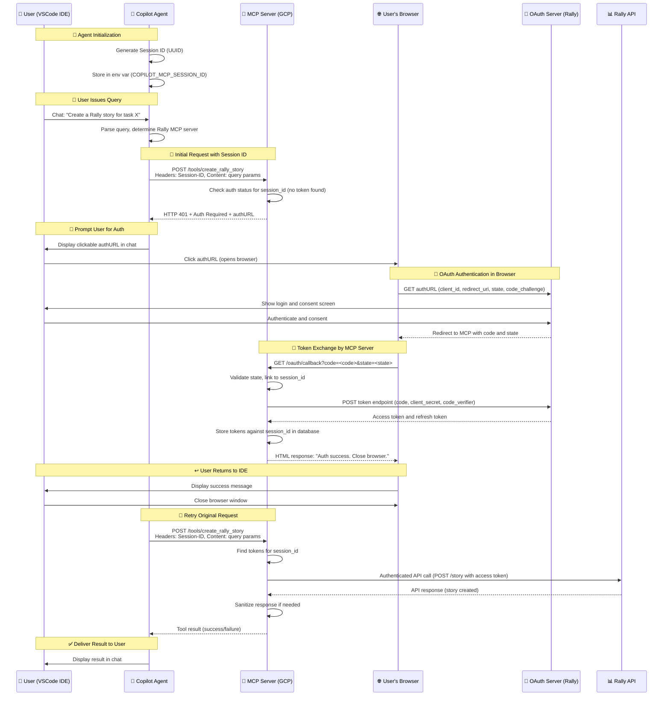

# 🚀 End-to-End Flow: GitHub Copilot Agent with Custom MCP Server

## 📋 Overview

This document details the comprehensive end-to-end workflow of a user interacting with **GitHub Copilot's Agent Mode** to execute tasks against **Rally** through a custom **MCP (Model Context Protocol)** server, including **OAuth 2.1 authentication with PKCE**.

---

## 🔧 Prerequisites

| Component | Description |
|-----------|-------------|
| 🔨 **VS Code IDE** | GitHub Copilot Agent Mode enabled |
| ☁️ **Custom MCP Server** | Deployed on Google Cloud Platform (GCP) |
| 🔐 **Rally OAuth App** | Application registration completed |
| ⚙️ **mcp.json** | Configuration file properly set up |

---

## 🌊 Sequence Diagram



---

## 📖 Step-by-Step Explanation

### 1. 🚀 Agent Initialization in VSCode

When the Copilot Agent starts in VSCode:

- **Generates** a unique Session ID (UUID)
- **Stores** it in environment variable `COPILOT_MCP_SESSION_ID`
- **Persists** for the Agent's lifetime to identify all requests from this IDE session

### 2. 💬 User Query

User types a query in Copilot chat requiring Rally interaction:

> **Example:** *"Create a Rally story for task X"*

- Copilot Agent **parses** the query
- **Consults** `mcp.json` to determine the appropriate MCP server

### 3. 📡 Initial Request to MCP Server

Agent sends a request to the Rally MCP server:

```http
POST /tools/create_rally_story
Headers: 
  Session-ID: <session_id>
Content: <query_parameters>
```

### 4. 🔍 Authentication Check on MCP Server

MCP server processes the request:

- ✅ **Checks** database for access token associated with Session ID
- ❌ **No token exists** (first request)
- **Responds** with `HTTP 401`
- **Includes** OAuth authorization URL (`authURL`) with parameters:
  - `client_id`: Rally OAuth application ID
  - `redirect_uri`: MCP server's callback endpoint
  - `state`: Token linked to the Session ID
  - `code_challenge`: PKCE code challenge

### 5. 🔐 User Authentication via Browser

User completes authentication flow:

1. **Agent renders** `authURL` as clickable link in chat
2. **User clicks** link, opening default browser to Rally OAuth page
3. **User authenticates** with Rally and grants required permissions

### 6. 🔄 OAuth Redirect and Token Exchange

OAuth flow completion:

1. **Rally OAuth server** redirects to MCP server's redirect URI with authorization code and state
2. **MCP server callback** endpoint:
   - ✅ Validates `state` parameter (CSRF protection)
   - 🔍 Retrieves associated Session ID
   - 🔄 Exchanges authorization code for access token
   - 💾 Stores tokens in database mapped to Session ID
   - 📄 Returns HTML success page to browser

### 7. ↩️ User Return to IDE

User returns to development environment:

- 👀 **Sees** success message in browser
- ❌ **Closes** browser window

### 8. ✅ Execution of Query

Agent completes the original request:

1. 🔄 **Automatically retries** the original request with same Session ID
2. 🔍 **MCP server finds** access token for Session ID
3. 📡 **Makes authenticated** API call to Rally
4. 🛡️ **Sanitizes response** if needed
5. 📤 **Returns result** to Agent
6. 💬 **Agent displays** result in chat

---

## 🔑 Key Points

| Aspect | Description |
|--------|-------------|
| 🆔 **Session ID Management** | Generated once by Agent and used consistently to maintain state |
| 🔐 **OAuth Flow** | MCP server acts as OAuth client, handling entire flow including PKCE |
| 🔄 **Retry Mechanism** | Agent automatically retries after authentication completion |
| 🛡️ **Security** | PKCE prevents authorization code interception; state parameter binds authentication to request |

---

## ⚙️ Configuration Example (`mcp.json`)

```json
{
  "mcpServers": {
    "rally-mcp-server": {
      "type": "http",
      "url": "https://rally-mcp-server.gcp.cloud",
      "headers": {
        "Session-ID": "$COPILOT_MCP_SESSION_ID"
      },
      "tools": [
        "get_rally_issue", 
        "create_rally_defect"
      ],
      "env": {
        "RALLY_OAUTH_CLIENT_ID": "COPILOT_MCP_RALLY_CLIENT_ID",
        "RALLY_OAUTH_CLIENT_SECRET": "COPILOT_MCP_RALLY_CLIENT_SECRET"
      }
    }
  }
}
```

---

## � OAuth 2.1 AuthURL Examples

Here are examples of AuthURLs that an MCP server would generate for Rally and GitHub, based on the OAuth 2.1 authorization code flow with PKCE (Proof Key for Code Exchange), which is the current MCP authentication standard.

### Example AuthURL for Rally

```text
https://rally1.rallydev.com/login/oauth2/auth?
  response_type=code
  &client_id=your_rally_client_id
  &redirect_uri=https://your-mcp-server.gcp.cloud/oauth/callback
  &scope=alm:read%20alm:write
  &state=7a3f81b0e5c2d4a6b9c8e1f2a7d3e5c8
  &code_challenge=5VXp1mP5z6uRxE3Xv8w7Wr2qH0nK8lL9aBc3dF1gS4iJ7yT6oM
  &code_challenge_method=S256
```

### Example AuthURL for GitHub

```text
https://github.com/login/oauth/authorize?
  response_type=code
  &client_id=your_github_client_id
  &redirect_uri=https://your-mcp-server.gcp.cloud/oauth/callback
  &scope=repo%20read:user
  &state=8b4c6e2a1d9f3e7c5a0b2d8e3f1a5c7b
  &code_challenge=kL9aBc3dF1gS4iJ7yT6oM5VXp1mP5z6uRxE3Xv8w7Wr2qH0n
  &code_challenge_method=S256
```

### 🔍 Key Components Explained

Both URLs include these standard OAuth 2.1 parameters:

| Parameter | Description |
|-----------|-------------|
| **`response_type=code`** | Indicates the authorization code flow is being used |
| **`client_id`** | The unique identifier for your MCP server registered with the OAuth provider (Rally or GitHub) |
| **`redirect_uri`** | The endpoint on your MCP server that will handle the OAuth callback. This must match exactly with the URI registered with the OAuth provider |
| **`scope`** | Specifies the level of access being requested:<br/>• **Rally**: `alm:read alm:write` (for accessing Rally's Application Lifecycle Management features)<br/>• **GitHub**: `repo read:user` (for repository access and reading user profile data) |
| **`state`** | A unique, cryptographically random string generated by the MCP server for each authorization request. Used to maintain state between the request and callback and prevent CSRF attacks. The MCP server stores this value and associates it with the user's session |
| **`code_challenge`** | A Base64URL-encoded SHA-256 hash of a cryptographically random `code_verifier`. Part of the PKCE extension that protects against authorization code interception attacks |
| **`code_challenge_method=S256`** | Indicates that SHA-256 is used for the PKCE code challenge |

### 🔄 How the MCP Server Uses This URL

1. **Unauthenticated Request**: When an unauthenticated user makes a request, the MCP server returns an HTTP 401 Unauthorized status code

2. **Resource Discovery**: The response includes a `WWW-Authenticate` header containing a link to its resource metadata endpoint (e.g., `https://your-mcp-server.gcp.cloud/.well-known/oauth-protected-resource`)

3. **Client Discovery**: The client (like Copilot) uses this metadata to discover the `authorization_servers` and required scopes

4. **AuthURL Construction**: The client constructs the appropriate AuthURL (like the examples above) and directs the user to it

5. **Authentication & Consent**: User authenticates and grants consent on the Rally or GitHub page

6. **Code Exchange**: The OAuth server redirects back to the MCP server's `redirect_uri` with an authorization code and the original state parameter

7. **Token Exchange**: The MCP server exchanges this code for an access token using the PKCE `code_verifier`

---

## �🔒 Security Considerations

| Security Measure | Implementation |
|------------------|----------------|
| 🔐 **Token Storage** | Tokens stored securely on MCP server, not on client |
| 🛡️ **Context Sanitization** | Performed on MCP server before sending responses to Agent |
| ✅ **Input Validation** | Sanitization implemented on MCP server |
| 🎯 **Authorization Checks** | Fine-grained checks performed against Rally APIs |
| 🔒 **PKCE Protection** | Prevents authorization code interception attacks |
| 🎲 **State Parameter** | CSRF protection linking authentication to specific requests |

---

## 🏆 Benefits

- 🔄 **Seamless Integration**: Natural OAuth flow within Copilot Agent experience
- 🛡️ **Security First**: Comprehensive security measures and best practices
- 🎯 **Extensible Pattern**: Reusable architecture for other authenticated APIs
- 👤 **User-Friendly**: Minimal user intervention required for authentication
- 📊 **Session Management**: Persistent authentication across multiple requests

---

This workflow provides a **secure, extensible pattern** for integrating authenticated tools into the **GitHub Copilot Agent experience** with **Rally API integration**.

---

*📝 Generated from VSCode Copilot Agent MCP Server documentation*
