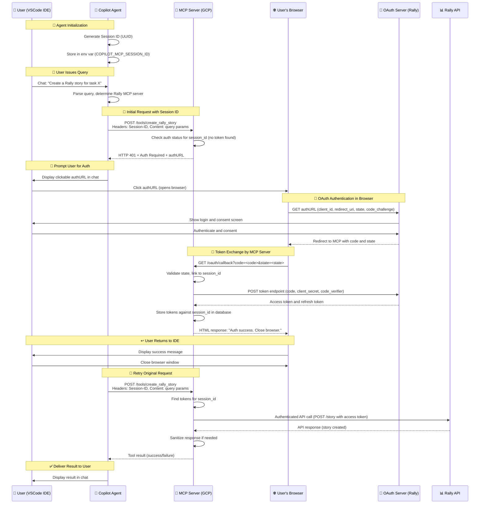

# 🚀 End-to-End Flow: GitHub Copilot Agent with Custom MCP Server

## 📋 Overview

This document details the comprehensive end-to-end workflow of a user interacting with **GitHub Copilot's Agent Mode** to execute tasks against **Rally** through a custom **MCP (Model Context Protocol)** server, including **OAuth 2.1 authentication with PKCE**.

---

## 🔧 Prerequisites

| Component | Description |
|-----------|-------------|
| 🔨 **VS Code IDE** | GitHub Copilot Agent Mode enabled |
| ☁️ **Custom MCP Server** | Deployed on Google Cloud Platform (GCP) |
| 🔐 **Rally OAuth App** | Application registration completed |
| ⚙️ **mcp.json** | Configuration file properly set up |

---

## 🌊 Sequence Diagram



---

## 📖 Step-by-Step Explanation

### 1. 🚀 Agent Initialization in VSCode

When the Copilot Agent starts in VSCode:

- **Generates** a unique Session ID (UUID)
- **Stores** it in environment variable `COPILOT_MCP_SESSION_ID`
- **Persists** for the Agent's lifetime to identify all requests from this IDE session

### 2. 💬 User Query

User types a query in Copilot chat requiring Rally interaction:

> **Example:** *"Create a Rally story for task X"*

- Copilot Agent **parses** the query
- **Consults** `mcp.json` to determine the appropriate MCP server

### 3. 📡 Initial Request to MCP Server

Agent sends a request to the Rally MCP server:

```http
POST /tools/create_rally_story
Headers: 
  Session-ID: <session_id>
Content: <query_parameters>
```

### 4. 🔍 Authentication Check on MCP Server

MCP server processes the request:

- ✅ **Checks** database for access token associated with Session ID
- ❌ **No token exists** (first request)
- **Responds** with `HTTP 401`
- **Includes** OAuth authorization URL (`authURL`) with parameters:
  - `client_id`: Rally OAuth application ID
  - `redirect_uri`: MCP server's callback endpoint
  - `state`: Token linked to the Session ID
  - `code_challenge`: PKCE code challenge

### 5. 🔐 User Authentication via Browser

User completes authentication flow:

1. **Agent renders** `authURL` as clickable link in chat
2. **User clicks** link, opening default browser to Rally OAuth page
3. **User authenticates** with Rally and grants required permissions

### 6. 🔄 OAuth Redirect and Token Exchange

OAuth flow completion:

1. **Rally OAuth server** redirects to MCP server's redirect URI with authorization code and state
2. **MCP server callback** endpoint:
   - ✅ Validates `state` parameter (CSRF protection)
   - 🔍 Retrieves associated Session ID
   - 🔄 Exchanges authorization code for access token
   - 💾 Stores tokens in database mapped to Session ID
   - 📄 Returns HTML success page to browser

### 7. ↩️ User Return to IDE

User returns to development environment:

- 👀 **Sees** success message in browser
- ❌ **Closes** browser window

### 8. ✅ Execution of Query

Agent completes the original request:

1. 🔄 **Automatically retries** the original request with same Session ID
2. 🔍 **MCP server finds** access token for Session ID
3. 📡 **Makes authenticated** API call to Rally
4. 🛡️ **Sanitizes response** if needed
5. 📤 **Returns result** to Agent
6. 💬 **Agent displays** result in chat

---

## 🔑 Key Points

| Aspect | Description |
|--------|-------------|
| 🆔 **Session ID Management** | Generated once by Agent and used consistently to maintain state |
| 🔐 **OAuth Flow** | MCP server acts as OAuth client, handling entire flow including PKCE |
| 🔄 **Retry Mechanism** | Agent automatically retries after authentication completion |
| 🛡️ **Security** | PKCE prevents authorization code interception; state parameter binds authentication to request |

---

## ⚙️ Configuration Example (`mcp.json`)

```json
{
  "mcpServers": {
    "rally-mcp-server": {
      "type": "http",
      "url": "https://rally-mcp-server.gcp.cloud",
      "headers": {
        "Session-ID": "$COPILOT_MCP_SESSION_ID"
      },
      "tools": [
        "get_rally_issue", 
        "create_rally_defect"
      ],
      "env": {
        "RALLY_OAUTH_CLIENT_ID": "COPILOT_MCP_RALLY_CLIENT_ID",
        "RALLY_OAUTH_CLIENT_SECRET": "COPILOT_MCP_RALLY_CLIENT_SECRET"
      }
    }
  }
}
```

---

## 🔒 Security Considerations

| Security Measure | Implementation |
|------------------|----------------|
| 🔐 **Token Storage** | Tokens stored securely on MCP server, not on client |
| 🛡️ **Context Sanitization** | Performed on MCP server before sending responses to Agent |
| ✅ **Input Validation** | Sanitization implemented on MCP server |
| 🎯 **Authorization Checks** | Fine-grained checks performed against Rally APIs |
| 🔒 **PKCE Protection** | Prevents authorization code interception attacks |
| 🎲 **State Parameter** | CSRF protection linking authentication to specific requests |

---

## 🏆 Benefits

- 🔄 **Seamless Integration**: Natural OAuth flow within Copilot Agent experience
- 🛡️ **Security First**: Comprehensive security measures and best practices
- 🎯 **Extensible Pattern**: Reusable architecture for other authenticated APIs
- 👤 **User-Friendly**: Minimal user intervention required for authentication
- 📊 **Session Management**: Persistent authentication across multiple requests

---

This workflow provides a **secure, extensible pattern** for integrating authenticated tools into the **GitHub Copilot Agent experience** with **Rally API integration**.

---

*📝 Generated from VSCode Copilot Agent MCP Server documentation*
