# 🚀 End-to-End Flow: GitHub Copilot Agent with Custom MCP Server

## 📋 Overview

This document details the comprehensive end-to-end workflow of a user interacting with **GitHub Copilot's Agent Mode** to execute tasks against **Rally** through a custom **MCP (Model Context Protocol)** server, including **OAuth 2.1 authentic## 🔒 Security Controls Implementation

Since **GitHub Copilot Agent** and the underlying **LLM** are out-of-the-box services without access for custom security implementation, **ALL 9 security controls must be implemented on the MCP Server** to ensure comprehensive protection.

### 🎯 Required MCP Server Security Controls (9/9)

| **Security Control** | **MCP Server Implementation** | **Rationale** | **Protection Against** |
|---------------------|-------------------------------|---------------|------------------------|
| **1. Input Sanitization** | ✅ **CRITICAL** - Validate all incoming requests from Copilot Agent | Cannot implement on Copilot Agent (no access) | Prompt injection, XSS, SQL injection attacks |
| **2. Token Validation** | ✅ **CRITICAL** - Validate OAuth tokens and session IDs | Must be server-side for security | Unauthorized access, token tampering |
| **3. Schema Validation** | ✅ **CRITICAL** - Validate JSON-RPC 2.0 message format | MCP Server must enforce protocol compliance | Protocol violations, malformed requests |
| **4. Credential Management** | ✅ **CRITICAL** - Secure storage of OAuth tokens and secrets | Centralized secure storage required | Secret exposure, credential theft |
| **5. Context Sanitization** | ✅ **CRITICAL** - Sanitize responses before sending to Agent | Cannot implement on Copilot Agent (no access) | Context poisoning, PII leakage |
| **6. Prompt Injection Protection** | ✅ **CRITICAL** - Filter malicious prompts from Agent requests | Cannot implement on LLM (no access) | AI behavior manipulation |
| **7. Context Size Validation** | ✅ **CRITICAL** - Limit request/response sizes | Prevent resource exhaustion on server | DoS attacks, resource exhaustion |
| **8. Response Sanitization** | ✅ **CRITICAL** - Remove PII and sensitive data from responses | Final checkpoint before Agent delivery | Information leakage, PII exposure |
| **9. Model Armor Integration** | ✅ **CRITICAL** - Real-time AI threat detection | Cannot implement on out-of-box LLM | Advanced AI threats, model attacks |

### 🛡️ Security Control Distribution - Out-of-Box Scenario

```mermaid
graph TB
    subgraph "OUT-OF-BOX COMPONENTS (No Custom Security Access)"
        CA[GitHub Copilot Agent<br/>❌ No Security Implementation Access<br/>🔒 Microsoft Managed]
        LLM[Underlying LLM<br/>❌ No Security Implementation Access<br/>🔒 OpenAI/Microsoft Managed]
    end
    
    subgraph "CUSTOM MCP SERVER (All Security Controls Required)"
        MCP[MCP Server on GCP<br/>✅ ALL 9 Security Controls<br/>🛡️ Complete Protection Stack]
        
        SC1[1. Input Sanitization<br/>🔍 Request Validation]
        SC2[2. Token Validation<br/>🔐 OAuth Security]
        SC3[3. Schema Validation<br/>📋 Protocol Compliance]
        SC4[4. Credential Management<br/>🗄️ Secure Storage]
        SC5[5. Context Sanitization<br/>🧹 Response Cleaning]
        SC6[6. Prompt Injection Protection<br/>🚫 Malicious Prompt Filtering]
        SC7[7. Context Size Validation<br/>📏 Resource Protection]
        SC8[8. Response Sanitization<br/>🧼 PII Removal]
        SC9[9. Model Armor Integration<br/>🛡️ AI Threat Detection]
    end
    
    subgraph "BUSINESS SYSTEMS"
        API[Rally API<br/>🏢 Enterprise Systems<br/>📊 Business Data]
    end
    
    CA -->|Unsecured Requests| MCP
    LLM -->|AI Processing| CA
    
    MCP --> SC1
    MCP --> SC2
    MCP --> SC3
    MCP --> SC4
    MCP --> SC5
    MCP --> SC6
    MCP --> SC7
    MCP --> SC8
    MCP --> SC9
    
    MCP -->|Secured API Calls| API
    
    style CA fill:#ffebee,stroke:#d32f2f,stroke-width:3px
    style LLM fill:#ffebee,stroke:#d32f2f,stroke-width:3px
    style MCP fill:#e8f5e8,stroke:#2e7d32,stroke-width:4px
    style API fill:#fff3e0,stroke:#ef6c00,stroke-width:3px
```



### 🔐 Detailed Security Implementation Requirements

#### **Input Layer Security (Controls 1, 6, 7)**
```http
POST /tools/create_rally_story
Headers: Session-ID: <session_id>
Content: <user_query>

MCP Server Processing:
1. Input Sanitization: Validate and sanitize user_query
2. Prompt Injection Protection: Scan for malicious prompts
3. Context Size Validation: Enforce size limits
```

#### **Protocol Layer Security (Controls 2, 3, 4)**
```json
{
  "tokenValidation": "Verify OAuth tokens and session integrity",
  "schemaValidation": "Enforce JSON-RPC 2.0 compliance",
  "credentialManagement": "Secure OAuth token storage and rotation"
}
```

#### **Output Layer Security (Controls 5, 8, 9)**
```http
Response Processing:
1. Context Sanitization: Remove context poisoning attempts
2. Response Sanitization: Strip PII and sensitive data
3. Model Armor Integration: Real-time threat detection
```

### ⚠️ Security Architecture Constraints

| **Component** | **Security Capability** | **Implementation Location** |
|---------------|------------------------|----------------------------|
| **GitHub Copilot Agent** | ❌ No custom security access | Microsoft managed service |
| **Underlying LLM** | ❌ No custom security access | OpenAI/Microsoft managed |
| **MCP Server** | ✅ Full security control | **ALL 9 controls required** |
| **Business APIs** | ⚡ Existing enterprise security | Protected by MCP Server |

### 🎯 Critical Security Recommendations

1. **Comprehensive Server-Side Security**: Implement all 9 controls on MCP Server since Agent/LLM are inaccessible
2. **Defense in Depth**: Multiple security layers on MCP Server to compensate for lack of client-side controls
3. **Real-Time Monitoring**: Enhanced logging and monitoring since no visibility into Agent/LLM processing
4. **Input Validation**: Extra stringent validation since cannot control Agent input processing
5. **Output Sanitization**: Comprehensive response cleaning since no control over Agent output handling

### 🔒 Security Considerations Summary

| Security Measure | Implementation |
|------------------|----------------|
| 🔐 **Token Storage** | Tokens stored securely on MCP server, not on client |
| 🛡️ **Context Sanitization** | Performed on MCP server before sending responses to Agent |
| ✅ **Input Validation** | Comprehensive sanitization implemented on MCP server |
| 🎯 **Authorization Checks** | Fine-grained checks performed against Rally APIs |
| 🔒 **PKCE Protection** | Prevents authorization code interception attacks |
| 🎲 **State Parameter** | CSRF protection linking authentication to specific requests |
| 🚫 **Prompt Injection Defense** | Server-side filtering of malicious prompts |
| 📏 **Resource Protection** | Context size limits and DoS prevention |
| 🛡️ **AI Threat Detection** | Model Armor integration for advanced threats | PKCE**.

---

## 🔧 Prerequisites

| Component | Description |
|-----------|-------------|
| 🔨 **VS Code IDE** | GitHub Copilot Agent Mode enabled |
| ☁️ **Custom MCP Server** | Deployed on Google Cloud Platform (GCP) |
| 🔐 **Rally OAuth App** | Application registration completed |
| ⚙️ **mcp.json** | Configuration file properly set up |

---

## 🌊 Sequence Diagram

```mermaid
sequenceDiagram
    participant User as 👤 User (VSCode IDE)
    participant Agent as 🤖 Copilot Agent
    participant MCP as 🔧 MCP Server (GCP)
    participant Browser as 🌐 User's Browser
    participant OAuth as 🔐 OAuth Server (Rally)
    participant Rally as 📊 Rally API

    Note over User, Agent: 🚀 Agent Initialization
    Agent->>Agent: Generate Session ID (UUID)
    Agent->>Agent: Store in env var (COPILOT_MCP_SESSION_ID)

    Note over User, Agent: 💬 User Issues Query
    User->>Agent: Chat: "Create a Rally story for task X"
    Agent->>Agent: Parse query, determine Rally MCP server

    Note over Agent, MCP: 📡 Initial Request with Session ID
    Agent->>MCP: POST /tools/create_rally_story<br/>Headers: Session-ID, Content: query params
    MCP->>MCP: Check auth status for session_id (no token found)
    MCP-->>Agent: HTTP 401 + Auth Required + authURL

    Note over Agent, User: 🔗 Prompt User for Auth
    Agent->>User: Display clickable authURL in chat
    User->>Browser: Click authURL (opens browser)

    Note over Browser, OAuth: 🔐 OAuth Authentication in Browser
    Browser->>OAuth: GET authURL (client_id, redirect_uri, state, code_challenge)
    OAuth->>User: Show login and consent screen
    User->>OAuth: Authenticate and consent
    OAuth-->>Browser: Redirect to MCP with code and state

    Note over Browser, MCP: 🔄 Token Exchange by MCP Server
    Browser->>MCP: GET /oauth/callback?code=<code>&state=<state>
    MCP->>MCP: Validate state, link to session_id
    MCP->>OAuth: POST token endpoint (code, client_secret, code_verifier)
    OAuth-->>MCP: Access token and refresh token
    MCP->>MCP: Store tokens against session_id in database
    MCP-->>Browser: HTML response: "Auth success. Close browser."

    Note over User, Browser: ↩️ User Returns to IDE
    Browser->>User: Display success message
    User->>Browser: Close browser window

    Note over Agent, MCP: 🔄 Retry Original Request
    Agent->>MCP: POST /tools/create_rally_story<br/>Headers: Session-ID, Content: query params
    MCP->>MCP: Find tokens for session_id
    MCP->>Rally: Authenticated API call (POST /story with access token)
    Rally-->>MCP: API response (story created)
    MCP->>MCP: Sanitize response if needed
    MCP-->>Agent: Tool result (success/failure)

    Note over Agent, User: ✅ Deliver Result to User
    Agent->>User: Display result in chat
```



---

## 📖 Step-by-Step Explanation

### 1. 🚀 Agent Initialization in VSCode

When the Copilot Agent starts in VSCode:

- **Generates** a unique Session ID (UUID)
- **Stores** it in environment variable `COPILOT_MCP_SESSION_ID`
- **Persists** for the Agent's lifetime to identify all requests from this IDE session

### 2. 💬 User Query

User types a query in Copilot chat requiring Rally interaction:

> **Example:** *"Create a Rally story for task X"*

- Copilot Agent **parses** the query
- **Consults** `mcp.json` to determine the appropriate MCP server

### 3. 📡 Initial Request to MCP Server

Agent sends a request to the Rally MCP server:

```http
POST /tools/create_rally_story
Headers: 
  Session-ID: <session_id>
Content: <query_parameters>
```

### 4. 🔍 Authentication Check on MCP Server

MCP server processes the request:

- ✅ **Checks** database for access token associated with Session ID
- ❌ **No token exists** (first request)
- **Responds** with `HTTP 401`
- **Includes** OAuth authorization URL (`authURL`) with parameters:
  - `client_id`: Rally OAuth application ID
  - `redirect_uri`: MCP server's callback endpoint
  - `state`: Token linked to the Session ID
  - `code_challenge`: PKCE code challenge

### 5. 🔐 User Authentication via Browser

User completes authentication flow:

1. **Agent renders** `authURL` as clickable link in chat
2. **User clicks** link, opening default browser to Rally OAuth page
3. **User authenticates** with Rally and grants required permissions

### 6. 🔄 OAuth Redirect and Token Exchange

OAuth flow completion:

1. **Rally OAuth server** redirects to MCP server's redirect URI with authorization code and state
2. **MCP server callback** endpoint:
   - ✅ Validates `state` parameter (CSRF protection)
   - 🔍 Retrieves associated Session ID
   - 🔄 Exchanges authorization code for access token
   - 💾 Stores tokens in database mapped to Session ID
   - 📄 Returns HTML success page to browser

### 7. ↩️ User Return to IDE

User returns to development environment:

- 👀 **Sees** success message in browser
- ❌ **Closes** browser window

### 8. ✅ Execution of Query

Agent completes the original request:

1. 🔄 **Automatically retries** the original request with same Session ID
2. 🔍 **MCP server finds** access token for Session ID
3. 📡 **Makes authenticated** API call to Rally
4. 🛡️ **Sanitizes response** if needed
5. 📤 **Returns result** to Agent
6. 💬 **Agent displays** result in chat

---

## � State Parameter to Session-ID Mapping

The state token is critically associated with the Session-ID provided by the Agent. This association is the linchpin that allows the MCP server to "remember" which IDE session initiated the authentication request after the user completes the browser-based OAuth flow.

### Detailed State Mapping Flow


### Step-by-Step State Mapping Breakdown

1. **Initial Request with Session-ID**: The Copilot Agent makes its first call to the MCP server's tool endpoint (e.g., `POST /tools/create_rally_story`). It includes the `Session-ID: ABC123` header.

2. **Server Generates State**: The MCP server receives the request and sees that `Session-ID: ABC123` has no associated access tokens. It then:
   - Generates a unique, cryptographically random string for the state parameter (e.g., `XYZ789`)
   - Creates a crucial association in its database: it stores `state=XYZ789 -> Session-ID=ABC123`

3. **AuthURL with State**: The MCP server generates the AuthURL for the OAuth provider (Rally/GitHub) and includes the generated state parameter:
   ```text
   https://rally1.rallydev.com/login/oauth2/auth?response_type=code&client_id=...&state=XYZ789&...
   ```

4. **OAuth Redirection**: After the user authenticates, the OAuth server redirects back to the MCP server's callback URL with the authorization code and the original state parameter (`.../oauth/callback?code=a1b2c3&state=XYZ789`).

5. **State Validation and Session Lookup**: The MCP server's callback endpoint:
   - Receives the request with `?state=XYZ789`
   - Validates the state parameter to prevent CSRF
   - Uses the state value to look up the associated Session-ID in its database
   - Finds that `state=XYZ789` is linked to `Session-ID=ABC123`

6. **Token Storage**: The MCP server exchanges the code for an access token. It then stores this access token (and refresh token) against the `Session-ID: ABC123` in its database.

7. **Completing the Loop**: When the Copilot Agent retries the original request with `Session-ID: ABC123`, the MCP server finds the valid tokens and can execute the tool call.

### Parameter Summary

| Parameter | Generated By | Purpose | Association |
|-----------|-------------|---------|-------------|
| **Session-ID** | Copilot Agent | A persistent identifier for the entire IDE session. Used to link all requests from the same user to their stored OAuth tokens. | The key used by the MCP server to store and retrieve the user's access tokens. |
| **state** | MCP Server | A one-time, unique token for the OAuth flow. Its sole purpose is to securely connect the OAuth callback response back to the original session that initiated the request. | The temporary bridge. The MCP server creates a database entry that maps the state token to the Session-ID. |

This mechanism ensures that even though the OAuth flow happens out-of-band in a web browser, the resulting credentials are correctly linked to the original user session in the IDE.

---

## �🔑 Key Points

| Aspect | Description |
|--------|-------------|
| 🆔 **Session ID Management** | Generated once by Agent and used consistently to maintain state |
| 🔐 **OAuth Flow** | MCP server acts as OAuth client, handling entire flow including PKCE |
| 🔄 **Retry Mechanism** | Agent automatically retries after authentication completion |
| 🛡️ **Security** | PKCE prevents authorization code interception; state parameter binds authentication to request |

---

## ⚙️ Configuration Example (`mcp.json`)

```json
{
  "mcpServers": {
    "rally-mcp-server": {
      "type": "http",
      "url": "https://rally-mcp-server.gcp.cloud",
      "headers": {
        "Session-ID": "$COPILOT_MCP_SESSION_ID"
      },
      "tools": [
        "get_rally_issue", 
        "create_rally_defect"
      ],
      "env": {
        "RALLY_OAUTH_CLIENT_ID": "COPILOT_MCP_RALLY_CLIENT_ID",
        "RALLY_OAUTH_CLIENT_SECRET": "COPILOT_MCP_RALLY_CLIENT_SECRET"
      }
    }
  }
}
```

---

## � OAuth 2.1 AuthURL Examples

Here are examples of AuthURLs that an MCP server would generate for Rally and GitHub, based on the OAuth 2.1 authorization code flow with PKCE (Proof Key for Code Exchange), which is the current MCP authentication standard.

### Example AuthURL for Rally

```text
https://rally1.rallydev.com/login/oauth2/auth?
  response_type=code
  &client_id=your_rally_client_id
  &redirect_uri=https://your-mcp-server.gcp.cloud/oauth/callback
  &scope=alm:read%20alm:write
  &state=7a3f81b0e5c2d4a6b9c8e1f2a7d3e5c8
  &code_challenge=5VXp1mP5z6uRxE3Xv8w7Wr2qH0nK8lL9aBc3dF1gS4iJ7yT6oM
  &code_challenge_method=S256
```

### Example AuthURL for GitHub

```text
https://github.com/login/oauth/authorize?
  response_type=code
  &client_id=your_github_client_id
  &redirect_uri=https://your-mcp-server.gcp.cloud/oauth/callback
  &scope=repo%20read:user
  &state=8b4c6e2a1d9f3e7c5a0b2d8e3f1a5c7b
  &code_challenge=kL9aBc3dF1gS4iJ7yT6oM5VXp1mP5z6uRxE3Xv8w7Wr2qH0n
  &code_challenge_method=S256
```

### 🔍 Key Components Explained

Both URLs include these standard OAuth 2.1 parameters:

| Parameter | Description |
|-----------|-------------|
| **`response_type=code`** | Indicates the authorization code flow is being used |
| **`client_id`** | The unique identifier for your MCP server registered with the OAuth provider (Rally or GitHub) |
| **`redirect_uri`** | The endpoint on your MCP server that will handle the OAuth callback. This must match exactly with the URI registered with the OAuth provider |
| **`scope`** | Specifies the level of access being requested:<br/>• **Rally**: `alm:read alm:write` (for accessing Rally's Application Lifecycle Management features)<br/>• **GitHub**: `repo read:user` (for repository access and reading user profile data) |
| **`state`** | A unique, cryptographically random string generated by the MCP server for each authorization request. Used to maintain state between the request and callback and prevent CSRF attacks. The MCP server stores this value and associates it with the user's session |
| **`code_challenge`** | A Base64URL-encoded SHA-256 hash of a cryptographically random `code_verifier`. Part of the PKCE extension that protects against authorization code interception attacks |
| **`code_challenge_method=S256`** | Indicates that SHA-256 is used for the PKCE code challenge |

### 🔄 How the MCP Server Uses This URL

1. **Unauthenticated Request**: When an unauthenticated user makes a request, the MCP server returns an HTTP 401 Unauthorized status code

2. **Resource Discovery**: The response includes a `WWW-Authenticate` header containing a link to its resource metadata endpoint (e.g., `https://your-mcp-server.gcp.cloud/.well-known/oauth-protected-resource`)

3. **Client Discovery**: The client (like Copilot) uses this metadata to discover the `authorization_servers` and required scopes

4. **AuthURL Construction**: The client constructs the appropriate AuthURL (like the examples above) and directs the user to it

5. **Authentication & Consent**: User authenticates and grants consent on the Rally or GitHub page

6. **Code Exchange**: The OAuth server redirects back to the MCP server's `redirect_uri` with an authorization code and the original state parameter

7. **Token Exchange**: The MCP server exchanges this code for an access token using the PKCE `code_verifier`

---

## �🔒 Security Considerations

| Security Measure | Implementation |
|------------------|----------------|
| 🔐 **Token Storage** | Tokens stored securely on MCP server, not on client |
| 🛡️ **Context Sanitization** | Performed on MCP server before sending responses to Agent |
| ✅ **Input Validation** | Sanitization implemented on MCP server |
| 🎯 **Authorization Checks** | Fine-grained checks performed against Rally APIs |
| 🔒 **PKCE Protection** | Prevents authorization code interception attacks |
| 🎲 **State Parameter** | CSRF protection linking authentication to specific requests |

---

## 🏆 Benefits

- 🔄 **Seamless Integration**: Natural OAuth flow within Copilot Agent experience
- 🛡️ **Security First**: Comprehensive security measures and best practices
- 🎯 **Extensible Pattern**: Reusable architecture for other authenticated APIs
- 👤 **User-Friendly**: Minimal user intervention required for authentication
- 📊 **Session Management**: Persistent authentication across multiple requests

---

This workflow provides a **secure, extensible pattern** for integrating authenticated tools into the **GitHub Copilot Agent experience** with **Rally API integration**.

---

*📝 Generated from VSCode Copilot Agent MCP Server documentation*
