## ✅ **Realistic Implementation Pattern**

### What GitHub Copilot CAN Do:
- ✅ Display text messages with URLs
- ✅ Make HTTP requests to MCP Server
- ✅ Wait for user text responses
- ✅ Retry requests based on user confirmation
- ✅ Maintain conversation context

### What GitHub Copilot CANNOT Do:
- ❌ Render clickable links or buttons
- ❌ Open browser windows
- ❌ Handle OAuth redirects directly
- ❌ Detect external authentication completion
- ❌ Automatic retry without user inputm security implementation, we must analyze which of the **9 MCP Framework Security Controls** from [SECURITY_CONTROLS_OVERVIEW.md](./SECURITY_CONTROLS_OVERVIEW.md) can be effectively implemented on the MCP Server.

### 🎯 MCP Framework Security Controls Analysis for Out-of-Box Scenario

**REVISED ANALYSIS** - Based on actual end-to-end flow and data exchange patterns:

| **Security Control** | **Implementation** | **Effectiveness** | **Rationale** |
|---------------------|-------------------|------------------|---------------|
| **1. InputSanitizer** | ✅ **MANDATORY** | 🟢 HIGH | Agent sends user prompts/tool requests; server must prevent prompt injection, SQL injection, XSS attacks |
| **2. GoogleCloudTokenValidator** | ❌ **NOT APPLICABLE** | � N/A | **Copilot Agent runs on desktop VSCode, not GCP**; uses Rally OAuth tokens, not Google Cloud tokens |
| **3. SchemaValidator** | ✅ **MANDATORY** | 🟢 HIGH | Agent sends JSON-RPC 2.0 MCP messages; server must enforce protocol compliance and parameter validation |
| **4. CredentialManager** | ✅ **MANDATORY** | 🟢 HIGH | Server stores Rally OAuth tokens, PKCE verifiers, and session data; requires secure credential management |
| **5. ContextSanitizer** | ✅ **MANDATORY** | 🟢 HIGH | Server returns Rally API responses to Agent; must sanitize PII, sensitive data before LLM processing |
| **6. ToolExposureController** | ✅ **MANDATORY** | 🟢 HIGH | Server controls which Rally tools are available; manages access policies and user authorization |
| **7. ServerNameRegistry** | 🔶 **OPTIONAL** | 🟡 MEDIUM | Could validate MCP server identity in multi-server setups; limited value in single Rally integration |
| **8. SemanticMappingValidator** | 🔶 **OPTIONAL** | 🟡 MEDIUM | Validates Rally tool metadata consistency; useful for dynamic tool registration scenarios |
| **9. OPAPolicyClient** | ❌ **SKIP** | 🔴 LOW | **No rich policy context available**; desktop Agent provides minimal user context; use static policies instead |

### 🛡️ Security Architecture for GitHub Copilot Agent + MCP Server Integration

```mermaid
graph TB
    subgraph "DESKTOP ENVIRONMENT (Limited Security Control)"
        CA[GitHub Copilot Agent<br/>❌ No Security Implementation Access<br/>🔒 Microsoft Managed<br/>📍 Desktop VSCode]
        LLM[Underlying LLM<br/>❌ No Security Implementation Access<br/>🔒 OpenAI/Microsoft Managed]
    end
    
    subgraph "CUSTOM MCP SERVER (5 Mandatory + 2 Optional Controls)"
        MCP[MCP Server with FastMCP<br/>✅ 5 MANDATORY Security Controls<br/>🔶 2 OPTIONAL Controls<br/>❌ 2 NOT APPLICABLE Controls]
        
        subgraph "MANDATORY CONTROLS (Required for Production)"
            SC1[1. InputSanitizer<br/>🔍 Prompt Injection Protection<br/>� Rally API Input Validation]
            SC3[3. SchemaValidator<br/>📋 JSON-RPC 2.0 Compliance<br/>✅ Pydantic Model Validation]
            SC4[4. CredentialManager<br/>🗄️ Rally OAuth Token Storage<br/>🔐 PKCE Verifier Management]
            SC5[5. ContextSanitizer<br/>🧹 Rally Response Sanitization<br/>🚫 PII Protection]
            SC6[6. ToolExposureController<br/>🎯 Rally Tool Access Control<br/>📝 Session-based Authorization]
        end
        
        subgraph "OPTIONAL CONTROLS (Enhanced Security)"
            SC7[7. ServerNameRegistry<br/>🏷️ MCP Server Identity<br/>🔍 Multi-server Validation]
            SC8[8. SemanticMappingValidator<br/>🔍 Rally Tool Metadata<br/>📊 Dynamic Tool Validation]
        end
        
        subgraph "NOT APPLICABLE CONTROLS"
            SC2[2. GoogleCloudTokenValidator<br/>❌ NOT APPLICABLE<br/>📍 Desktop Agent ≠ GCP Environment]
            SC9[9. OPAPolicyClient<br/>❌ NOT APPLICABLE<br/>⚠️ Limited desktop context]
        end
    end
    
    subgraph "RALLY BUSINESS SYSTEM"
        RALLY[Rally API<br/>🔐 Rally OAuth 2.1<br/>📊 Enterprise ALM Data]
    end
    
    CA -->|Unsecured Requests| MCP
    LLM -->|AI Processing| CA
    
    MCP --> SC1
    MCP --> SC2
    MCP --> SC3
    MCP --> SC4
    MCP --> SC5
    MCP --> SC6
    MCP -.-> SC7
    MCP -.-> SC8
    
    MCP -->|Secured API Calls| RALLY
    
    style CA fill:#ffebee,stroke:#d32f2f,stroke-width:3px
    style LLM fill:#ffebee,stroke:#d32f2f,stroke-width:3px
    style MCP fill:#e8f5e8,stroke:#2e7d32,stroke-width:4px
    style SC1 fill:#c8e6c9,stroke:#2e7d32,stroke-width:2px
    style SC2 fill:#c8e6c9,stroke:#2e7d32,stroke-width:2px
    style SC3 fill:#c8e6c9,stroke:#2e7d32,stroke-width:2px
    style SC4 fill:#c8e6c9,stroke:#2e7d32,stroke-width:2px
    style SC5 fill:#c8e6c9,stroke:#2e7d32,stroke-width:2px
    style SC6 fill:#c8e6c9,stroke:#2e7d32,stroke-width:2px
    style SC7 fill:#fff9c4,stroke:#f57f17,stroke-width:2px,stroke-dasharray: 5 5
    style SC8 fill:#fff9c4,stroke:#f57f17,stroke-width:2px,stroke-dasharray: 5 5
    style SC9 fill:#ffebee,stroke:#d32f2f,stroke-width:2px,stroke-dasharray: 10 5
    style RALLY fill:#fff3e0,stroke:#ef6c00,stroke-width:3px
```



### 🔐 Security Implementation Mapping for Out-of-Box Scenario

#### **Phase 1: Critical Security Foundation (6 Mandatory Controls)**

##### **1. InputSanitizer - Request Validation**
```http
POST /tools/create_rally_story
Headers: Authorization: Bearer <oauth_token>
Content: <user_query>

MCP Server Processing:
✅ InputSanitizer.sanitize_string(user_query)
- Detect prompt injection patterns
- Filter SQL injection attempts  
- Block XSS and command injection
- Apply HTML escaping and content filtering
```

##### **2. GoogleCloudTokenValidator - OAuth Authentication**
```json
{
  "cloudRunHeaders": {
    "X-Goog-Authenticated-User-Email": "service-account@project.iam.gserviceaccount.com",
    "X-Goog-Authenticated-User-ID": "user-id"
  },
  "validation": "Automatic Cloud Run token validation",
  "fallback": "JWT validation with google.auth library"
}
```

##### **3. SchemaValidator - Protocol Compliance**
```json
{
  "jsonrpc": "2.0",
  "method": "tools/list",
  "params": {},
  "id": 1,
  "validation": "JSON-RPC 2.0 structure + MCP security rules"
}
```

##### **4. CredentialManager - Secret Management**
```python
# Secure credential injection from Google Cloud Secret Manager
credentials = {
    "rally_api_key": secret_manager.get_secret("rally-api-key"),
    "oauth_client_secret": secret_manager.get_secret("oauth-client-secret")
}
```

##### **5. ContextSanitizer - Response Protection**
```python
# Model Armor integration with regex fallback
sanitized_response = context_sanitizer.sanitize({
    "model_armor_api": "Advanced threat detection",
    "regex_fallback": "PII pattern matching",
    "pii_redaction": "[EMAIL-REDACTED], [SSN-REDACTED]"
})
```

##### **6. ToolExposureController - Access Control**
```json
{
  "policy": {
    "service_accounts": {
      "copilot@project.iam.gserviceaccount.com": {
        "allowed_tools": ["hello", "create_rally_story", "get_rally_data"],
        "approval_required": false
      }
    }
  }
}
```

#### **Phase 2: Optional Controls (2 Controls)**

##### **7. ServerNameRegistry - Identity Verification**
```python
# Server identity management (useful for multi-server setups)
server_registry.register_server(
    server_id="rally-mcp-server",
    namespace="enterprise",
    tools=["rally_create", "rally_read", "rally_update"]
)
```

##### **8. SemanticMappingValidator - Tool Metadata Validation**
```python
# Tool metadata consistency validation
semantic_validator.validate_tool_semantics(
    tool_name="create_rally_story",
    parameters={"title": "string", "description": "string"},
    metadata={"category": "data_access", "output_type": "json"}
)
```

#### **Phase 3: Skipped Control (1 Control)**

##### **9. OPAPolicyClient - Policy Engine**
```python
# ❌ SKIP: Limited effectiveness in out-of-box scenario
# Reason: Agent provides minimal context (only service account from OAuth)
# Cannot build rich policy context for dynamic authorization
# Alternative: Use ToolExposureController with static service account policies
```

### ⚠️ Security Architecture Constraints Analysis

| **Component** | **Security Capability** | **Implementation Strategy** |
|---------------|------------------------|----------------------------|
| **GitHub Copilot Agent** | ❌ No custom security access | Microsoft managed - cannot modify |
| **Underlying LLM** | ❌ No custom security access | OpenAI/Microsoft managed - cannot modify |
| **MCP Server** | ✅ Full security control | **6 mandatory + 2 optional controls** |
| **Business APIs** | ⚡ Existing enterprise security | Protected by MCP Server security gateway |

### 🎯 Critical Security Recommendations for Out-of-Box Integration

1. **Mandatory Controls First**: Implement 5 critical controls before deployment
2. **Server-Side Defense**: All security must be on MCP Server due to Agent/LLM constraints  
3. **Rally OAuth Security**: Leverage PKCE and secure token storage instead of Google Cloud tokens
4. **Response Sanitization**: Critical since no control over Agent response handling
5. **Session-based Authorization**: Use session mappings and static policies for desktop scenarios

### 🔒 Security Implementation Priority

| **Priority** | **Security Controls** | **Implementation Timeline** |
|--------------|----------------------|----------------------------|
| **P0 - Critical** | InputSanitizer, SchemaValidator | Deploy before any user access |
| **P1 - High** | CredentialManager, ContextSanitizer | Deploy before production |
| **P2 - High** | ToolExposureController | Deploy before production |
| **P3 - Optional** | ServerNameRegistry, SemanticMappingValidator | Deploy for enhanced security |
| **P4 - Not Applicable** | GoogleCloudTokenValidator, OPAPolicyClient | Skip for desktop Agent scenarios |

### 🔒 Security Implementation Summary for Desktop Agent Scenario

| Security Control | Implementation Status | Technology Stack |
|------------------|----------------------|------------------|
| 🔐 **InputSanitizer** | ✅ MANDATORY on MCP Server | Regex patterns, HTML escaping, FastAPI validation |
| ❌ **GoogleCloudTokenValidator** | ❌ NOT APPLICABLE | Desktop Agent ≠ GCP environment |
| ✅ **SchemaValidator** | ✅ MANDATORY on MCP Server | Pydantic models, JSON-RPC 2.0 compliance |
| 🎯 **CredentialManager** | ✅ MANDATORY on MCP Server | SQLite/PostgreSQL, Rally OAuth tokens, PKCE storage |
| 🧹 **ContextSanitizer** | ✅ MANDATORY on MCP Server | Regex filtering, PII detection, response sanitization |
| 🎲 **ToolExposureController** | ✅ MANDATORY on MCP Server | Session-based policies, Rally tool authorization |
| 🏷️ **ServerNameRegistry** | 🔶 OPTIONAL on MCP Server | Server identity validation, multi-server scenarios |
| 🔍 **SemanticMappingValidator** | 🔶 OPTIONAL on MCP Server | Rally tool metadata validation, dynamic registration |
| ❌ **OPAPolicyClient** | ❌ NOT APPLICABLE | Limited desktop context, use static policies instead |

### 📊 Security Coverage Analysis

**✅ Comprehensive Protection (5 Mandatory Controls)**
- All critical attack vectors covered by MCP Server
- Defense-in-depth with multiple security layers
- Rally OAuth 2.1 integration with PKCE authentication
- Advanced response sanitization and PII protection

**🔶 Enhanced Features (2 Optional Controls)**
- Server identity verification for multi-server environments
- Tool metadata validation for dynamic tool scenarios

**❌ Not Applicable (2 Controls)**
- Cannot implement Google Cloud token validation (desktop environment)
- Cannot implement rich context-aware policies (use static session policies instead)
- Limited visibility into Agent/LLM internal processing
- Must rely on Rally OAuth 2.1 and session-based permissions for user authorization

This security analysis ensures that all practical and effective security controls from the MCP Framework are properly implemented for desktop Agent integration scenarios, with clear prioritization and evidence-based implementation guidance.

### 🔍 **Detailed Security Control Analysis Based on Data Flow**

#### **Data Exchange Points in the End-to-End Flow:**

**1. Agent → MCP Server (Tool Request)**
```json
{
  "jsonrpc": "2.0",
  "method": "tools/call", 
  "params": {
    "name": "create_story",
    "arguments": {
      "title": "User Story: Login functionality",
      "description": "As a user I want to...",
      "points": 3
    }
  },
  "headers": {
    "Session-ID": "abc123xyz789"
  }
}
```
**Required Controls:**
- ✅ **InputSanitizer**: Validates `title`, `description` for injection attacks
- ✅ **SchemaValidator**: Validates JSON-RPC 2.0 structure and parameters  
- ✅ **CredentialManager**: Validates `Session-ID` and retrieves stored tokens

**2. MCP Server → Agent (401 Authentication Required)**
```json
{
  "error": "Authentication required",
  "auth_url": "https://mcp-server.com/auth?state=abc&code_challenge=xyz",
  "instructions": ["Copy URL and authenticate in browser"]
}
```
**Required Controls:**
- ✅ **ContextSanitizer**: Ensures auth URLs are safe and don't leak sensitive data
- ✅ **ToolExposureController**: Controls which tools require authentication

**3. MCP Server ↔ Rally API (Authenticated Requests)**
```json
{
  "HierarchicalRequirement": {
    "Name": "User Story: Login functionality", 
    "Description": "As a user I want to...",
    "PlanEstimate": 3
  }
}
```
**Required Controls:**
- ✅ **CredentialManager**: Manages Rally OAuth tokens and PKCE verifiers
- ✅ **InputSanitizer**: Validates data before sending to Rally API
- ✅ **ContextSanitizer**: Sanitizes Rally responses before returning to Agent

**4. MCP Server → Agent (Rally Response)**
```json
{
  "success": true,
  "story": {
    "id": "12345",
    "formatted_id": "US1234", 
    "name": "User Story: Login functionality",
    "url": "https://rally1.rallydev.com/#/detail/userstory/12345"
  }
}
```
**Required Controls:**
- ✅ **ContextSanitizer**: Removes PII, sensitive URLs, internal Rally data
- ✅ **ToolExposureController**: Controls which Rally data fields are exposed

#### **Why Specific Controls Are NOT APPLICABLE:**

**❌ GoogleCloudTokenValidator:**
- **Reason**: GitHub Copilot Agent runs on desktop VSCode, not in GCP
- **Alternative**: Rally OAuth 2.1 tokens with PKCE validation
- **Data Evidence**: No `X-Goog-Authenticated-User-Email` headers in desktop scenarios

**❌ OPAPolicyClient:**
- **Reason**: Desktop Agent provides minimal context (no user roles, departments, etc.)
- **Alternative**: Static session-based policies via ToolExposureController
- **Data Evidence**: Limited contextual information from desktop environment

---
