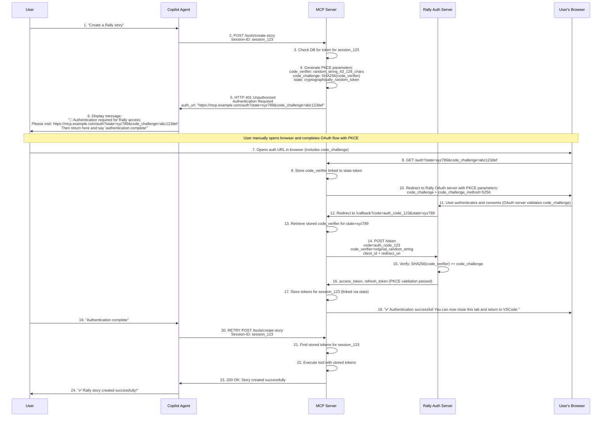

## 🌊 Sequence Diagram

```mermaid
sequenceDiagram
    participant User
    participant Agent as Copilot Agent
    participant MCP as MCP Server
    participant AuthSrv as Rally Auth Server
    participant Browser as User's Browser

    User->>Agent: 1. "Create a Rally story"
    Agent->>MCP: 2. POST /tools/create-story<br>Session-ID: session_123
    MCP->>MCP: 3. Check DB for token for session_123
    MCP->>MCP: 4. Generate PKCE parameters:<br>code_verifier: random_string_43_128_chars<br>code_challenge: SHA256(code_verifier)<br>state: cryptographically_random_token
    MCP->>Agent: 5. HTTP 401 Unauthorized<br>Authentication Required<br>auth_url: "https://mcp.example.com/auth?state=xyz789&code_challenge=abc123def"

    Agent->>User: 6. Display message:<br>"🔐 Authentication required for Rally access.<br>Please visit: https://mcp.example.com/auth?state=xyz789&code_challenge=abc123def<br>Then return here and say 'authentication complete'"
    
    Note over User,Browser: User manually opens browser and completes OAuth flow with PKCE
    User->>Browser: 7. Opens auth URL in browser (includes code_challenge)
    Browser->>MCP: 8. GET /auth?state=xyz789&code_challenge=abc123def
    MCP->>MCP: 9. Store code_verifier linked to state token
    MCP->>Browser: 10. Redirect to Rally OAuth server with PKCE parameters:<br>code_challenge + code_challenge_method=S256
    Browser->>AuthSrv: 11. User authenticates and consents (OAuth server validates code_challenge)
    AuthSrv->>MCP: 12. Redirect to /callback?code=auth_code_123&state=xyz789
    MCP->>MCP: 13. Retrieve stored code_verifier for state=xyz789
    MCP->>AuthSrv: 14. POST /token<br>code=auth_code_123<br>code_verifier=original_random_string<br>client_id + redirect_uri
    AuthSrv->>AuthSrv: 15. Verify: SHA256(code_verifier) == code_challenge
    AuthSrv->>MCP: 16. access_token, refresh_token (PKCE validation passed)
    MCP->>MCP: 17. Store tokens for session_123 (linked via state)
    MCP->>Browser: 18. "✅ Authentication successful! You can now close this tab and return to VSCode."
    
    User->>Agent: 19. "Authentication complete"
    Agent->>MCP: 20. RETRY POST /tools/create-story<br>Session-ID: session_123
    MCP->>MCP: 21. Find stored tokens for session_123
    MCP->>MCP: 22. Execute tool with stored tokens
    MCP->>Agent: 23. 200 OK: Story created successfully
    Agent->>User: 24. "✅ Rally story created successfully!"
```

---
