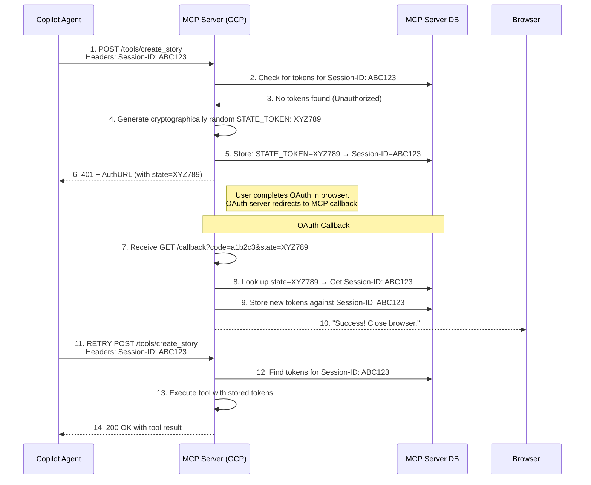

## � State Parameter to Session-ID Mapping

The state token is critically associated with the Session-ID provided by the Agent. This association is the linchpin that allows the MCP server to "remember" which IDE session initiated the authentication request after the user completes the browser-based OAuth flow.

### Detailed State Mapping Flow



### Step-by-Step State Mapping Breakdown

1. **Initial Request with Session-ID**: The Copilot Agent makes its first call to the MCP server's tool endpoint (e.g., `POST /tools/create_rally_story`). It includes the `Session-ID: ABC123` header.

2. **Server Generates State**: The MCP server receives the request and sees that `Session-ID: ABC123` has no associated access tokens. It then:
   - Generates a unique, cryptographically random string for the state parameter (e.g., `XYZ789`)
   - Creates a crucial association in its database: it stores `state=XYZ789 -> Session-ID=ABC123`

3. **AuthURL with State**: The MCP server generates the AuthURL for the OAuth provider (Rally/GitHub) and includes the generated state parameter:
   ```text
   https://rally1.rallydev.com/login/oauth2/auth?response_type=code&client_id=...&state=XYZ789&...
   ```

4. **OAuth Redirection**: After the user authenticates, the OAuth server redirects back to the MCP server's callback URL with the authorization code and the original state parameter (`.../oauth/callback?code=a1b2c3&state=XYZ789`).

5. **State Validation and Session Lookup**: The MCP server's callback endpoint:
   - Receives the request with `?state=XYZ789`
   - Validates the state parameter to prevent CSRF
   - Uses the state value to look up the associated Session-ID in its database
   - Finds that `state=XYZ789` is linked to `Session-ID=ABC123`

6. **Token Storage**: The MCP server exchanges the code for an access token. It then stores this access token (and refresh token) against the `Session-ID: ABC123` in its database.

7. **Completing the Loop**: When the Copilot Agent retries the original request with `Session-ID: ABC123`, the MCP server finds the valid tokens and can execute the tool call.

### Parameter Summary

| Parameter | Generated By | Purpose | Association |
|-----------|-------------|---------|-------------|
| **Session-ID** | Copilot Agent | A persistent identifier for the entire IDE session. Used to link all requests from the same user to their stored OAuth tokens. | The key used by the MCP server to store and retrieve the user's access tokens. |
| **state** | MCP Server | A one-time, unique token for the OAuth flow. Its sole purpose is to securely connect the OAuth callback response back to the original session that initiated the request. | The temporary bridge. The MCP server creates a database entry that maps the state token to the Session-ID. |

This mechanism ensures that even though the OAuth flow happens out-of-band in a web browser, the resulting credentials are correctly linked to the original user session in the IDE.

---
