## 🔗 OAuth 2.1 AuthURL Examples with PKCE

Here are examples of AuthURLs that an MCP server would generate for Rally and GitHub, based on the OAuth 2.1 authorization code flow with PKCE (Proof Key for Code Exchange), which is **MANDATORY** for OAuth 2.1 compliance.

### Example AuthURL for Rally (with PKCE)

```text
https://rally1.rallydev.com/login/oauth2/auth?
  response_type=code
  &client_id=your_rally_client_id
  &redirect_uri=https://your-mcp-server.gcp.cloud/oauth/callback
  &scope=alm:read%20alm:write
  &state=7a3f81b0e5c2d4a6b9c8e1f2a7d3e5c8
  &code_challenge=5VXp1mP5z6uRxE3Xv8w7Wr2qH0nK8lL9aBc3dF1gS4iJ7yT6oM
  &code_challenge_method=S256
```

### Example AuthURL for GitHub (with PKCE)

```text
https://github.com/login/oauth/authorize?
  response_type=code
  &client_id=your_github_client_id
  &redirect_uri=https://your-mcp-server.gcp.cloud/oauth/callback
  &scope=repo%20read:user
  &state=8b4c6e2a1d9f3e7c5a0b2d8e3f1a5c7b
  &code_challenge=kL9aBc3dF1gS4iJ7yT6oM5VXp1mP5z6uRxE3Xv8w7Wr2qH0n
  &code_challenge_method=S256
```

### 🔐 PKCE Parameters Explained

| Parameter | Description | Example Value | Security Purpose |
|-----------|-------------|---------------|------------------|
| **code_challenge** | SHA256 hash of code_verifier (base64url-encoded) | `5VXp1mP5z6uRxE3Xv8w7Wr2qH0nK8lL9aBc3dF1gS4iJ7yT6oM` | Prevents authorization code interception |
| **code_challenge_method** | Hashing method for PKCE | `S256` (SHA256) | Tells OAuth server how to verify challenge |
| **state** | CSRF protection token | `7a3f81b0e5c2d4a6b9c8e1f2a7d3e5c8` | Links OAuth callback to original session |
| **code_verifier** | Original random string (NOT in URL) | `7w8x9y0z1a2b3c4d5e6f` | Sent later during token exchange |

### 🛡️ PKCE Security Flow

```mermaid
graph LR
    A[MCP Server Generates<br/>code_verifier] --> B[Calculate<br/>code_challenge = SHA256]
    B --> C[Include code_challenge<br/>in Auth URL]
    C --> D[User Completes OAuth<br/>at OAuth Server]
    D --> E[OAuth Server Stores<br/>code_challenge]
    E --> F[Authorization Code<br/>Returned to MCP Server]
    F --> G[MCP Server Sends<br/>code_verifier in Token Request]
    G --> H[OAuth Server Verifies<br/>SHA256 Match]
    H --> I[Tokens Issued Only<br/>if PKCE Valid]
```



### 🔍 Key Components Explained

Both URLs include these standard OAuth 2.1 parameters:

| Parameter | Description |
|-----------|-------------|
| **`response_type=code`** | Indicates the authorization code flow is being used |
| **`client_id`** | The unique identifier for your MCP server registered with the OAuth provider (Rally or GitHub) |
| **`redirect_uri`** | The endpoint on your MCP server that will handle the OAuth callback. This must match exactly with the URI registered with the OAuth provider |
| **`scope`** | Specifies the level of access being requested:<br/>• **Rally**: `alm:read alm:write` (for accessing Rally's Application Lifecycle Management features)<br/>• **GitHub**: `repo read:user` (for repository access and reading user profile data) |
| **`state`** | A unique, cryptographically random string generated by the MCP server for each authorization request. Used to maintain state between the request and callback and prevent CSRF attacks. The MCP server stores this value and associates it with the user's session |
| **`code_challenge`** | A Base64URL-encoded SHA-256 hash of a cryptographically random `code_verifier`. Part of the PKCE extension that protects against authorization code interception attacks |
| **`code_challenge_method=S256`** | Indicates that SHA-256 is used for the PKCE code challenge |

### 🔄 How the MCP Server Uses This URL

1. **Unauthenticated Request**: When an unauthenticated user makes a request, the MCP server returns an HTTP 401 Unauthorized status code

2. **Resource Discovery**: The response includes a `WWW-Authenticate` header containing a link to its resource metadata endpoint (e.g., `https://your-mcp-server.gcp.cloud/.well-known/oauth-protected-resource`)

3. **Client Discovery**: The client (like Copilot) uses this metadata to discover the `authorization_servers` and required scopes

4. **AuthURL Construction**: The client constructs the appropriate AuthURL (like the examples above) and directs the user to it

5. **Authentication & Consent**: User authenticates and grants consent on the Rally or GitHub page

6. **Code Exchange**: The OAuth server redirects back to the MCP server's `redirect_uri` with an authorization code and the original state parameter

7. **Token Exchange**: The MCP server exchanges this code for an access token using the PKCE `code_verifier`

---
