# MCP Implementation Class Diagram (Enhanced Security Architecture)

This document provides a comprehensive class diagram showing the relationships between classes in the enhanced MCP (Model Context Protocol) implementation, including the new 3-layer security architecture with LLM Guard integration, Model Armor protection, and optimized defense-in-depth patterns.

## Enhanced Security Architecture Overview

```
┌─────────────────────────────────────────────────────────────────┐
│                    3-Layer Security Architecture                 │
├─────────────────────────────────────────────────────────────────┤
│ Layer 1: Apigee Gateway (External)                             │
│ ├── Authentication & Authorization                              │
│ ├── Rate Limiting & Throttling                                 │
│ ├── CORS Policy Enforcement                                    │
│ └── Basic Input Validation                                     │
├─────────────────────────────────────────────────────────────────┤
│ Layer 2: Agent Service (4 Controls + 2 LLM Guards)             │
│ ├── Prompt Injection Protection (Model Armor + Fallback)       │
│ ├── Context Size Validation                                    │
│ ├── MCP Response Verification                                  │
│ ├── Response Sanitization                                      │
│ ├── LLM Input Guard (Model Armor)                              │
│ └── LLM Output Guard (Model Armor)                             │
├─────────────────────────────────────────────────────────────────┤
│ Layer 3: MCP Server (12 Comprehensive Controls)                │
│ └── Complete Zero-Trust Tool Security Pipeline                 │
└─────────────────────────────────────────────────────────────────┘
```

## Class Diagram (PlantUML Format)

```plantuml
@startuml MCP_Enhanced_Architecture_Class_Diagram

!define LIGHTBLUE #E1F5FE
!define LIGHTGREEN #E8F5E8
!define LIGHTYELLOW #FFF3E0
!define LIGHTRED #FFEBEE
!define LIGHTPURPLE #F3E5F5
!define LIGHTCYAN #E0F2F1
!define LIGHTORANGE #FFF8E1

package "Agent Service Layer (Layer 2)" {
    class AgentService LIGHTCYAN {
        +mcp_client: BaseMCPClient
        +model: str
        +name: str
        +instruction: str
        +agent: LlmAgent
        +toolset: MCPToolset
        +session_service: InMemorySessionService
        +is_initialized: bool
        +security_config: OptimizedSecurityConfig
        +security: OptimizedAgentSecurity
        +logger: Logger
        --
        +__init__(mcp_client: BaseMCPClient, model: str, name: str, instruction: str, security_config: OptimizedSecurityConfig)
        +initialize(): void
        +greet_user(message: str, user_id: str, session_id: str): Dict[str, Any]
        +secure_greet_user(request: GreetingRequest, fastapi_request: Request): Dict[str, Any]
        +get_security_status(): Dict[str, Any]
        +cleanup(): void
    }

    class OptimizedSecurityConfig LIGHTCYAN {
        +enable_prompt_injection_protection: bool
        +enable_context_size_validation: bool
        +enable_mcp_response_verification: bool
        +enable_response_sanitization: bool
        +enable_security_audit_logging: bool
        +enable_llm_input_guard: bool
        +enable_llm_output_guard: bool
        +max_context_size: int
        +prompt_injection_threshold: float
        +max_response_size: int
        +verify_mcp_signatures: bool
        +trust_unsigned_responses: bool
        +llm_model_name: str
        +llm_guard_timeout: float
    }

    class OptimizedAgentSecurity LIGHTCYAN {
        +config: OptimizedSecurityConfig
        +prompt_guard: PromptInjectionGuard
        +context_validator: ContextSizeValidator
        +mcp_verifier: MCPResponseVerifier
        +response_sanitizer: ResponseSanitizer
        +auditor: SecurityAuditor
        +llm_guard: LLMGuard
        +logger: Logger
        --
        +__init__(config: OptimizedSecurityConfig)
        +validate_request(message: str, user_id: str, session_id: str, context: str): Tuple[bool, Dict]
        +verify_mcp_response(mcp_response: Dict, user_id: str, session_id: str): Tuple[bool, Dict]
        +sanitize_response(response: str, user_id: str, session_id: str): Tuple[str, Dict]
        +guard_llm_input(context: str, user_message: str, system_prompt: str): Tuple[bool, Dict, Dict]
        +guard_llm_output(llm_response: str, original_context: str): Tuple[bool, str, Dict]
        +get_security_status(): Dict[str, Any]
    }

    class PromptInjectionGuard LIGHTYELLOW {
        +threshold: float
        +logger: Logger
        +agent_fallback_patterns: List[str]
        +compiled_fallback_patterns: List[re.Pattern]
        --
        +__init__(threshold: float)
        +detect_injection(message: str): Tuple[bool, float, Dict]
        +_check_model_armor_agent_threats(text: str): Dict[str, Any]
        +_detect_with_fallback_patterns(message: str, detection_details: Dict): Tuple[bool, float, Dict]
        +_get_pattern_description(pattern_index: int): str
        +_has_repetitive_patterns(message: str): bool
    }

    class LLMGuard LIGHTYELLOW {
        +model_name: str
        +logger: Logger
        +input_protection_config: Dict[str, Any]
        +output_protection_config: Dict[str, Any]
        --
        +__init__(model_name: str)
        +sanitize_llm_input(context: str, user_message: str, system_prompt: str): Tuple[bool, Dict, Dict]
        +validate_llm_output(llm_response: str, original_context: str): Tuple[bool, str, Dict]
        +_check_model_armor_llm_input(combined_input: str): Dict[str, Any]
        +_check_model_armor_llm_output(llm_response: str, original_context: str): Dict[str, Any]
        +_basic_input_sanitization(context: str, user_message: str, system_prompt: str): Dict[str, str]
        +_basic_output_sanitization(llm_response: str): str
    }

    class ContextSizeValidator LIGHTYELLOW {
        +max_size: int
        +logger: Logger
        --
        +__init__(max_size: int)
        +validate_size(message: str, context: str): Tuple[bool, Dict]
    }

    class MCPResponseVerifier LIGHTYELLOW {
        +verify_signatures: bool
        +trust_unsigned: bool
        +logger: Logger
        --
        +__init__(verify_signatures: bool, trust_unsigned: bool)
        +verify_response(mcp_response: Dict): Tuple[bool, Dict]
        +_verify_signature(data: str, signature: str): bool
    }

    class ResponseSanitizer LIGHTYELLOW {
        +max_response_size: int
        +logger: Logger
        +sanitization_patterns: List[Tuple[str, str]]
        +compiled_patterns: List[Tuple[re.Pattern, str]]
        --
        +__init__(max_response_size: int)
        +sanitize_response(response: str, user_id: str): Tuple[str, Dict]
    }

    class SecurityAuditor LIGHTYELLOW {
        +enable_logging: bool
        +logger: Logger
        --
        +__init__(enable_logging: bool)
        +log_security_event(event_type: str, details: Dict, user_id: str, session_id: str): void
        +_get_event_severity(event_type: str): str
    }

    class BaseMCPClient LIGHTYELLOW {
        +mcp_url: str
        +target_audience: str
        +session: httpx.AsyncClient
        +credentials: Optional[Credentials]
        --
        +__init__(mcp_url: str, target_audience: str)
        +get_toolset(): Tuple[List[Tool], MCPToolset]
        +_get_id_token(): str
        +_authenticate_with_gcp(request: Request): Request
    }
}

package "MCP Server Layer (Layer 3)" {
    abstract class BaseMCPServer <<ABC>> LIGHTBLUE {
        +config: Dict[str, Any]
        +input_sanitizer: InputSanitizer
        +token_validator: GoogleCloudTokenValidator
        +credential_manager: CredentialManager
        +context_sanitizer: ContextSanitizer
        +context_security: ContextSecurity
        +opa_client: OPAPolicyClient
        +installer_validator: InstallerSecurityValidator
        +server_registry: ServerNameRegistry
        +remote_authenticator: RemoteServerAuthenticator
        +tool_controller: ToolExposureController
        +semantic_validator: SemanticMappingValidator
        --
        +__init__(config: Dict[str, Any])
        +handle_request(request: Dict[str, Any]): Dict[str, Any]
        +validate_security_configuration(): Dict[str, Any]
        +_get_tool_metadata(tool_name: str): Dict[str, Any]
        +_determine_error_phase(error: Exception): str
        --
        <<abstract>> +_load_tool_schema(tool_name: str): Dict[str, Any]
        <<abstract>> +_load_security_rules(): List[Dict[str, Any]]
        <<abstract>> +get_expected_audience(): str
        <<abstract>> +validate_authorization(request_payload: dict)
        <<abstract>> +fetch_data(validated_params: dict, credentials: dict)
        <<abstract>> +build_context(raw_data): dict
    }

    class MCPServer LIGHTGREEN {
        +mcp: FastMCP
        --
        +__init__(config: Dict[str, Any])
        +register_tools(): void
        +get_fastapi_app(): FastAPI
        +_load_tool_schema(tool_name: str): Dict[str, Any]
        +_load_security_rules(): List[Dict[str, Any]]
        +get_expected_audience(): str
        +validate_authorization(request_payload: dict): void
        +fetch_data(validated_params: dict, credentials: dict): dict
        +build_context(raw_data): dict
    }
}

package "Security Controls (MCP Layer)" {
    class InputSanitizer LIGHTRED {
        +security_profile: str
        +patterns: List[re.Pattern]
        --
        +sanitize(text: str): str
        +sanitize_dict(data: Dict[str, Any]): Dict[str, Any]
        +_load_patterns(profile: str): List[re.Pattern]
        +_check_model_armor(text: str): Dict[str, Any]
    }

    class GoogleCloudTokenValidator LIGHTRED {
        +expected_audience: str
        +project_id: str
        +token_cache: Dict[str, Any]
        --
        +validate(token: str): Dict[str, Any]
        +_verify_google_token(token: str): Dict[str, Any]
        +_validate_token_claims(claims: Dict[str, Any]): bool
    }

    class CredentialManager LIGHTRED {
        +project_id: str
        +secret_client: secretmanager.SecretManagerServiceClient
        --
        +get_credentials(tool_name: str, params: Dict[str, Any]): Dict[str, Any]
        +_get_secret(secret_name: str): str
        +_build_secret_path(secret_name: str): str
    }

    class ContextSanitizer LIGHTRED {
        +security_level: str
        +sanitization_rules: Dict[str, Any]
        --
        +sanitize(context: Dict[str, Any]): Dict[str, Any]
        +_apply_data_loss_prevention(context: Dict[str, Any]): Dict[str, Any]
    }

    class ContextSecurity LIGHTRED {
        +kms_key_path: Optional[str]
        +signing_strategy: str
        --
        +sign(context: Dict[str, Any]): Dict[str, Any]
        +verify(signed_context: Dict[str, Any]): bool
    }

    class OPAPolicyClient LIGHTRED {
        +opa_url: str
        +timeout: int
        --
        +check_policy(policy_context: Dict[str, Any]): bool
    }

    class InstallerSecurityValidator LIGHTRED {
        +trusted_registries: List[str]
        +signature_keys: Dict[str, str]
        --
        +validate_tool_integrity(tool_name: str, metadata: Dict[str, Any]): bool
    }

    class ServerNameRegistry LIGHTRED {
        +registry_backend: str
        +registered_servers: Dict[str, Dict[str, Any]]
        --
        +verify_server_identity(server_id: str, tool_name: str): bool
    }

    class RemoteServerAuthenticator LIGHTRED {
        +trusted_ca_certs: List[str]
        +handshake_timeout: int
        --
        +authenticate_remote_server(server_id: str, certificate: str): bool
    }

    class ToolExposureController LIGHTRED {
        +policy_file: Optional[str]
        +exposure_policies: Dict[str, Dict[str, Any]]
        --
        +validate_tool_exposure(tool_name: str, user_id: str): bool
    }

    class SemanticMappingValidator LIGHTRED {
        +semantic_models: Dict[str, Any]
        +validation_cache: Dict[str, bool]
        --
        +validate_tool_semantics(tool_name: str, params: Dict[str, Any]): bool
    }
}

package "External Integrations" {
    class LlmAgent LIGHTORANGE {
        <<Google ADK>>
        +model: str
        +name: str
        +instruction: str
        +tools: List[Tool]
    }

    class MCPToolset LIGHTORANGE {
        <<Google ADK>>
        +tools: List[Tool]
        +close(): void
    }

    class FastMCP LIGHTORANGE {
        <<External Framework>>
        +tool(): decorator
        +http_app(): FastAPI
    }

    class FastAPI LIGHTORANGE {
        <<External Framework>>
        +mount(): void
        +get(): decorator
        +post(): decorator
    }

    class ModelArmor LIGHTORANGE {
        <<External API>>
        +analyze(): Dict[str, Any]
        +llm_guard_input(): Dict[str, Any]
        +llm_guard_output(): Dict[str, Any]
    }
}

package "Data Models" {
    class GreetingRequest LIGHTPURPLE {
        +message: str
        +user_id: Optional[str]
        +session_id: Optional[str]
        +signed_context: Optional[str]
    }

    class GreetingResponse LIGHTPURPLE {
        +response: str
        +user_id: str
        +session_id: str
        +success: bool
        +security_validation: Optional[Dict]
    }

    class SecurityStatusResponse LIGHTPURPLE {
        +security_level: str
        +active_controls: list
        +configuration: Dict[str, Any]
        +architecture: str
    }
}

' Inheritance relationships
BaseMCPServer --|> ABC : extends
MCPServer --|> BaseMCPServer : extends

' Agent Service composition relationships
AgentService *-- OptimizedAgentSecurity : contains
AgentService *-- BaseMCPClient : contains
AgentService *-- LlmAgent : contains
AgentService *-- MCPToolset : contains

' Optimized Security composition
OptimizedAgentSecurity *-- OptimizedSecurityConfig : contains
OptimizedAgentSecurity *-- PromptInjectionGuard : contains
OptimizedAgentSecurity *-- LLMGuard : contains
OptimizedAgentSecurity *-- ContextSizeValidator : contains
OptimizedAgentSecurity *-- MCPResponseVerifier : contains
OptimizedAgentSecurity *-- ResponseSanitizer : contains
OptimizedAgentSecurity *-- SecurityAuditor : contains

' MCP Server composition (12 controls)
BaseMCPServer *-- InputSanitizer : contains
BaseMCPServer *-- GoogleCloudTokenValidator : contains
BaseMCPServer *-- CredentialManager : contains
BaseMCPServer *-- ContextSanitizer : contains
BaseMCPServer *-- ContextSecurity : contains
BaseMCPServer *-- OPAPolicyClient : contains
BaseMCPServer *-- InstallerSecurityValidator : contains
BaseMCPServer *-- ServerNameRegistry : contains
BaseMCPServer *-- RemoteServerAuthenticator : contains
BaseMCPServer *-- ToolExposureController : contains
BaseMCPServer *-- SemanticMappingValidator : contains

' External integrations
MCPServer *-- FastMCP : contains
AgentService ..> FastAPI : creates
PromptInjectionGuard ..> ModelArmor : uses
LLMGuard ..> ModelArmor : uses
InputSanitizer ..> ModelArmor : uses

' Data flow relationships
AgentService ..> GreetingRequest : processes
AgentService ..> GreetingResponse : produces
AgentService ..> SecurityStatusResponse : produces

note top of AgentService : Enhanced AgentService with\n6-layer security architecture\n(4 controls + 2 LLM guards)

note top of OptimizedAgentSecurity : Streamlined security for Agent layer\nwith Model Armor integration\nand LLM protection

note top of LLMGuard : Model Armor LLM protection:\n- Input sanitization\n- Output validation\n- Context poisoning prevention\n- Prompt leakage protection

note top of BaseMCPServer : Complete MCP Server with\n12-phase security pipeline\nfor comprehensive tool protection

note bottom of "Agent Service Layer (Layer 2)" : Layer 2: Agent-specific security\nPerformance: 11-13ms overhead\nFocus: Agent behavior protection

note bottom of "MCP Server Layer (Layer 3)" : Layer 3: Comprehensive tool security\nAll tool interactions protected\nZero-trust architecture

@enduml
```



## Enhanced Architecture Relationships

### **3-Layer Security Architecture**

#### **Layer 1: Apigee Gateway (External)**
- **Authentication & Authorization**: OAuth 2.0, JWT validation
- **Rate Limiting & Throttling**: Request throttling, DDoS protection  
- **CORS Policy Enforcement**: Cross-origin request management
- **Basic Input Validation**: Size limits, format validation

#### **Layer 2: Agent Service (6 Controls)**
1. **Prompt Injection Protection** - Model Armor + fallback patterns
2. **Context Size Validation** - Resource exhaustion protection
3. **MCP Response Verification** - Trust but verify principle
4. **Response Sanitization** - Information leakage prevention
5. **LLM Input Guard** - Model Armor input protection
6. **LLM Output Guard** - Model Armor output validation

#### **Layer 3: MCP Server (12 Controls)**
- **Complete zero-trust security pipeline**
- **Comprehensive tool protection**
- **Enterprise-grade threat detection**

### **Key Design Patterns**

#### **1. Layered Security Pattern**
- **Clear separation of concerns** across 3 layers
- **Non-redundant controls** optimized for each layer
- **Defense-in-depth** without performance penalties

#### **2. Composition Pattern**
- `AgentService` composes `OptimizedAgentSecurity`
- `OptimizedAgentSecurity` composes 6 security controls
- `BaseMCPServer` composes 12 security controls

#### **3. Strategy Pattern**
- Security controls are pluggable strategies
- Model Armor integration with fallback patterns
- Configurable security levels per deployment

#### **4. Facade Pattern**
- `OptimizedAgentSecurity` provides simplified interface
- `AgentService` coordinates all components seamlessly
- `BaseMCPServer` orchestrates MCP security pipeline

#### **5. Observer Pattern**
- `SecurityAuditor` observes all security events
- Comprehensive audit trail for compliance
- Real-time security monitoring and alerting

### **Model Armor Integration**

#### **Enterprise-Grade Threat Detection**
- **Agent Layer**: Agent behavior manipulation detection
- **LLM Layer**: Input/output protection and validation
- **Fallback Protection**: Local patterns when API unavailable
- **Performance Optimized**: 3-4ms Model Armor overhead

#### **Security Benefits**
- **Specialized Detection**: Context-aware threat analysis
- **Comprehensive Coverage**: All AI interaction points protected
- **Enterprise Support**: Production-ready API integration
- **Audit Compliance**: Detailed security event logging

### **Performance Characteristics**

#### **Agent Service Layer**
- **Total Overhead**: 11-13ms for 6 controls
- **Optimized Flow**: Fast-fail validation sequence
- **Model Armor**: 3-4ms per API call with fallback
- **Memory Efficient**: Minimal resource footprint

#### **Architecture Benefits**
1. **Eliminates Security Redundancy** - No duplicate controls
2. **Optimizes Performance** - Minimal latency impact (~13ms total)
3. **Maintains Defense-in-Depth** - Complementary protection layers
4. **Clear Separation of Concerns** - Each layer has specific responsibilities
5. **Enterprise-Ready** - Production deployment and monitoring

This enhanced architecture provides enterprise-grade AI security with comprehensive Model Armor protection while maintaining optimal performance and clear architectural boundaries.
