# MCP Enhanced Architecture - Mermaid Class Diagram

This document provides a Mermaid-format class diagram for the enhanced MCP implementation with 3-layer security architecture, LLM Guard integration, and Model Armor protection.

## Enhanced 3-Layer Security Architecture

```
┌─────────────────────────────────────────────────────────────────┐
│                    3-Layer Security Architecture                 │
├─────────────────────────────────────────────────────────────────┤
│ Layer 1: Apigee Gateway (External)                             │
│ ├── Authentication & Authorization                              │
│ ├── Rate Limiting & Throttling                                 │
│ ├── CORS Policy Enforcement                                    │
│ └── Basic Input Validation                                     │
├─────────────────────────────────────────────────────────────────┤
│ Layer 2: Agent Service (4 Controls + 2 LLM Guards)             │
│ ├── Prompt Injection Protection (Model Armor + Fallback)       │
│ ├── Context Size Validation                                    │
│ ├── MCP Response Verification                                  │
│ ├── Response Sanitization                                      │
│ ├── LLM Input Guard (Model Armor)                              │
│ └── LLM Output Guard (Model Armor)                             │
├─────────────────────────────────────────────────────────────────┤
│ Layer 3: MCP Server (12 Comprehensive Controls)                │
│ └── Complete Zero-Trust Tool Security Pipeline                 │
└─────────────────────────────────────────────────────────────────┘
```

## Mermaid Class Diagram

```mermaid
classDiagram
    %% Agent Service Layer (Layer 2) - Enhanced Security
    class AgentService {
        +BaseMCPClient mcp_client
        +str model
        +str name
        +str instruction
        +LlmAgent agent
        +MCPToolset toolset
        +InMemorySessionService session_service
        +bool is_initialized
        +OptimizedSecurityConfig security_config
        +OptimizedAgentSecurity security
        +Logger logger
        +__init__(mcp_client, model, name, instruction, security_config)
        +initialize() void
        +greet_user(message, user_id, session_id) Dict
        +secure_greet_user(request, fastapi_request) Dict
        +get_security_status() Dict
        +cleanup() void
    }

    class OptimizedSecurityConfig {
        +bool enable_prompt_injection_protection
        +bool enable_context_size_validation
        +bool enable_mcp_response_verification
        +bool enable_response_sanitization
        +bool enable_security_audit_logging
        +bool enable_llm_input_guard
        +bool enable_llm_output_guard
        +int max_context_size
        +float prompt_injection_threshold
        +int max_response_size
        +bool verify_mcp_signatures
        +bool trust_unsigned_responses
        +str llm_model_name
        +float llm_guard_timeout
    }

    class OptimizedAgentSecurity {
        +OptimizedSecurityConfig config
        +PromptInjectionGuard prompt_guard
        +ContextSizeValidator context_validator
        +MCPResponseVerifier mcp_verifier
        +ResponseSanitizer response_sanitizer
        +SecurityAuditor auditor
        +LLMGuard llm_guard
        +Logger logger
        +__init__(config)
        +validate_request(message, user_id, session_id, context) Tuple
        +verify_mcp_response(mcp_response, user_id, session_id) Tuple
        +sanitize_response(response, user_id, session_id) Tuple
        +guard_llm_input(context, user_message, system_prompt) Tuple
        +guard_llm_output(llm_response, original_context) Tuple
        +get_security_status() Dict
    }

    class PromptInjectionGuard {
        +float threshold
        +Logger logger
        +List agent_fallback_patterns
        +List compiled_fallback_patterns
        +__init__(threshold)
        +detect_injection(message) Tuple
        +_check_model_armor_agent_threats(text) Dict
        +_detect_with_fallback_patterns(message, detection_details) Tuple
        +_get_pattern_description(pattern_index) str
        +_has_repetitive_patterns(message) bool
    }

    class LLMGuard {
        +str model_name
        +Logger logger
        +Dict input_protection_config
        +Dict output_protection_config
        +__init__(model_name)
        +sanitize_llm_input(context, user_message, system_prompt) Tuple
        +validate_llm_output(llm_response, original_context) Tuple
        +_check_model_armor_llm_input(combined_input) Dict
        +_check_model_armor_llm_output(llm_response, original_context) Dict
        +_basic_input_sanitization(context, user_message, system_prompt) Dict
        +_basic_output_sanitization(llm_response) str
    }

    class ContextSizeValidator {
        +int max_size
        +Logger logger
        +__init__(max_size)
        +validate_size(message, context) Tuple
    }

    class MCPResponseVerifier {
        +bool verify_signatures
        +bool trust_unsigned
        +Logger logger
        +__init__(verify_signatures, trust_unsigned)
        +verify_response(mcp_response) Tuple
        +_verify_signature(data, signature) bool
    }

    class ResponseSanitizer {
        +int max_response_size
        +Logger logger
        +List sanitization_patterns
        +List compiled_patterns
        +__init__(max_response_size)
        +sanitize_response(response, user_id) Tuple
    }

    class SecurityAuditor {
        +bool enable_logging
        +Logger logger
        +__init__(enable_logging)
        +log_security_event(event_type, details, user_id, session_id) void
        +_get_event_severity(event_type) str
    }

    class BaseMCPClient {
        +str mcp_url
        +str target_audience
        +AsyncClient session
        +Optional credentials
        +__init__(mcp_url, target_audience)
        +get_toolset() Tuple
        +_get_id_token() str
        +_authenticate_with_gcp(request) Request
    }

    %% MCP Server Layer (Layer 3) - Comprehensive Security
    class BaseMCPServer {
        <<abstract>>
        +Dict config
        +InputSanitizer input_sanitizer
        +GoogleCloudTokenValidator token_validator
        +CredentialManager credential_manager
        +ContextSanitizer context_sanitizer
        +ContextSecurity context_security
        +OPAPolicyClient opa_client
        +InstallerSecurityValidator installer_validator
        +ServerNameRegistry server_registry
        +RemoteServerAuthenticator remote_authenticator
        +ToolExposureController tool_controller
        +SemanticMappingValidator semantic_validator
        +__init__(config)
        +handle_request(request) Dict
        +validate_security_configuration() Dict
        +_get_tool_metadata(tool_name) Dict
        +_determine_error_phase(error) str
        +_load_tool_schema(tool_name)* Dict
        +_load_security_rules()* List
        +get_expected_audience()* str
        +validate_authorization(request_payload)* void
        +fetch_data(validated_params, credentials)* dict
        +build_context(raw_data)* dict
    }

    class MCPServer {
        +FastMCP mcp
        +__init__(config)
        +register_tools() void
        +get_fastapi_app() FastAPI
        +_load_tool_schema(tool_name) Dict
        +_load_security_rules() List
        +get_expected_audience() str
        +validate_authorization(request_payload) void
        +fetch_data(validated_params, credentials) dict
        +build_context(raw_data) dict
    }

    %% Security Controls (MCP Layer 3)
    class InputSanitizer {
        +str security_profile
        +List patterns
        +sanitize(text) str
        +sanitize_dict(data) Dict
        +_load_patterns(profile) List
        +_check_model_armor(text) Dict
    }

    class GoogleCloudTokenValidator {
        +str expected_audience
        +str project_id
        +Dict token_cache
        +validate(token) Dict
        +_verify_google_token(token) Dict
        +_validate_token_claims(claims) bool
    }

    class CredentialManager {
        +str project_id
        +SecretManagerServiceClient secret_client
        +get_credentials(tool_name, params) Dict
        +_get_secret(secret_name) str
        +_build_secret_path(secret_name) str
    }

    class ContextSanitizer {
        +str security_level
        +Dict sanitization_rules
        +sanitize(context) Dict
        +_apply_data_loss_prevention(context) Dict
    }

    class ContextSecurity {
        +Optional kms_key_path
        +str signing_strategy
        +sign(context) Dict
        +verify(signed_context) bool
    }

    class OPAPolicyClient {
        +str opa_url
        +int timeout
        +check_policy(policy_context) bool
    }

    class InstallerSecurityValidator {
        +List trusted_registries
        +Dict signature_keys
        +validate_tool_integrity(tool_name, metadata) bool
    }

    class ServerNameRegistry {
        +str registry_backend
        +Dict registered_servers
        +verify_server_identity(server_id, tool_name) bool
    }

    class RemoteServerAuthenticator {
        +List trusted_ca_certs
        +int handshake_timeout
        +authenticate_remote_server(server_id, certificate) bool
    }

    class ToolExposureController {
        +Optional policy_file
        +Dict exposure_policies
        +validate_tool_exposure(tool_name, user_id) bool
    }

    class SemanticMappingValidator {
        +Dict semantic_models
        +Dict validation_cache
        +validate_tool_semantics(tool_name, params) bool
    }

    %% External Integrations
    class LlmAgent {
        <<Google ADK>>
        +str model
        +str name
        +str instruction
        +List tools
    }

    class MCPToolset {
        <<Google ADK>>
        +List tools
        +close() void
    }

    class FastMCP {
        <<External Framework>>
        +tool() decorator
        +http_app() FastAPI
    }

    class FastAPI {
        <<External Framework>>
        +mount() void
        +get() decorator
        +post() decorator
    }

    class ModelArmor {
        <<External API>>
        +analyze() Dict
        +llm_guard_input() Dict
        +llm_guard_output() Dict
    }

    %% Data Models
    class GreetingRequest {
        +str message
        +Optional user_id
        +Optional session_id
        +Optional signed_context
    }

    class GreetingResponse {
        +str response
        +str user_id
        +str session_id
        +bool success
        +Optional security_validation
    }

    class SecurityStatusResponse {
        +str security_level
        +list active_controls
        +Dict configuration
        +str architecture
    }

    %% Inheritance Relationships
    MCPServer --|> BaseMCPServer : extends

    %% Agent Service Composition (Layer 2)
    AgentService *-- OptimizedAgentSecurity : contains
    AgentService *-- BaseMCPClient : contains
    AgentService *-- LlmAgent : contains
    AgentService *-- MCPToolset : contains

    %% Agent Security Composition (6 Controls)
    OptimizedAgentSecurity *-- OptimizedSecurityConfig : contains
    OptimizedAgentSecurity *-- PromptInjectionGuard : contains
    OptimizedAgentSecurity *-- LLMGuard : contains
    OptimizedAgentSecurity *-- ContextSizeValidator : contains
    OptimizedAgentSecurity *-- MCPResponseVerifier : contains
    OptimizedAgentSecurity *-- ResponseSanitizer : contains
    OptimizedAgentSecurity *-- SecurityAuditor : contains

    %% MCP Server Composition (12 Controls)
    BaseMCPServer *-- InputSanitizer : contains
    BaseMCPServer *-- GoogleCloudTokenValidator : contains
    BaseMCPServer *-- CredentialManager : contains
    BaseMCPServer *-- ContextSanitizer : contains
    BaseMCPServer *-- ContextSecurity : contains
    BaseMCPServer *-- OPAPolicyClient : contains
    BaseMCPServer *-- InstallerSecurityValidator : contains
    BaseMCPServer *-- ServerNameRegistry : contains
    BaseMCPServer *-- RemoteServerAuthenticator : contains
    BaseMCPServer *-- ToolExposureController : contains
    BaseMCPServer *-- SemanticMappingValidator : contains

    %% External Integrations
    MCPServer *-- FastMCP : contains
    AgentService ..> FastAPI : creates
    PromptInjectionGuard ..> ModelArmor : uses
    LLMGuard ..> ModelArmor : uses
    InputSanitizer ..> ModelArmor : uses

    %% Data Flow Relationships
    AgentService ..> GreetingRequest : processes
    AgentService ..> GreetingResponse : produces
    AgentService ..> SecurityStatusResponse : produces

    %% Layer Boundaries
    class Layer1 {
        <<Apigee Gateway>>
        External Authentication
        Rate Limiting
        CORS Policy
        Basic Validation
    }

    class Layer2 {
        <<Agent Service>>
        6 Security Controls
        Model Armor Integration
        LLM Protection
    }

    class Layer3 {
        <<MCP Server>>
        12 Security Controls
        Zero-Trust Pipeline
        Tool Protection
    }
```



## Enhanced Architecture Benefits

### **Layer Separation & Optimization**

#### **Layer 1: Apigee Gateway (External)**
- **Authentication & Authorization**: OAuth 2.0, JWT validation
- **Rate Limiting & Throttling**: DDoS protection, request management
- **CORS Policy Enforcement**: Cross-origin security
- **Basic Input Validation**: Size limits, format checks

#### **Layer 2: Agent Service (6 Controls)**
1. **PromptInjectionGuard**: Model Armor + fallback patterns
2. **LLMGuard**: Input/output Model Armor protection  
3. **ContextSizeValidator**: Resource exhaustion prevention
4. **MCPResponseVerifier**: Trust but verify responses
5. **ResponseSanitizer**: Information leakage prevention
6. **SecurityAuditor**: Comprehensive audit logging

#### **Layer 3: MCP Server (12 Controls)**
- **Complete zero-trust security pipeline**
- **Comprehensive tool interaction protection**
- **Enterprise-grade threat detection**

### **Model Armor Integration**

#### **Enhanced Threat Detection**
- **Agent Layer**: Behavior manipulation detection
- **LLM Layer**: Input/output content protection
- **Tool Layer**: General input sanitization
- **Fallback Patterns**: Local protection when API unavailable

#### **Performance Optimization**
- **Agent Layer**: 11-13ms total overhead
- **Model Armor**: 3-4ms per API call
- **Optimized Flow**: Fast-fail validation sequence
- **Memory Efficient**: Minimal resource footprint

### **Design Patterns Implemented**

1. **Layered Security**: Clear separation of concerns
2. **Composition**: Security controls as composed components
3. **Strategy**: Pluggable security strategies
4. **Facade**: Simplified security interface
5. **Observer**: Comprehensive audit trail

### **Enterprise Benefits**

1. **Zero Security Redundancy**: Each layer has specific responsibilities
2. **Optimal Performance**: ~13ms total latency impact
3. **Defense-in-Depth**: Complementary protection layers
4. **Enterprise-Ready**: Production monitoring and compliance
5. **Model Armor Protection**: Specialized AI threat detection

This enhanced architecture provides enterprise-grade AI security with comprehensive Model Armor integration while maintaining optimal performance and clear architectural boundaries.
