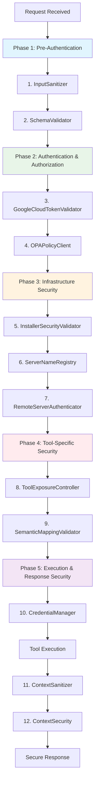

# MCP Implementation Class Diagram (Mermaid)

This is an alternative visual representation using Mermaid syntax for the MCP implementation class relationships.

```mermaid
classDiagram
    %% Core Framework Classes
    class ABC {
        <<abstract>>
    }
    
    class BaseMCPServer {
        <<abstract>>
        +config: Dict[str, Any]
        +input_sanitizer: InputSanitizer
        +token_validator: GoogleCloudTokenValidator
        +credential_manager: CredentialManager
        +context_sanitizer: ContextSanitizer
        +context_security: ContextSecurity
        +opa_client: OPAPolicyClient
        +installer_validator: InstallerSecurityValidator
        +server_registry: ServerNameRegistry
        +remote_authenticator: RemoteServerAuthenticator
        +tool_controller: ToolExposureController
        +semantic_validator: SemanticMappingValidator
        +handle_request(request: Dict[str, Any]) Dict[str, Any]
        +validate_security_configuration() Dict[str, Any]
        +_get_tool_metadata(tool_name: str)* Dict[str, Any]
        +_determine_error_phase(error: Exception) str
        +_load_tool_schema(tool_name: str)* Dict[str, Any]
        +_load_security_rules()* List[Dict[str, Any]]
        +get_expected_audience()* str
        +validate_authorization(request_payload: dict)*
        +fetch_data(validated_params: dict, credentials: dict)*
        +build_context(raw_data)*
    }
    
    class MCPServer {
        +mcp: FastMCP
        +register_tools() void
        +get_fastapi_app() FastAPI
        +_load_tool_schema(tool_name: str) Dict[str, Any]
        +_load_security_rules() List[Dict[str, Any]]
        +get_expected_audience() str
        +validate_authorization(request_payload: dict) void
        +fetch_data(validated_params: dict, credentials: dict) dict
        +build_context(raw_data) dict
    }
    
    %% Security Control Classes
    class InputSanitizer {
        +security_profile: str
        +patterns: List[re.Pattern]
        +sanitize(text: str) str
        +sanitize_dict(data: Dict[str, Any]) Dict[str, Any]
        +_load_patterns(profile: str) List[re.Pattern]
        +_check_model_armor(text: str) Dict[str, Any]
    }
    
    class GoogleCloudTokenValidator {
        +expected_audience: str
        +project_id: str
        +token_cache: Dict[str, Any]
        +validate(token: str) Dict[str, Any]
        +_verify_google_token(token: str) Dict[str, Any]
        +_validate_token_claims(claims: Dict[str, Any]) bool
    }
    
    class SchemaValidator {
        +schema: Dict[str, Any]
        +security_rules: List[Dict[str, Any]]
        +validate(data: Dict[str, Any]) Dict[str, Any]
        +_apply_security_rules(data: Dict[str, Any]) Dict[str, Any]
        +_validate_against_schema(data: Dict[str, Any]) Dict[str, Any]
    }
    
    class CredentialManager {
        +project_id: str
        +secret_client: secretmanager.SecretManagerServiceClient
        +get_credentials(tool_name: str, params: Dict[str, Any]) Dict[str, Any]
        +_get_secret(secret_name: str) str
        +_build_secret_path(secret_name: str) str
    }
    
    class ContextSanitizer {
        +security_level: str
        +sanitization_rules: Dict[str, Any]
        +sanitize(context: Dict[str, Any]) Dict[str, Any]
        +_apply_data_loss_prevention(context: Dict[str, Any]) Dict[str, Any]
        +_remove_sensitive_fields(context: Dict[str, Any]) Dict[str, Any]
    }
    
    class ContextSecurity {
        +kms_key_path: Optional[str]
        +signing_strategy: str
        +private_key: Optional[rsa.RSAPrivateKey]
        +public_key: Optional[rsa.RSAPublicKey]
        +sign(context: Dict[str, Any]) Dict[str, Any]
        +verify(signed_context: Dict[str, Any]) bool
        +_kms_sign(data: bytes) bytes
        +_local_sign(data: bytes) bytes
    }
    
    class OPAPolicyClient {
        +opa_url: str
        +timeout: int
        +check_policy(policy_context: Dict[str, Any]) bool
        +_make_opa_request(context: Dict[str, Any]) Dict[str, Any]
        +_parse_opa_response(response: Dict[str, Any]) bool
    }
    
    %% Zero-Trust Security Controls
    class InstallerSecurityValidator {
        +trusted_registries: List[str]
        +signature_keys: Dict[str, str]
        +validation_cache: Dict[str, bool]
        +validate_tool_integrity(tool_name: str, metadata: Dict[str, Any]) bool
        +_check_source_registry(source: str) bool
        +_verify_package_signature(metadata: Dict[str, Any]) bool
    }
    
    class ServerNameRegistry {
        +registry_backend: str
        +namespace_separator: str
        +registered_servers: Dict[str, Dict[str, Any]]
        +register_server(server_id: str, metadata: Dict[str, Any]) bool
        +verify_server_identity(server_id: str, tool_name: str) bool
        +_validate_server_capabilities(server_id: str, tool_name: str) bool
    }
    
    class RemoteServerAuthenticator {
        +trusted_ca_certs: List[str]
        +handshake_timeout: int
        +authentication_cache: Dict[str, Dict[str, Any]]
        +authenticate_remote_server(server_id: str, certificate: str) bool
        +_verify_certificate_chain(certificate: str) bool
        +_perform_security_handshake(server_id: str) bool
    }
    
    class ToolExposureController {
        +policy_file: Optional[str]
        +default_policy: str
        +exposure_policies: Dict[str, Dict[str, Any]]
        +usage_tracking: Dict[str, List[Dict[str, Any]]]
        +validate_tool_exposure(tool_name: str, user_id: str) bool
        +approve_tool_exposure(tool_name: str, user_id: str) str
        +_load_exposure_policies() Dict[str, Dict[str, Any]]
    }
    
    class SemanticMappingValidator {
        +semantic_models: Dict[str, Any]
        +validation_cache: Dict[str, bool]
        +validate_tool_semantics(tool_name: str, params: Dict[str, Any]) bool
        +_validate_parameter_semantics(tool_name: str, params: Dict[str, Any]) bool
        +_check_semantic_consistency(tool_metadata: Dict[str, Any]) bool
    }
    
    %% Exception Classes
    class SecurityException {
        +message: str
        +error_code: str
        +security_context: Dict[str, Any]
    }
    
    class Exception {
        <<built-in>>
        +message: str
    }
    
    %% External Dependencies
    class FastMCP {
        <<external>>
        +tool() decorator
        +http_app(path: str, transport: str) FastAPI
    }
    
    class FastAPI {
        <<external>>
        +mount(path: str, app: FastAPI) void
        +get(path: str) decorator
        +post(path: str) decorator
    }
    
    %% Inheritance Relationships
    ABC <|-- BaseMCPServer : extends
    BaseMCPServer <|-- MCPServer : extends
    Exception <|-- SecurityException : extends
    
    %% Composition Relationships (BaseMCPServer contains all security controls)
    BaseMCPServer *-- InputSanitizer : contains
    BaseMCPServer *-- GoogleCloudTokenValidator : contains
    BaseMCPServer *-- CredentialManager : contains
    BaseMCPServer *-- ContextSanitizer : contains
    BaseMCPServer *-- ContextSecurity : contains
    BaseMCPServer *-- OPAPolicyClient : contains
    BaseMCPServer *-- InstallerSecurityValidator : contains
    BaseMCPServer *-- ServerNameRegistry : contains
    BaseMCPServer *-- RemoteServerAuthenticator : contains
    BaseMCPServer *-- ToolExposureController : contains
    BaseMCPServer *-- SemanticMappingValidator : contains
    
    %% MCPServer specific relationships
    MCPServer *-- FastMCP : contains
    MCPServer ..> FastAPI : creates
    
    %% Security Control Dependencies
    SchemaValidator ..> InputSanitizer : may use
    ContextSecurity ..> CredentialManager : may use
    ToolExposureController ..> OPAPolicyClient : may use
    
    %% Exception Dependencies
    InputSanitizer ..> SecurityException : throws
    GoogleCloudTokenValidator ..> SecurityException : throws
    SchemaValidator ..> SecurityException : throws
    CredentialManager ..> SecurityException : throws
    ContextSanitizer ..> SecurityException : throws
    ContextSecurity ..> SecurityException : throws
    OPAPolicyClient ..> SecurityException : throws
    InstallerSecurityValidator ..> SecurityException : throws
    ServerNameRegistry ..> SecurityException : throws
    RemoteServerAuthenticator ..> SecurityException : throws
    ToolExposureController ..> SecurityException : throws
    SemanticMappingValidator ..> SecurityException : throws
```

## Security Pipeline Flow

The `BaseMCPServer.handle_request()` method orchestrates all 12 security controls in this optimal order:

## Key Design Patterns

1. **Template Method**: `BaseMCPServer.handle_request()` defines the security algorithm
2. **Strategy**: Security controls are pluggable strategies
3. **Composite**: BaseMCPServer composes 12 security controls
4. **Facade**: Simplified interface to complex security subsystem
5. **Chain of Responsibility**: Security pipeline with ordered validation

This architecture provides enterprise-grade security with clear separation of concerns and comprehensive coverage of all attack vectors.
