# MCP Implementation Class Diagram

This document provides a comprehensive class diagram showing the relationships between classes in the MCP (Model Context Protocol) implementation, including inheritance and delegation patterns.

## Class Diagram (PlantUML Format)

```plantuml
@startuml MCP_Implementation_Class_Diagram

!define LIGHTBLUE #E1F5FE
!define LIGHTGREEN #E8F5E8
!define LIGHTYELLOW #FFF3E0
!define LIGHTRED #FFEBEE
!define LIGHTPURPLE #F3E5F5

package "Core Framework" {
    abstract class BaseMCPServer <<ABC>> LIGHTBLUE {
        +config: Dict[str, Any]
        +input_sanitizer: InputSanitizer
        +token_validator: GoogleCloudTokenValidator
        +credential_manager: CredentialManager
        +context_sanitizer: ContextSanitizer
        +context_security: ContextSecurity
        +opa_client: OPAPolicyClient
        +installer_validator: InstallerSecurityValidator
        +server_registry: ServerNameRegistry
        +remote_authenticator: RemoteServerAuthenticator
        +tool_controller: ToolExposureController
        +semantic_validator: SemanticMappingValidator
        --
        +__init__(config: Dict[str, Any])
        +handle_request(request: Dict[str, Any]): Dict[str, Any]
        +validate_security_configuration(): Dict[str, Any]
        +_get_tool_metadata(tool_name: str): Dict[str, Any]
        +_determine_error_phase(error: Exception): str
        --
        <<abstract>> +_load_tool_schema(tool_name: str): Dict[str, Any]
        <<abstract>> +_load_security_rules(): List[Dict[str, Any]]
        <<abstract>> +get_expected_audience(): str
        <<abstract>> +validate_authorization(request_payload: dict)
        <<abstract>> +fetch_data(validated_params: dict, credentials: dict)
        <<abstract>> +build_context(raw_data): dict
    }

    class MCPServer LIGHTGREEN {
        +mcp: FastMCP
        --
        +__init__(config: Dict[str, Any])
        +register_tools(): void
        +get_fastapi_app(): FastAPI
        +_load_tool_schema(tool_name: str): Dict[str, Any]
        +_load_security_rules(): List[Dict[str, Any]]
        +get_expected_audience(): str
        +validate_authorization(request_payload: dict): void
        +fetch_data(validated_params: dict, credentials: dict): dict
        +build_context(raw_data): dict
    }
}

package "Security Controls" {
    class InputSanitizer LIGHTYELLOW {
        +security_profile: str
        +patterns: List[re.Pattern]
        --
        +__init__(security_profile: str = "default")
        +sanitize(text: str): str
        +sanitize_dict(data: Dict[str, Any]): Dict[str, Any]
        +_load_patterns(profile: str): List[re.Pattern]
        +_check_model_armor(text: str): Dict[str, Any]
        +_get_credential_if_available(secret_name: str): Optional[str]
    }

    class GoogleCloudTokenValidator LIGHTYELLOW {
        +expected_audience: str
        +project_id: str
        +token_cache: Dict[str, Any]
        --
        +__init__(expected_audience: str, project_id: str)
        +validate(token: str): Dict[str, Any]
        +_verify_google_token(token: str): Dict[str, Any]
        +_validate_token_claims(claims: Dict[str, Any]): bool
        +_cache_token_validation(token: str, claims: Dict[str, Any]): void
    }

    class SchemaValidator LIGHTYELLOW {
        +schema: Dict[str, Any]
        +security_rules: List[Dict[str, Any]]
        --
        +__init__(schema: Dict[str, Any], security_rules: List[Dict[str, Any]])
        +validate(data: Dict[str, Any]): Dict[str, Any]
        +_apply_security_rules(data: Dict[str, Any]): Dict[str, Any]
        +_validate_against_schema(data: Dict[str, Any]): Dict[str, Any]
    }

    class CredentialManager LIGHTYELLOW {
        +project_id: str
        +secret_client: secretmanager.SecretManagerServiceClient
        --
        +__init__(project_id: str)
        +get_credentials(tool_name: str, params: Dict[str, Any], user_context: Dict[str, Any] = None): Dict[str, Any]
        +_get_secret(secret_name: str): str
        +_build_secret_path(secret_name: str): str
    }

    class ContextSanitizer LIGHTYELLOW {
        +security_level: str
        +sanitization_rules: Dict[str, Any]
        --
        +__init__(security_level: str = "standard")
        +sanitize(context: Dict[str, Any]): Dict[str, Any]
        +_apply_data_loss_prevention(context: Dict[str, Any]): Dict[str, Any]
        +_remove_sensitive_fields(context: Dict[str, Any]): Dict[str, Any]
    }

    class ContextSecurity LIGHTYELLOW {
        +kms_key_path: Optional[str]
        +signing_strategy: str
        +private_key: Optional[rsa.RSAPrivateKey]
        +public_key: Optional[rsa.RSAPublicKey]
        --
        +__init__(kms_key_path: Optional[str] = None)
        +sign(context: Dict[str, Any]): Dict[str, Any]
        +verify(signed_context: Dict[str, Any]): bool
        +_kms_sign(data: bytes): bytes
        +_local_sign(data: bytes): bytes
    }

    class OPAPolicyClient LIGHTYELLOW {
        +opa_url: str
        +timeout: int
        --
        +__init__(opa_url: str, timeout: int = 10)
        +check_policy(policy_context: Dict[str, Any]): bool
        +_make_opa_request(context: Dict[str, Any]): Dict[str, Any]
        +_parse_opa_response(response: Dict[str, Any]): bool
    }
}

package "Zero-Trust Security Controls" {
    class InstallerSecurityValidator LIGHTRED {
        +trusted_registries: List[str]
        +signature_keys: Dict[str, str]
        +validation_cache: Dict[str, bool]
        --
        +__init__(trusted_registries: List[str], signature_keys: Dict[str, str])
        +validate_tool_integrity(tool_name: str, metadata: Dict[str, Any]): bool
        +_check_source_registry(source: str): bool
        +_verify_package_signature(metadata: Dict[str, Any]): bool
        +_validate_dependencies(dependencies: List[str]): bool
    }

    class ServerNameRegistry LIGHTRED {
        +registry_backend: str
        +namespace_separator: str
        +registered_servers: Dict[str, Dict[str, Any]]
        --
        +__init__(registry_backend: str, namespace_separator: str)
        +register_server(server_id: str, metadata: Dict[str, Any]): bool
        +verify_server_identity(server_id: str, tool_name: str): bool
        +_validate_server_capabilities(server_id: str, tool_name: str): bool
        +_check_namespace_collision(server_id: str): bool
    }

    class RemoteServerAuthenticator LIGHTRED {
        +trusted_ca_certs: List[str]
        +handshake_timeout: int
        +authentication_cache: Dict[str, Dict[str, Any]]
        --
        +__init__(trusted_ca_certs: List[str], handshake_timeout: int)
        +authenticate_remote_server(server_id: str, certificate: str, handshake_data: Dict[str, Any]): bool
        +_verify_certificate_chain(certificate: str): bool
        +_perform_security_handshake(server_id: str, handshake_data: Dict[str, Any]): bool
        +_validate_server_capabilities(server_id: str): bool
    }

    class ToolExposureController LIGHTRED {
        +policy_file: Optional[str]
        +default_policy: str
        +exposure_policies: Dict[str, Dict[str, Any]]
        +usage_tracking: Dict[str, List[Dict[str, Any]]]
        --
        +__init__(policy_file: Optional[str], default_policy: str)
        +validate_tool_exposure(tool_name: str, user_id: str, access_level: str = "user"): bool
        +approve_tool_exposure(tool_name: str, user_id: str, approval_context: Dict[str, Any]): str
        +_load_exposure_policies(): Dict[str, Dict[str, Any]]
        +_check_user_permissions(user_id: str, tool_name: str): bool
        +_track_tool_usage(tool_name: str, user_id: str, access_level: str): void
    }

    class SemanticMappingValidator LIGHTRED {
        +semantic_models: Dict[str, Any]
        +validation_cache: Dict[str, bool]
        --
        +__init__(semantic_models: Dict[str, Any])
        +validate_tool_semantics(tool_name: str, params: Dict[str, Any], tool_metadata: Dict[str, Any] = None): bool
        +_validate_parameter_semantics(tool_name: str, params: Dict[str, Any]): bool
        +_check_semantic_consistency(tool_metadata: Dict[str, Any]): bool
        +_validate_tool_ontology(tool_name: str, metadata: Dict[str, Any]): bool
    }
}

package "Exceptions" {
    class SecurityException LIGHTPURPLE {
        +message: str
        +error_code: str
        +security_context: Dict[str, Any]
        --
        +__init__(message: str, error_code: str = None, security_context: Dict[str, Any] = None)
    }
}

package "External Dependencies" {
    class FastMCP <<external>> {
        +tool(): decorator
        +http_app(path: str, transport: str): FastAPI
    }

    class FastAPI <<external>> {
        +mount(path: str, app: FastAPI): void
        +get(path: str): decorator
        +post(path: str): decorator
    }

    class ABC <<external>> {
        <<abstract>>
    }

    class Exception <<external>> {
        +message: str
    }
}

' Inheritance relationships
BaseMCPServer --|> ABC : extends
MCPServer --|> BaseMCPServer : extends
SecurityException --|> Exception : extends

' Delegation/Composition relationships (BaseMCPServer uses these security controls)
BaseMCPServer *-- InputSanitizer : contains
BaseMCPServer *-- GoogleCloudTokenValidator : contains
BaseMCPServer *-- CredentialManager : contains
BaseMCPServer *-- ContextSanitizer : contains
BaseMCPServer *-- ContextSecurity : contains
BaseMCPServer *-- OPAPolicyClient : contains
BaseMCPServer *-- InstallerSecurityValidator : contains
BaseMCPServer *-- ServerNameRegistry : contains
BaseMCPServer *-- RemoteServerAuthenticator : contains
BaseMCPServer *-- ToolExposureController : contains
BaseMCPServer *-- SemanticMappingValidator : contains

' MCPServer specific relationships
MCPServer *-- FastMCP : contains
MCPServer ..> FastAPI : creates

' Dependencies between security controls
SchemaValidator ..> InputSanitizer : may use
ContextSecurity ..> CredentialManager : may use for KMS keys
ToolExposureController ..> OPAPolicyClient : may use for policies

' Exception usage
InputSanitizer ..> SecurityException : throws
GoogleCloudTokenValidator ..> SecurityException : throws
SchemaValidator ..> SecurityException : throws
CredentialManager ..> SecurityException : throws
ContextSanitizer ..> SecurityException : throws
ContextSecurity ..> SecurityException : throws
OPAPolicyClient ..> SecurityException : throws
InstallerSecurityValidator ..> SecurityException : throws
ServerNameRegistry ..> SecurityException : throws
RemoteServerAuthenticator ..> SecurityException : throws
ToolExposureController ..> SecurityException : throws
SemanticMappingValidator ..> SecurityException : throws

note top of BaseMCPServer : Abstract base class implementing\n12-phase security pipeline with\ndefense-in-depth architecture

note top of MCPServer : Concrete implementation with\nFastMCP integration and\nFastAPI HTTP endpoints

note top of "Security Controls" : Phase 1-2: Pre-authentication\nfast-fail security controls

note top of "Zero-Trust Security Controls" : Phase 3-4: Infrastructure and\ntool-specific security controls

note bottom of BaseMCPServer : handle_request() orchestrates all\n12 security controls in optimal order:\n1. InputSanitizer\n2. SchemaValidator\n3. GoogleCloudTokenValidator\n4. OPAPolicyClient\n5. InstallerSecurityValidator\n6. ServerNameRegistry\n7. RemoteServerAuthenticator\n8. ToolExposureController\n9. SemanticMappingValidator\n10. CredentialManager\n11. ContextSanitizer\n12. ContextSecurity

@enduml
```

## Relationship Summary

### Inheritance Relationships
1. **MCPServer extends BaseMCPServer** - Concrete implementation of the abstract base class
2. **BaseMCPServer extends ABC** - Abstract base class pattern
3. **SecurityException extends Exception** - Custom security exception handling

### Delegation/Composition Relationships

#### BaseMCPServer contains (Composition):
- **InputSanitizer** - Input sanitization and threat detection
- **GoogleCloudTokenValidator** - Authentication token validation  
- **CredentialManager** - Secure credential management
- **ContextSanitizer** - Output sanitization
- **ContextSecurity** - Cryptographic signing and verification
- **OPAPolicyClient** - Policy-based authorization
- **InstallerSecurityValidator** - Supply chain protection
- **ServerNameRegistry** - Server identity management
- **RemoteServerAuthenticator** - Secure communication
- **ToolExposureController** - Tool capability management
- **SemanticMappingValidator** - Tool metadata verification

#### MCPServer contains (Composition):
- **FastMCP** - Model Context Protocol implementation
- **FastAPI** - HTTP API framework (created/configured)

### Dependency Relationships (Uses/References)
- **SchemaValidator** may use InputSanitizer for input pre-processing
- **ContextSecurity** may use CredentialManager for KMS key access
- **ToolExposureController** may use OPAPolicyClient for policy decisions
- All security controls may throw **SecurityException** for error handling

## Architecture Patterns

### 1. **Template Method Pattern**
- `BaseMCPServer.handle_request()` defines the algorithm (12-phase security pipeline)
- Subclasses implement specific abstract methods (`_load_tool_schema`, `fetch_data`, etc.)

### 2. **Strategy Pattern**
- Security controls are pluggable strategies for different security aspects
- Can be configured or replaced based on deployment requirements

### 3. **Composite Pattern**
- BaseMCPServer composes multiple security controls
- Each control handles a specific security concern

### 4. **Facade Pattern**
- BaseMCPServer provides a simplified interface to complex security subsystem
- `handle_request()` coordinates all security controls seamlessly

### 5. **Chain of Responsibility**
- Security controls form a pipeline where each validates specific aspects
- Request flows through all controls in optimal order

This architecture provides a robust, extensible, and secure foundation for MCP server implementations with clear separation of concerns and comprehensive security coverage.
