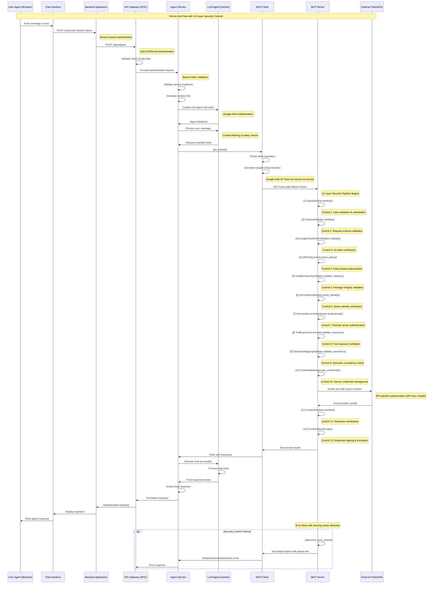

# End-to-End Sequence Diagram for ADK MCP Implementation

## Complete User-to-Tools Flow with Security Controls

## Detailed Step-by-Step Description

### **Phase 1: User Interaction & Frontend Authentication**

#### **Step 1-3: User to Backend Flow**
1. **User Input**: User types message in browser-based chat interface
2. **UI Processing**: Chat interface captures input and prepares API call
3. **Backend Authentication**: Backend validates user session/token before proceeding

**Security**: Session-based user authentication, CSRF protection

---

### **Phase 2: Backend to Agent Service Authentication**

#### **Step 4-6: API Gateway Authentication**
4. **Backend to APIC**: Backend calls API Gateway with Client ID/Secret
5. **Credential Validation**: APIC validates client credentials and generates bearer token
6. **Authenticated Forwarding**: APIC forwards request to Agent Service with validated token

**Security**: OAuth 2.0 Client Credentials flow, rate limiting, request validation

---

### **Phase 3: Agent Service Initialization**

#### **Step 7-9: Service Readiness**
7. **Service Validation**: Agent Service checks initialization status
8. **Session Management**: Generates unique user_id and session_id for tracking
9. **LLM Agent Creation**: Initializes LLM Agent with model configuration and system prompt

**Security**: Service readiness checks, session isolation, secure configuration

---

### **Phase 4: LLM Integration**

#### **Step 10-12: AI Model Communication**
10. **Agent Initialization**: Creates Google ADK LLM Agent with tools
11. **Content Processing**: LLM processes user message with safety filters
12. **Tool Discovery**: LLM requests available tools for task completion

**Security**: Google ADK authentication, content filtering, safety checks

---

### **Phase 5: MCP Client Authentication**

#### **Step 13-15: Service-to-Service Authentication**
13. **Token Management**: MCP Client checks ID token expiration
14. **Credential Generation**: Uses Google Auth library to generate ID token for target audience
15. **Authentication Validation**: Validates credentials and token format

**Security**: Google Cloud ID tokens, service account authentication, token lifecycle management

---

### **Phase 6: MCP Security Pipeline (12 Controls)**

#### **Step 16: Request to MCP Server**
16. **Tool Request**: MCP Client requests available tools with Bearer token

#### **Phase 6.1: Pre-Authentication (Fast Fail)**
17. **[Control 1] Input Sanitization**: `InputSanitizer.sanitize()` 
    - Validates and cleans all input parameters
    - Removes malicious content and injection attempts
    
18. **[Control 2] Schema Validation**: `SchemaValidator.validate()`
    - Validates request structure against predefined schemas
    - Ensures data type compliance and required fields

#### **Phase 6.2: Authentication & Authorization**
19. **[Control 3] Token Validation**: `GoogleCloudTokenValidator.validate()`
    - Verifies Google Cloud ID token authenticity
    - Validates audience, issuer, and expiration
    
20. **[Control 4] Policy Authorization**: `OPAPolicyClient.check_policy()`
    - Evaluates Open Policy Agent rules
    - Checks user permissions and access policies

#### **Phase 6.3: Infrastructure Security**
21. **[Control 5] Package Integrity**: `InstallerSecurityValidator.validate_integrity()`
    - Validates software package signatures
    - Checks against trusted registries
    
22. **[Control 6] Server Identity**: `ServerNameRegistry.verify_identity()`
    - Verifies server identity and registration
    - Validates namespace and service discovery
    
23. **[Control 7] Remote Authentication**: `RemoteServerAuthenticator.authenticate()`
    - Authenticates remote server connections
    - Validates certificates and handshakes

#### **Phase 6.4: Tool-Specific Security**
24. **[Control 8] Tool Exposure**: `ToolExposureController.validate_exposure()`
    - Controls which tools are exposed to users
    - Applies exposure policies and restrictions
    
25. **[Control 9] Semantic Validation**: `SemanticMappingValidator.validate_semantics()`
    - Validates semantic consistency of requests
    - Checks for logical contradictions

#### **Phase 6.5: Execution & Response Security**
26. **[Control 10] Credential Management**: `CredentialManager.get_credentials()`
    - Securely retrieves API credentials from Google Secret Manager
    - Manages credential lifecycle and rotation

---

### **Phase 7: Tool Execution**

#### **Step 27-28: External API Calls**
27. **Tool Invocation**: MCP Server calls external tools/APIs with secure context
28. **API Authentication**: Tools authenticate using API keys, OAuth tokens, or certificates

**Security**: API-specific authentication, secure credential injection, request signing

---

### **Phase 8: Response Security**

#### **Step 29-30: Response Protection**
29. **[Control 11] Response Sanitization**: `ContextSanitizer.sanitize()`
    - Removes sensitive information from responses
    - Applies data loss prevention rules
    
30. **[Control 12] Response Security**: `ContextSecurity.sign()`
    - Signs responses for integrity verification
    - Encrypts sensitive response data

---

### **Phase 9: Response Flow**

#### **Step 31-36: Response Delivery**
31. **Secure Response**: MCP Server returns secured tool results
32. **Tool Integration**: MCP Client processes and forwards tools to Agent Service
33. **LLM Processing**: LLM Agent executes tools and generates final response
34. **Response Extraction**: Agent Service extracts final response from LLM events
35. **Authenticated Return**: Response flows back through APIC with authentication
36. **User Display**: Final response displayed to user in chat interface

**Security**: End-to-end encryption, response integrity, audit logging

---

### **Error Handling & Security**

#### **Security Exception Flow**
- **Phase Detection**: `_determine_error_phase()` identifies which security control failed
- **Contextual Errors**: Security exceptions include phase information for debugging
- **Graceful Degradation**: System fails securely without exposing sensitive information
- **Audit Trail**: All security events logged for compliance and monitoring

---

## **Security Architecture Summary**

### **Authentication Layers**
1. **User-to-Backend**: Session-based authentication
2. **Backend-to-APIC**: OAuth 2.0 Client Credentials
3. **APIC-to-AgentService**: Bearer token validation
4. **AgentService-to-LLM**: Google ADK authentication
5. **MCPClient-to-MCPServer**: Google Cloud ID tokens
6. **MCPServer-to-Tools**: API-specific authentication

### **Security Control Coverage**
- **Input Layer**: Controls 1-2 (Sanitization, Schema validation)
- **Auth Layer**: Controls 3-4 (Token validation, Policy authorization)
- **Infrastructure Layer**: Controls 5-7 (Integrity, Identity, Remote auth)
- **Application Layer**: Controls 8-9 (Tool exposure, Semantic validation)
- **Response Layer**: Controls 10-12 (Credentials, Sanitization, Security)

### **Zero-Trust Implementation**
- **Never Trust, Always Verify**: Every request validated through all 12 controls
- **Least Privilege**: Tools exposed based on strict policy controls
- **Defense in Depth**: Multiple security layers with fail-safe defaults
- **Continuous Monitoring**: All interactions logged and monitored

This sequence diagram shows a production-ready, enterprise-grade security implementation with comprehensive authentication, authorization, and data protection throughout the entire request-response lifecycle.
